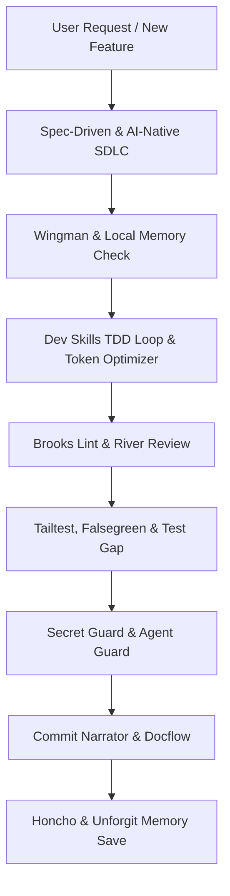

# Persistent Agent Memory & Plugin Ecosystem: VID Platform

**Project:** VID (Virtual Identification) Multi-Tenant Platform  
**Last Updated:** 2026-09-24  
**Persistence Surface:** Git-tracked memory ledger + `.agents/` customization suite  

---

## 1. Project Context & Durable Conclusions (Honcho / Wingman / Knowl)

### 1.1 Architecture & Stack Contract
- **Architecture:** Multi-tenant educational ecosystem. Single unified platform, not disconnected CRUD modules.
- **Master Anchor:** **Student is a central master entity**, never a separate workspace. All 18 workspaces pivot around this single record.
- **Multi-Tenancy:** Single shared PostgreSQL database with `institution_id` indexed on all tenant tables, enforced server-side via `TenantMiddleware` and Row-Level Security (RLS).
- **Backend:** Python 3.11+ + FastAPI (async REST) + Pydantic v2 + SQLAlchemy 2.0 (asyncpg).
- **Frontend:** React 18+ (Next.js / Vite SPA) + TypeScript 5.x + Tailwind CSS + TanStack Query + Zod + Radix UI / Lucide.
- **AI Yantra:** Strictly bounded to 3 workspaces: Voice Agent, AI Attendance, AI Tutor. AI never receives raw unrestricted DB access.
- **Responsive Guarantee:** 320px to 1440px+ responsiveness, zero horizontal page scrolling, adaptive form columns, mobile table-to-card transformation.

### 1.2 Core Development Directives
- **Spec-First:** Must maintain `/docs/PRD.md`, `/docs/TECH_SPEC.md`, `/docs/TASKS.md`, `/docs/DECISIONS.md`.
- **Pre-Commit Verification:** Validate attendance and marks before database commit (zero silent failures).
- **Auditing:** Financial and academic mutations generate immutable audit logs (`audit_logs`).

---

## 2. Installed Plugin Suite (28 Plugins Matrix)

All 28 plugins are installed locally in `.agents/plugins/` with manifests (`plugin.json`) and operational runbooks (`SKILL.md`), registered in `.agents/plugins.json` and `.agents/skills.json`.

| # | Plugin Name | Category | Primary Trigger / Condition | Skill Invocation |
| :--- | :--- | :--- | :--- | :--- |
| 1 | **mcp-local-memory** | Memory | Entity relationship queries, schema dependencies | `local-memory` |
| 2 | **Honcho** | Memory | Session start, user preference recall, durable decisions | `honcho-memory` |
| 3 | **metabrain** | Memory | Recurring patterns (3+ instances) graduating to rules | `metabrain` |
| 4 | **Knowl** | Memory | Codebase updates requiring fact retirement / verification | `knowl` |
| 5 | **MeMesh** | Memory | Cross-agent/cross-tool state handoffs (SQLite bus) | `memesh` |
| 6 | **Wingman** | Memory | Pre-edit check on database models and API schemas | `wingman` |
| 7 | **Unforgit** | Memory | Architectural choices, conventions, gotchas | `unforgit` |
| 8 | **Brooks Lint** | Code Quality | Architectural review of code diffs (classic wisdom) | `brooks-lint` |
| 9 | **River Review** | Code Quality | Multi-perspective diff review (Security, Perf, Arch, Test) | `river-review` |
| 10 | **Codex Reviewer** | Code Quality | Adversarial second-pass review before milestone delivery | `codex-reviewer` |
| 11 | **debt-ops** | Code Quality | AI write-time shortcut detection, logging deferrals | `debt-ops` |
| 12 | **MegaLinter** | Code Quality | Multi-language linting/formatting pass (Ruff, ESLint) | `megalinter` |
| 13 | **tailtest** | Testing | Detecting changed files and executing targeted test suites | `tailtest` |
| 14 | **falsegreen-skill**| Testing | Auditing test assertions for hollow/tautological passes | `falsegreen` |
| 15 | **Flaky Detector** | Testing | Rerunning test suites to detect race conditions | `flaky-detector` |
| 16 | **Test Gap** | Testing | Finding lines in git diff lacking test coverage | `test-gap` |
| 17 | **Agent Guard** | Security | Intercepting commands/files to block secret leaks | `agent-guard` |
| 18 | **Secret Guard** | Security | Pre-commit entropy and regex secret scanning | `secret-guard` |
| 19 | **AxonFlow** | Security | Terminal command policy enforcement, PII protection | `axonflow` |
| 20 | **HOL Guard** | Security | Integrity and antivirus check for imported plugins | `hol-guard` |
| 21 | **Spec-Driven Dev** | SDLC Discipline | Enforcing Requirements $\to$ Design $\to$ Tasks pipeline | `spec-driven` |
| 22 | **Dev Skills** | SDLC Discipline | Executing TDD (Red-Green-Refactor), systematic debug | `dev-skills` |
| 23 | **AI-Native SDLC** | SDLC Discipline | Human approval gates at Plan, Design, Build, Test milestones | `ai-native-sdlc` |
| 24 | **Commit Narrator** | Git Automation | Generating semantic commit messages explaining the *why* | `commit-narrator` |
| 25 | **PR Storyteller** | Git Automation | Synthesizing PR titles, summaries, and test plans | `pr-storyteller` |
| 26 | **Docflow** | Git Automation | Enforcing docs freshness and updating changelogs | `docflow` |
| 27 | **token-optimizer**| Token Cost | Line-range file views, scoped ripgrep searches | `token-optimizer` |
| 28 | **Espresso** | Token Cost | Output compression, concise answers, zero boilerplate | `espresso` |

---

## 3. Workflow Activation Guide

When executing SDLC workflows in this repository, follow this execution mapping:

1. **Before Editing Code:**
   - Consult `Wingman` and `Local Memory` to ensure data contracts (tenant isolation, student master relationships) are preserved.
2. **During Coding:**
   - Follow `Dev Skills` TDD practices.
   - Use `Token Optimizer` to keep file inspections focused and concise.
   - Guard against technical debt via `debt-ops`.
3. **During Review & Testing:**
   - Execute `River Review` across Security, Performance, Architecture, and Testing lenses.
   - Run `Tailtest` to execute unit tests.
   - Inspect assertions with `falsegreen-skill` to eliminate false positives.
   - Run `Test Gap` on the diff.
4. **Before Git Commit:**
   - Execute `Secret Guard` to scan for high-entropy tokens and leaked credentials.
   - Invoke `Commit Narrator` to generate a semantic conventional commit with the context and *why*.
   - Update `docs/TASKS.md` and documentation with `Docflow`.
5. **Session Wrap-Up:**
   - Persist durable architectural insights and user preferences to `Honcho` and `Unforgit` memory.

---

## 4. Frontend Implementation & Stitch Conversion State (2026-09-25)
- **Framework & Libraries:** Next.js 14 App Router + TypeScript 5 (strict mode) + Tailwind CSS + TanStack Query v5 + Zod + Lucide React.
- **Stitch MCP Projects Converted:**
  - `projects/5658266557968362284` ("VID Platform Design System") & `projects/13948709977704856800` ("Virtual Identification Design System") parsed as visual reference and re-architected into modular React components using `components/ui`.
- **Step 3 Shared Component Library (`frontend/components/ui/`):**
  - `Button.tsx` (primary black pill, secondary outline pill, destructive, ghost; dense/default/lg; leading/trailing icons).
  - `Badge.tsx` (neutral, positive, warning, error with 6px semantic dots).
  - `Card.tsx` (`Card`, `CardHeader`, `CardTitle`, `CardDescription`, `CardContent`, `CardFooter`, `StatCard`, `SpotHeroPanel`, `PlanCard`).
  - `Table.tsx` (desktop internal scroll with sortable headers + Rule 22 automatic mobile card-collapse).
  - `Form/index.tsx` (`Input`, searchable `Select`, `DatePicker`, `FormField` with Zod validation display).
  - `Sidebar.tsx` (role-scoped, dynamic optional module filtering, active black pill, tablet collapsed rail, mobile drawer).
  - `Topbar.tsx` (breadcrumb trail, institution identity, perspective switcher).
  - `SettingsShell.tsx` (two-pane list + fluid detail; collapses to tab strip on mobile).
  - `SlideOver.tsx` (480px right-side drawer with backdrop blur and sticky footer).
  - `ProgressBar.tsx` (tabular percentage indicators).
  - `ConfirmDialog.tsx` (destructive action confirmation modal with consequence warning).
  - `States.tsx` (`EmptyState`, `ErrorState`, `LoadingSkeleton`, `PermissionDenied`).
- **Student Master Entity (Rule 1):** Exactly ONE `<StudentProfile>` component built in `components/student/StudentProfile.tsx` supporting 8 full tabs: Personal/Parents, Academic, Attendance, Exams, Fees, Documents, Timetable, AI Tutor. Reused identically at `/students/[id]` and in modal drawers.
- **Dynamic Navigation (Rules 5 & 25):** Driven by `/config/navigation.ts` filtering modules dynamically when optional extensions are toggled in `/settings`.
- **Verified Build & Git Push:** Production build compiled (`32/32 static routes`), remote synchronized on `laxminivas06/vidforum:main` (Commit `e2d98b7`).

---

## 5. Backend & Supabase Database Architecture Implementation (2026-09-25)

### 5.1 Cloud Database Infrastructure (Supabase PostgreSQL)
- **Host & Deployment:** Supabase PostgreSQL Pooler (`aws-0-ap-northeast-2.pooler.supabase.com:5432/postgres`), SSL connection pool configured in `backend/src/config/database.ts`.
- **Complete Schema (127 Tables):** Migrated all 16 architectural domains covering core tenancy, security, academics, admissions, students, guardians, faculty, attendance, examinations, finance, documents, timetable, HRMS, AI Yantra, and optional extensions.
- **Extensions Active:** `uuid-ossp`, `pgcrypto`, `btree_gist`, `pg_trgm`.
- **Security & RLS Helper Functions:** Deployed in `public` schema (`my_institution_ids()`, `has_permission()`, `is_assigned_faculty()`, `is_guardian_of()`) avoiding Supabase `auth` schema restrictions while maintaining strict tenant isolation.
- **Audit & Consistency Triggers:** 
  - `log_audit_event()` with table-aware primary key branching (`institutions.id` vs `institution_id`).
  - `enforce_tenant_consistency()` ensuring child records never reference parents from another tenant.
- **Comprehensive Seed Data (`backend/db/seed.sql`):** Seeded 3 subscription plans, 4 institutions (Springfield, Cambridge, St. Mary's, Oakridge), module toggles, standard RBAC roles, academic tree (Science, Commerce, Grade 10/11/12, Sections A/B, Physics/Math/English), faculty roster & class assignments, student master records, parent guardians, Kanban admission applications, fee structures, and initial invoices.

### 5.2 Backend Layered MVC Engine (Node.js 22 + Express + TypeScript)
- **Design Pattern:** Layered MVC adhering strictly to `routes -> controllers -> services -> repositories -> PostgreSQL`.
- **Infrastructure & Middleware:**
  - `tenant.middleware.ts`: Extracts and enforces `institution_id` on all tenant-owned requests.
  - `auth.middleware.ts`: Bearer JWT token verification with decoded claims injection.
  - `rbac.middleware.ts`: Multi-tier role and permission gatekeeper.
  - `error.middleware.ts`: Centralized error interceptor producing standard envelope `{ success: false, error: { message, code } }`.
- **Implemented MVC Modules:**
  - **Admissions:** `admissions.routes.ts` $\to$ `admissions.controller.ts` $\to$ `admissions.service.ts` $\to$ `admissions.repository.ts` (enquiries, Kanban status transitions, document verification, atomic approval-to-student creation).
  - **Students:** `student.routes.ts` $\to$ `student.controller.ts` $\to$ `student.service.ts` $\to$ `student.repository.ts` (Single Student Master Entity 360° profile aggregation across personal, guardians, academic, fees, attendance).
  - **Institutions:** `institution.routes.ts` $\to$ `institution.controller.ts` $\to$ `institution.service.ts` $\to$ `institution.repository.ts` (Tenant management, subscription plans, module toggle flags).
  - **Academics:** `academics.routes.ts` $\to$ `academics.controller.ts` $\to$ `academics.service.ts` $\to$ `academics.repository.ts` (departments, courses, classes, sections, subjects).
  - **Faculty:** `faculty.routes.ts` $\to$ `faculty.controller.ts` $\to$ `faculty.service.ts` $\to$ `faculty.repository.ts` (faculty roster, workload counter, section/subject assignments).
  - **Finance:** `finance.routes.ts` $\to$ `finance.controller.ts` $\to$ `finance.service.ts` $\to$ `finance.repository.ts` (fee structures, student fee ledgers, payment checkout, invoices, receipts).
  - **Operational Routes:** `attendance.routes.ts`, `examinations.routes.ts`, `documents.routes.ts`, `hrms.routes.ts`, `timetable.routes.ts`, `ai-yantra.routes.ts`, `optional-modules.routes.ts`.

### 5.3 Frontend-to-Backend Integration & Offline Resilience
- **TanStack Query Hooks:** Implemented in `frontend/lib/api/hooks.ts`:
  - `useInstitutions()`, `useAdmissions()`, `useAcademics()`, `useFaculty()`, `useFinance()`.
- **Offline / Mock Fallback:** Automatic resilient failover to mock datasets if backend is unreachable or undergoing maintenance, ensuring continuous UI operability.

### 5.4 Repository Sync & Git Checkpoints
- **Commit `ca303cf`:** "Implemented Backend and DB" (101 files, 13,267 insertions).
- **Remote:** Synchronized with `https://github.com/laxminivas06/vidforum.git` on branch `main`.

---
*End of MEMORY.md*
