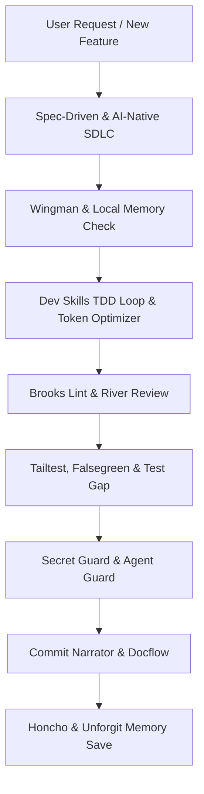

# Persistent Agent Memory & Plugin Ecosystem: VID Platform

**Project:** VID (Virtual Identification) Multi-Tenant Platform  
**Last Updated:** 2026-09-24  
**Persistence Surface:** Git-tracked memory ledger + `.agents/` customization suite  

---

## 1. Project Context & Durable Conclusions (Honcho / Wingman / Knowl)

### 1.1 Architecture & Stack Contract
- **Architecture:** Multi-tenant educational ecosystem. Single unified platform, not disconnected CRUD modules.
- **Master Anchor:** **Student is a central master entity**, never a separate workspace. All 18 workspaces pivot around this single record.
- **Multi-Tenancy:** Single shared PostgreSQL database with `institution_id` indexed on all tenant tables, enforced server-side via `TenantMiddleware` and Row-Level Security (RLS).
- **Backend:** Python 3.11+ + FastAPI (async REST) + Pydantic v2 + SQLAlchemy 2.0 (asyncpg).
- **Frontend:** React 18+ (Next.js / Vite SPA) + TypeScript 5.x + Tailwind CSS + TanStack Query + Zod + Radix UI / Lucide.
- **AI Yantra:** Strictly bounded to 3 workspaces: Voice Agent, AI Attendance, AI Tutor. AI never receives raw unrestricted DB access.
- **Responsive Guarantee:** 320px to 1440px+ responsiveness, zero horizontal page scrolling, adaptive form columns, mobile table-to-card transformation.

### 1.2 Core Development Directives
- **Spec-First:** Must maintain `/docs/PRD.md`, `/docs/TECH_SPEC.md`, `/docs/TASKS.md`, `/docs/DECISIONS.md`.
- **Pre-Commit Verification:** Validate attendance and marks before database commit (zero silent failures).
- **Auditing:** Financial and academic mutations generate immutable audit logs (`audit_logs`).

---

## 2. Installed Plugin Suite (28 Plugins Matrix)

All 28 plugins are installed locally in `.agents/plugins/` with manifests (`plugin.json`) and operational runbooks (`SKILL.md`), registered in `.agents/plugins.json` and `.agents/skills.json`.

| # | Plugin Name | Category | Primary Trigger / Condition | Skill Invocation |
| :--- | :--- | :--- | :--- | :--- |
| 1 | **mcp-local-memory** | Memory | Entity relationship queries, schema dependencies | `local-memory` |
| 2 | **Honcho** | Memory | Session start, user preference recall, durable decisions | `honcho-memory` |
| 3 | **metabrain** | Memory | Recurring patterns (3+ instances) graduating to rules | `metabrain` |
| 4 | **Knowl** | Memory | Codebase updates requiring fact retirement / verification | `knowl` |
| 5 | **MeMesh** | Memory | Cross-agent/cross-tool state handoffs (SQLite bus) | `memesh` |
| 6 | **Wingman** | Memory | Pre-edit check on database models and API schemas | `wingman` |
| 7 | **Unforgit** | Memory | Architectural choices, conventions, gotchas | `unforgit` |
| 8 | **Brooks Lint** | Code Quality | Architectural review of code diffs (classic wisdom) | `brooks-lint` |
| 9 | **River Review** | Code Quality | Multi-perspective diff review (Security, Perf, Arch, Test) | `river-review` |
| 10 | **Codex Reviewer** | Code Quality | Adversarial second-pass review before milestone delivery | `codex-reviewer` |
| 11 | **debt-ops** | Code Quality | AI write-time shortcut detection, logging deferrals | `debt-ops` |
| 12 | **MegaLinter** | Code Quality | Multi-language linting/formatting pass (Ruff, ESLint) | `megalinter` |
| 13 | **tailtest** | Testing | Detecting changed files and executing targeted test suites | `tailtest` |
| 14 | **falsegreen-skill**| Testing | Auditing test assertions for hollow/tautological passes | `falsegreen` |
| 15 | **Flaky Detector** | Testing | Rerunning test suites to detect race conditions | `flaky-detector` |
| 16 | **Test Gap** | Testing | Finding lines in git diff lacking test coverage | `test-gap` |
| 17 | **Agent Guard** | Security | Intercepting commands/files to block secret leaks | `agent-guard` |
| 18 | **Secret Guard** | Security | Pre-commit entropy and regex secret scanning | `secret-guard` |
| 19 | **AxonFlow** | Security | Terminal command policy enforcement, PII protection | `axonflow` |
| 20 | **HOL Guard** | Security | Integrity and antivirus check for imported plugins | `hol-guard` |
| 21 | **Spec-Driven Dev** | SDLC Discipline | Enforcing Requirements $\to$ Design $\to$ Tasks pipeline | `spec-driven` |
| 22 | **Dev Skills** | SDLC Discipline | Executing TDD (Red-Green-Refactor), systematic debug | `dev-skills` |
| 23 | **AI-Native SDLC** | SDLC Discipline | Human approval gates at Plan, Design, Build, Test milestones | `ai-native-sdlc` |
| 24 | **Commit Narrator** | Git Automation | Generating semantic commit messages explaining the *why* | `commit-narrator` |
| 25 | **PR Storyteller** | Git Automation | Synthesizing PR titles, summaries, and test plans | `pr-storyteller` |
| 26 | **Docflow** | Git Automation | Enforcing docs freshness and updating changelogs | `docflow` |
| 27 | **token-optimizer**| Token Cost | Line-range file views, scoped ripgrep searches | `token-optimizer` |
| 28 | **Espresso** | Token Cost | Output compression, concise answers, zero boilerplate | `espresso` |

---

## 3. Workflow Activation Guide

When executing SDLC workflows in this repository, follow this execution mapping:

1. **Before Editing Code:**
   - Consult `Wingman` and `Local Memory` to ensure data contracts (tenant isolation, student master relationships) are preserved.
2. **During Coding:**
   - Follow `Dev Skills` TDD practices.
   - Use `Token Optimizer` to keep file inspections focused and concise.
   - Guard against technical debt via `debt-ops`.
3. **During Review & Testing:**
   - Execute `River Review` across Security, Performance, Architecture, and Testing lenses.
   - Run `Tailtest` to execute unit tests.
   - Inspect assertions with `falsegreen-skill` to eliminate false positives.
   - Run `Test Gap` on the diff.
4. **Before Git Commit:**
   - Execute `Secret Guard` to scan for high-entropy tokens and leaked credentials.
   - Invoke `Commit Narrator` to generate a semantic conventional commit with the context and *why*.
   - Update `docs/TASKS.md` and documentation with `Docflow`.
5. **Session Wrap-Up:**
   - Persist durable architectural insights and user preferences to `Honcho` and `Unforgit` memory.

---
*End of MEMORY.md*
