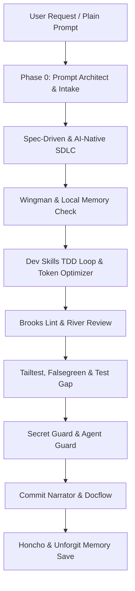

# Persistent Agent Memory & Plugin Ecosystem: VID Platform

**Project:** VID (Virtual Identification) Multi-Tenant Platform  
**Last Updated:** 2026-09-24  
**Persistence Surface:** Git-tracked memory ledger + `.agents/` customization suite  

---

## 1. Project Context & Durable Conclusions (Honcho / Wingman / Knowl)

### 1.1 Architecture & Stack Contract
- **Architecture:** Multi-tenant educational ecosystem. Single unified platform, not disconnected CRUD modules.
- **Master Anchor:** **Student is a central master entity**, never a separate workspace. All 18 workspaces pivot around this single record.
- **Multi-Tenancy:** Single shared PostgreSQL database with `institution_id` indexed on all tenant tables, enforced server-side via `TenantMiddleware` and Row-Level Security (RLS).
- **Backend:** Python 3.11+ + FastAPI (async REST) + Pydantic v2 + SQLAlchemy 2.0 (asyncpg).
- **Frontend:** React 18+ (Next.js / Vite SPA) + TypeScript 5.x + Tailwind CSS + TanStack Query + Zod + Radix UI / Lucide.
- **AI Yantra:** Strictly bounded to 3 workspaces: Voice Agent, AI Attendance, AI Tutor. AI never receives raw unrestricted DB access.
- **Responsive Guarantee:** 320px to 1440px+ responsiveness, zero horizontal page scrolling, adaptive form columns, mobile table-to-card transformation.

### 1.2 Core Development Directives
- **Spec-First:** Must maintain `/docs/PRD.md`, `/docs/TECH_SPEC.md`, `/docs/TASKS.md`, `/docs/DECISIONS.md`.
- **Pre-Commit Verification:** Validate attendance and marks before database commit (zero silent failures).
- **Auditing:** Financial and academic mutations generate immutable audit logs (`audit_logs`).
- **Zero Duplicate Data & Dates Policy:** Strictly prohibit duplicate data, duplicate dates, duplicate record IDs, or duplicate entities across all frontend pages, tables, and mock/seed repositories. All entities must possess globally unique identifiers and distinct, realistic dates and attributes.
- **Zero LocalStorage for Working/Domain Data Directive:** Strictly prohibit storing, caching, or retrieving any working, domain, or operational application data (institutions, tenant admins, workspace access, user roles, students, admissions, marks, fees, or academics) in browser `localStorage` or `sessionStorage`. All application state must be stored in and fetched directly from the centralized Supabase Cloud PostgreSQL database via backend endpoints. Local storage is strictly reserved for ephemeral JWT tokens (`vid_auth_token`).
- **Supabase MCP Database Protocol:** All database operations (schema inspection, table alterations, stored procedures, RPC functions, triggers, and DDL migrations) must be executed using the Supabase MCP Server (`supabase-mcp-server`, project `cyvckmjocomqzipbvbpv`), allowing direct modification, testing, and management of all PostgreSQL database functions with zero teardown of existing tested records.
- **Git Push Governance (All Workflows):** Strictly PROHIBIT pushing to Git/GitHub (`git push`) unless the user explicitly commands a git push in the prompt. Never push automatically as part of any SDLC or testing workflow.
- **Workspace Navigation Isolation (All Workflows):** Strictly isolate navigation in every workspace (Academics, Staff/HRMS, Admissions, etc.). When inside an isolated workspace, the sidebar must display ONLY that workspace's dedicated tools and functional routes. Never leak global or other workspace navigation items into an isolated workspace.

---

## 2. Installed Plugin Suite (28 Plugins Matrix)

All 28 plugins are installed locally in `.agents/plugins/` with manifests (`plugin.json`) and operational runbooks (`SKILL.md`), registered in `.agents/plugins.json` and `.agents/skills.json`.

| # | Plugin Name | Category | Primary Trigger / Condition | Skill Invocation |
| :--- | :--- | :--- | :--- | :--- |
| 1 | **mcp-local-memory** | Memory | Entity relationship queries, schema dependencies | `local-memory` |
| 2 | **Honcho** | Memory | Session start, user preference recall, durable decisions | `honcho-memory` |
| 3 | **metabrain** | Memory | Recurring patterns (3+ instances) graduating to rules | `metabrain` |
| 4 | **Knowl** | Memory | Codebase updates requiring fact retirement / verification | `knowl` |
| 5 | **MeMesh** | Memory | Cross-agent/cross-tool state handoffs (SQLite bus) | `memesh` |
| 6 | **Wingman** | Memory | Pre-edit check on database models and API schemas | `wingman` |
| 7 | **Unforgit** | Memory | Architectural choices, conventions, gotchas | `unforgit` |
| 8 | **Brooks Lint** | Code Quality | Architectural review of code diffs (classic wisdom) | `brooks-lint` |
| 9 | **River Review** | Code Quality | Multi-perspective diff review (Security, Perf, Arch, Test) | `river-review` |
| 10 | **Codex Reviewer** | Code Quality | Adversarial second-pass review before milestone delivery | `codex-reviewer` |
| 11 | **debt-ops** | Code Quality | AI write-time shortcut detection, logging deferrals | `debt-ops` |
| 12 | **MegaLinter** | Code Quality | Multi-language linting/formatting pass (Ruff, ESLint) | `megalinter` |
| 13 | **tailtest** | Testing | Detecting changed files and executing targeted test suites | `tailtest` |
| 14 | **falsegreen-skill**| Testing | Auditing test assertions for hollow/tautological passes | `falsegreen` |
| 15 | **Flaky Detector** | Testing | Rerunning test suites to detect race conditions | `flaky-detector` |
| 16 | **Test Gap** | Testing | Finding lines in git diff lacking test coverage | `test-gap` |
| 17 | **Agent Guard** | Security | Intercepting commands/files to block secret leaks | `agent-guard` |
| 18 | **Secret Guard** | Security | Pre-commit entropy and regex secret scanning | `secret-guard` |
| 19 | **AxonFlow** | Security | Terminal command policy enforcement, PII protection | `axonflow` |
| 20 | **HOL Guard** | Security | Integrity and antivirus check for imported plugins | `hol-guard` |
| 21 | **Spec-Driven Dev** | SDLC Discipline | Enforcing Requirements $\to$ Design $\to$ Tasks pipeline | `spec-driven` |
| 22 | **Dev Skills** | SDLC Discipline | Executing TDD (Red-Green-Refactor), systematic debug | `dev-skills` |
| 23 | **AI-Native SDLC** | SDLC Discipline | Human approval gates at Plan, Design, Build, Test milestones | `ai-native-sdlc` |
| 24 | **Commit Narrator** | Git Automation | Generating semantic commit messages explaining the *why* | `commit-narrator` |
| 25 | **PR Storyteller** | Git Automation | Synthesizing PR titles, summaries, and test plans | `pr-storyteller` |
| 26 | **Docflow** | Git Automation | Enforcing docs freshness and updating changelogs | `docflow` |
| 27 | **token-optimizer**| Token Cost | Line-range file views, scoped ripgrep searches | `token-optimizer` |
| 28 | **Espresso** | Token Cost | Output compression, concise answers, zero boilerplate | `espresso` |
| 29 | **Ponytail** | Code Minimalism | YAGNI extremist, native-platform-first, shortest working diffs | `ponytail` (Intensity: **Ultra**) |
| 30 | **a11y-audit** | Quality & a11y | WCAG 2.1 AA accessibility & touch-target audits (PRD Rule 29) | `a11y-audit` |
| 31 | **openapi-gen** | API Sync | Contract sync between Express /api/v1 and TanStack Query | `openapi-gen` |
| 32 | **prompt-architect** | Intake & Prompt | Plain-English requests needing architectural optimization & PRD rule injection | `prompt-architect` |

### 2.1 Ponytail Ultra Operating Matrix
**Active Mode:** `ULTRA` (Permanent across sessions per user instruction 2026-09-29)

#### Where Ponytail Ultra MUST be applied:
1. **Frontend UI Development:**
   - **Reuse Existing Primitives:** Always import from `@/components/ui/` (`Button`, `Card`, `Table`, `Badge`, `Form`, `ProgressBar`, `ConfirmDialog`, `States`). Never re-create ad-hoc wrappers or duplicate components.
   - **Native Platform First:** Use native HTML5 elements (`<dialog>`, `<input type="date">`, standard CSS flex/grid) over installing or configuring heavy NPM packages.
   - **Zero Speculative Abstractions:** No single-use interfaces, no multi-level prop adapters for components used in only one place, no premature state machines.
2. **Backend API & Service Layer:**
   - **Direct & Thin Flow:** Thin controller mapping request $\to$ service $\to$ repository. No speculative intermediate mapper layers when a direct SQL row or object mapping is sufficient.
   - **Minimal SQL Footprint:** Query only the exact columns needed by the client; avoid over-fetching and unnecessary multi-table joins when single table lookups suffice.
3. **Bug Fixing & Root-Cause Resolution:**
   - Always fix at the single shared bottleneck or root function rather than placing repetitive defensive checks across multiple calling files.
4. **File Footprint & Diff Size:**
   - The shortest working diff that achieves the functional requirement wins. Delete dead code and bloat before adding new lines.
5. **Output Discipline:**
   - Code first. Followed by at most 3 concise lines on what was deliberately skipped or deferred.

#### Where Ponytail Ultra is STRICTLY FORBIDDEN:
- **Tenant Isolation:** Never bypass `institution_id` checks or `tenantMiddleware` to "simplify" a query.
- **Role-Based Access Control (RBAC):** Never remove or simplify role checks or resource-level authorization.
- **Student Master Entity Constraint:** Never create a separate student workspace or duplicate student record.
- **Data Integrity & Audit:** Never bypass pre-commit validation (e.g. Exam Excel import verification or AI face attendance verification queue) or audit logging.

---

## 3. Workflow Activation Guide

When executing SDLC workflows in this repository, follow this execution mapping:


```mermaid
graph TD
    UserReq[User Request / Plain Prompt] --> Phase0[Phase 0: Prompt Architect & Intake]
    Phase0 --> SpecDriven[Spec-Driven & AI-Native SDLC]
    SpecDriven --> PreEditCheck[Wingman & Local Memory Check]
    PreEditCheck --> DevLoop[Dev Skills TDD Loop & Token Optimizer]
    DevLoop --> CodeReview[Brooks Lint & River Review]
    CodeReview --> TestCheck[Tailtest, Falsegreen & Test Gap]
    TestCheck --> SecCheck[Secret Guard & Agent Guard]
    SecCheck --> CommitPhase[Commit Narrator & Docflow]
    CommitPhase --> MemPersist[Honcho & Unforgit Memory Save]
```

0. **Phase 0 (Intake & Prompt Mastery):**
   - Execute `prompt-architect` to translate plain or informal user requests into structured, architecture-aware specifications enforcing PRD non-negotiables, `@/components/ui/` primitives, and acceptance criteria before touching code.
1. **Before Editing Code:**
   - Consult `Wingman` and `Local Memory` to ensure data contracts (tenant isolation, student master relationships) are preserved.
2. **During Coding:**
   - Follow `Dev Skills` TDD practices.
   - Use `Token Optimizer` to keep file inspections focused and concise.
   - Guard against technical debt via `debt-ops`.
3. **During Review & Testing:**
   - Execute `River Review` across Security, Performance, Architecture, and Testing lenses.
   - Run `Tailtest` to execute unit tests.
   - Inspect assertions with `falsegreen-skill` to eliminate false positives.
   - Run `Test Gap` on the diff.
4. **Before Git Commit & Git Governance:**
   - Execute `Secret Guard` to scan for high-entropy tokens and leaked credentials.
   - Invoke `Commit Narrator` to generate a semantic conventional commit with the context and *why*.
   - **Git Push Prohibition:** Strictly DO NOT run `git push` unless the user explicitly requested a push in the prompt.
   - **Workspace Navigation Isolation:** Ensure any workspace view strictly isolates sidebar items to that workspace's dedicated functional tools.
   - Update `docs/TASKS.md` and documentation with `Docflow`.
5. **Session Wrap-Up:**
   - Persist durable architectural insights and user preferences to `Honcho` and `Unforgit` memory.


---

## 4. Frontend Implementation & Stitch Conversion State (2026-09-25)
- **Framework & Libraries:** Next.js 14 App Router + TypeScript 5 (strict mode) + Tailwind CSS + TanStack Query v5 + Zod + Lucide React.
- **Stitch MCP Projects Converted:**
  - `projects/5658266557968362284` ("VID Platform Design System") & `projects/13948709977704856800` ("Virtual Identification Design System") parsed as visual reference and re-architected into modular React components using `components/ui`.
- **Step 3 Shared Component Library (`frontend/components/ui/`):**
  - `Button.tsx` (primary black pill, secondary outline pill, destructive, ghost; dense/default/lg; leading/trailing icons).
  - `Badge.tsx` (neutral, positive, warning, error with 6px semantic dots).
  - `Card.tsx` (`Card`, `CardHeader`, `CardTitle`, `CardDescription`, `CardContent`, `CardFooter`, `StatCard`, `SpotHeroPanel`, `PlanCard`).
  - `Table.tsx` (desktop internal scroll with sortable headers + Rule 22 automatic mobile card-collapse).
  - `Form/index.tsx` (`Input`, searchable `Select`, `DatePicker`, `FormField` with Zod validation display).
  - `Sidebar.tsx` (role-scoped, dynamic optional module filtering, active black pill, tablet collapsed rail, mobile drawer).
  - `Topbar.tsx` (breadcrumb trail, institution identity, perspective switcher).
  - `SettingsShell.tsx` (two-pane list + fluid detail; collapses to tab strip on mobile).
  - `SlideOver.tsx` (480px right-side drawer with backdrop blur and sticky footer).
  - `ProgressBar.tsx` (tabular percentage indicators).
  - `ConfirmDialog.tsx` (destructive action confirmation modal with consequence warning).
  - `States.tsx` (`EmptyState`, `ErrorState`, `LoadingSkeleton`, `PermissionDenied`).
- **Student Master Entity (Rule 1):** Exactly ONE `<StudentProfile>` component built in `components/student/StudentProfile.tsx` supporting 8 full tabs: Personal/Parents, Academic, Attendance, Exams, Fees, Documents, Timetable, AI Tutor. Reused identically at `/students/[id]` and in modal drawers.
- **Dynamic Navigation (Rules 5 & 25):** Driven by `/config/navigation.ts` filtering modules dynamically when optional extensions are toggled in `/settings`.
- **Verified Build & Git Push:** Production build compiled (`32/32 static routes`), remote synchronized on `laxminivas06/vidforum:main` (Commit `e2d98b7`).

---

## 5. Backend & Supabase Database Architecture Implementation (2026-09-25)

### 5.1 Cloud Database Infrastructure (Supabase PostgreSQL)
- **Host & Deployment:** Supabase PostgreSQL Pooler (`aws-0-ap-northeast-2.pooler.supabase.com:5432/postgres`), SSL connection pool configured in `backend/src/config/database.ts`.
- **Complete Schema (127 Tables):** Migrated all 16 architectural domains covering core tenancy, security, academics, admissions, students, guardians, faculty, attendance, examinations, finance, documents, timetable, HRMS, AI Yantra, and optional extensions.
- **Extensions Active:** `uuid-ossp`, `pgcrypto`, `btree_gist`, `pg_trgm`.
- **Security & RLS Helper Functions:** Deployed in `public` schema (`my_institution_ids()`, `has_permission()`, `is_assigned_faculty()`, `is_guardian_of()`) avoiding Supabase `auth` schema restrictions while maintaining strict tenant isolation.
- **Audit & Consistency Triggers:** 
  - `log_audit_event()` with table-aware primary key branching (`institutions.id` vs `institution_id`).
  - `enforce_tenant_consistency()` ensuring child records never reference parents from another tenant.
- **Comprehensive Seed Data (`backend/db/seed.sql`):** Seeded 3 subscription plans, 4 institutions (Springfield, Cambridge, St. Mary's, Oakridge), module toggles, standard RBAC roles, academic tree (Science, Commerce, Grade 10/11/12, Sections A/B, Physics/Math/English), faculty roster & class assignments, student master records, parent guardians, Kanban admission applications, fee structures, and initial invoices.

### 5.2 Backend Layered MVC Engine (Node.js 22 + Express + TypeScript)
- **Design Pattern:** Layered MVC adhering strictly to `routes -> controllers -> services -> repositories -> PostgreSQL`.
- **Infrastructure & Middleware:**
  - `tenant.middleware.ts`: Extracts and enforces `institution_id` on all tenant-owned requests.
  - `auth.middleware.ts`: Bearer JWT token verification with decoded claims injection.
  - `rbac.middleware.ts`: Multi-tier role and permission gatekeeper.
  - `error.middleware.ts`: Centralized error interceptor producing standard envelope `{ success: false, error: { message, code } }`.
- **Implemented MVC Modules:**
  - **Admissions:** `admissions.routes.ts` $\to$ `admissions.controller.ts` $\to$ `admissions.service.ts` $\to$ `admissions.repository.ts` (enquiries, Kanban status transitions, document verification, atomic approval-to-student creation).
  - **Students:** `student.routes.ts` $\to$ `student.controller.ts` $\to$ `student.service.ts` $\to$ `student.repository.ts` (Single Student Master Entity 360° profile aggregation across personal, guardians, academic, fees, attendance).
  - **Institutions:** `institution.routes.ts` $\to$ `institution.controller.ts` $\to$ `institution.service.ts` $\to$ `institution.repository.ts` (Tenant management, subscription plans, module toggle flags).
  - **Academics:** `academics.routes.ts` $\to$ `academics.controller.ts` $\to$ `academics.service.ts` $\to$ `academics.repository.ts` (departments, courses, classes, sections, subjects).
  - **Faculty:** `faculty.routes.ts` $\to$ `faculty.controller.ts` $\to$ `faculty.service.ts` $\to$ `faculty.repository.ts` (faculty roster, workload counter, section/subject assignments).
  - **Finance:** `finance.routes.ts` $\to$ `finance.controller.ts` $\to$ `finance.service.ts` $\to$ `finance.repository.ts` (fee structures, student fee ledgers, payment checkout, invoices, receipts).
  - **Operational Routes:** `attendance.routes.ts`, `examinations.routes.ts`, `documents.routes.ts`, `hrms.routes.ts`, `timetable.routes.ts`, `ai-yantra.routes.ts`, `optional-modules.routes.ts`.

### 5.3 Frontend-to-Backend Integration & Offline Resilience
- **TanStack Query Hooks:** Implemented in `frontend/lib/api/hooks.ts`:
  - `useInstitutions()`, `useAdmissions()`, `useAcademics()`, `useFaculty()`, `useFinance()`.
- **Offline / Mock Fallback:** Automatic resilient failover to mock datasets if backend is unreachable or undergoing maintenance, ensuring continuous UI operability.

### 5.4 Repository Sync & Git Checkpoints
- **Commit `ca303cf`:** "Implemented Backend and DB" (101 files, 13,267 insertions).
- **Remote:** Synchronized with `https://github.com/laxminivas06/vidforum.git` on branch `main`.


---

## 6. Codebase Knowledge Graph & Token-Preservation Engine (Graphify)

### 6.1 Knowledge Graph Architecture & Artifacts
The entire codebase (183 files, ~85k words across Next.js frontend, Node/Express MVC backend, Supabase PostgreSQL schemas, and architecture documentation) is indexed into a persistent, multi-tiered Knowledge Graph using the `graphify` engine:
- **Graph Database (`graphify-out/graph.json`):** 1,213 nodes, 2,904 edges, 88 clustered communities (GraphRAG-ready).
- **Interactive Visualizer (`graphify-out/graph.html`):** Standalone browser explorer with community clustering, search, node inspection, and shortest path traversal.
- **Agent-Navigable Wiki (`graphify-out/wiki/index.md`):** 98 modular markdown articles with back-references, community breakdowns, and cross-cutting connections.
- **Audit & Topology Report (`graphify-out/GRAPH_REPORT.md`):** High-level architectural analysis including God Nodes (`frontend/package.json`, `backend/db/schema.sql`, `frontend/components/student/StudentProfile.tsx`, `docs/PRD.md`), surprising bridges, and diagnostic health score.
- **Incremental Cache & Manifest (`graphify-out/cache/`, `graphify-out/manifest.json`):** SHA256 hashes of all AST and semantic inputs allowing sub-second incremental graph updates.

### 6.2 Token-Preservation Operating Directive
To eliminate token waste and avoid repeatedly loading raw source files into LLM context:
1. **Pre-Analysis Query:** Always query the knowledge graph first:
   ```powershell
   python -m graphify query "<question>"
   ```
2. **Context Navigation:** Check `graphify-out/wiki/index.md` or `graphify-out/GRAPH_REPORT.md` to pinpoint exact file and symbol locations.
3. **Shortest Path & Explanations:**
   ```powershell
   python -m graphify path "<SymbolA>" "<SymbolB>"
   python -m graphify explain "<Symbol>"
   ```
4. **Post-Change Incremental Sync:**
   After modifying code files, run:
   ```powershell
   python -m graphify --update
   ```
   This re-indexes ONLY modified files in milliseconds via tree-sitter AST, keeping the graph synchronized with zero token waste.

---

## 7. Cloud Database Direct Persistence & User Administration
- **Direct Database Mutations:** All newly provisioned tenants (`POST /api/v1/institutions`), institute administrators (`POST /api/v1/institutions/:id/admins`), and platform users (`POST /api/v1/users`) directly execute PostgreSQL `INSERT` queries into `institutions`, `auth.users`, `profiles`, and `user_roles`, bypassing mock-only stores.
- **Audit Trigger Isolation:** During bulk purge migrations, user audit triggers (`trg_audit_log`) must be temporarily bypassed with `ALTER TABLE institutions DISABLE TRIGGER trg_audit_log` to prevent cascade foreign key circular loops.
- **User Edit Capability:** Supported via `PATCH /api/v1/users/:id`, allowing selective updates to user full name, email, system role, tenancy assignment, and active/inactive status with immediate synchronization across PostgreSQL, TanStack Query cache (`["platform-users"]`), and the UI table.
- **Absolute Cloud Persistence (Zero LocalStorage for Domain Data):** All entities (tenants, administrators, workspace access lists, users, and academic structures) are persisted solely in the centralized Supabase Cloud PostgreSQL database. Browser `localStorage` is strictly prohibited for storing, staging, or caching application/domain data, preventing cross-user desynchronization. State invalidation and client synchronization are handled exclusively through TanStack Query (`queryClient.invalidateQueries`).

---

## 8. Isolated Workspace Navigation & Academics/Admissions Synchronization
- **Workspace Tool Isolation:** The sidebar enforces strict isolated workspace boundaries: when inside a dedicated workspace (e.g. `/academics`, `/admissions`), only that workspace's dedicated tools are rendered, completely eliminating cross-workspace contamination.
- **Academics Workspace Capabilities:** Exposes all 7 educational planning functionalities directly from the isolated sidebar:
  1. **Classes or Grades** (`/academics`): Section management, capacity tracking, class matrix generator.
  2. **Subject Master** (`/academics?tab=subjects`): Grade-scoped subject catalog, credit definitions, core vs. elective types, syllabus linking.
  3. **Curriculum Mapping** (`/academics?tab=mapping`): Period allocations, max/pass marks, copy matrix across grades.
  4. **Year Exam Schedule** (`/academics?tab=exams`): Assessment milestones, window dates, target grades.
  5. **Preferred Textbooks** (`/academics?tab=textbooks`): Prescribed textbook catalog, publisher, edition, and printable booklists.
  6. **Academic Years** (`/academics?tab=years`): Academic year lifecycles, active status toggling, and structure cloning.
  7. **Working Days & Schedule** (`/academics?tab=calendar`): Calendar event days, working Saturdays, and holiday management.
- **Deep Linking & Subroute Redirects:** Subroutes (`/academics/subjects`, `/academics/mapping`, `/academics/exams`, `/academics/textbooks`, `/academics/years`, `/academics/calendar`) redirect seamlessly to `/academics?tab=<tab_name>`, with URL search parameters and sidebar in constant bidirectional synchronization via Next.js App Router `useSearchParams()`.
- **Backend Academics Controller:** All academic query endpoints automatically resolve the active academic year fallback (`resolveAcademicYearId`), eliminating 400 Bad Request errors when queries omit an explicit `academicYearId`.

---
*End of MEMORY.md*
