# Product Requirements Document (PRD): VID (Virtual Identification)

**Document Version:** 1.0.0  
**Status:** Under Review (Phase 0 Deliverable)  
**Target Release:** VID Platform v1 (MVP) & Successive Modular Milestones  
**Author:** Senior Full-Stack Engineering Team (Antigravity Agent)

---

## 1. Executive Summary & Product Vision

**Product Name:** VID (Virtual Identification) Platform  
**One-Line Pitch:** A unified, multi-tenant educational operating ecosystem that connects every stage of the institutional lifecycle—from admissions to AI-driven learning and operations—around a single immutable student master record.

### 1.1 Problem Statement
Educational institutions frequently suffer from fragmented software landscapes: admissions exist in one CRM, academic grading in legacy spreadsheets or disparate portals, daily attendance in standalone biometric hardware, fee collections in disconnected accounting software, and parent communications in third-party messaging apps. This siloed architecture causes:
1. **Data Duplication & Inconsistency:** Student details are entered repeatedly across systems with high error rates.
2. **Disconnected Student Lifecycle:** Historical student performance, attendance, behavioral records, and fee statuses are rarely correlated.
3. **Operational Overhead & Security Risks:** Disjointed role management leads to security leaks, cross-institution leaks in multi-branch setups, and lack of audit trails.
4. **Superficial AI Integrations:** Generic chatbots that lack deep academic context, real student performance data, or multi-channel voice outreach capabilities.

### 1.2 Core Principle & Philosophy
> **One Institution $\to$ One Connected Ecosystem $\to$ One Student Master Record $\to$ Multiple Connected Services.**

VID is **not** a collection of disconnected CRUD modules. Every module in VID is an interconnected facet of a single operational engine. Students are **not** a separate workspace; they are the central master entity around which academic planning, attendance recognition, fee billing, examinations, and AI tutoring pivot.

---

## 2. Target Users & Personas

VID supports 10 distinct user roles across multi-tier hierarchy:

| Role | Access Scope | Primary Jobs to be Done |
| :--- | :--- | :--- |
| **Super Admin** | Platform-wide (All Institutions) | Tenant provisioning, institution lifecycle, plan & subscription management, global AI service keys, platform health monitoring, global audit logs. |
| **Institution Admin** | Single Institution Tenant | Institution profile, academic year setup, departments, courses, classes, sections, subjects, staff roles, permissions, optional module toggling, institutional audits. |
| **Admission Team** | Admissions Workspace | Inquiries, lead funnel, applications, document verification, interview scheduling, admission approval/waitlist, auto-enrolling accepted applicants into student master records. |
| **Academic Coordinator** | Academics Workspace | Academic calendar, syllabus/curriculum management, class-section-subject structure, faculty assignments, term promotions/demotions, academic performance metrics. |
| **Faculty / Teacher** | Faculty Workspace | Scoped strictly to assigned classes/sections/subjects: daily lecture timetable, roll-call attendance, course materials, assignments, exam mark submissions, AI tutor subject alignment. |
| **Attendance Officer / Admin** | Attendance Workspace | Biometric & CCTV camera stream recognition monitoring, face profile enrollment, manual/override attendance entry, daily attendance validations, absentee notifications. |
| **Exam Team / Controller** | Examinations Workspace | Exam type setup, term schedules, hall/room allocation, invigilator assignments, question paper vault, marks entry & Excel batch import with schema validation, report card generation. |
| **Finance Team / Accountant** | Finance Workspace | Fee structures, category discounts, scholarships, fee assignment to student master records, invoice generation, offline/online payment reconciliation, receipts, refund audits. |
| **HR / Staff Manager** | HRMS Workspace | Staff directory, employment contracts, biometric staff attendance, leave approval workflows, teacher workload allocation, payroll integration data exports. |
| **Student** | Student Portal (Web + App) | Personal master profile, daily timetable, subject materials, assignments, attendance logs, exam schedules, grades, fee invoices/receipts, 24/7 personalized Yantra AI Tutor. |
| **Parent / Guardian** | Parent Portal (Web + App) | Multi-child switcher from single login: real-time attendance alerts, fee invoice payments, report card reviews, voice/chat updates, teacher circulars. |

---

## 3. Product Scope & Modular Architecture

VID is architected into **Core Workspaces**, **AI Yantra Workspaces**, and **Optional Workspaces**, backed by **Shared Platform Services**.

### 3.1 Workspace Classification Matrix

```mermaid
graph TD
    VID[VID Platform] --> SuperAdmin[Super Admin Workspace]
    VID --> InstAdmin[Institution Admin Workspace]
    VID --> Core[Core Workspaces]
    VID --> AIYantra[AI Yantra Services]
    VID --> Optional[Optional Modular Workspaces]

    subgraph Core Workspaces
        Core --> Admissions
        Core --> Academics
        Core --> Faculty
        Core --> Attendance
        Core --> Examinations
        Core --> Finance[Finance & Fees]
        Core --> Documents
        Core --> HRMS[Staff / HRMS]
        Core --> Timetable
    end

    subgraph AI Yantra Workspaces
        AIYantra --> VoiceAgent[Yantra Voice Agent]
        AIYantra --> AIAttend[Yantra AI Attendance]
        AIYantra --> AITutor[Yantra AI Tutor]
    end

    subgraph Optional Workspaces
        Optional --> Events
        Optional --> Transport
        Optional --> Hostel
        Optional --> Library
        Optional --> Sports
        Optional --> Inventory[Inventory & Assets]
    end
```

### 3.2 The Student Master Entity
- **Rule 1:** There must be **no** "Student Workspace". Student is a central master entity.
- All 18 workspaces pivot around the same central `students` record containing:
  - Personal Information (Name, DOB, Blood Group, Emergency Contact, Address, Photo).
  - Parent / Guardian Relations (Father, Mother, Local Guardian, Multi-child link).
  - Admission Information (Enquiry ID, Application ID, Enrollment Date, Admission Category).
  - Academic Information (Current Academic Year, Department, Course, Class, Section, Roll No, Student ID).
  - Attendance Roll (Daily aggregate, period-wise attendance, biometric face embeddings link).
  - Examinations & Grading History (All terms, marks sheets, GPA/grades).
  - Ledger & Invoices (Fee structure, paid fees, outstanding dues, receipt ledger).
  - Document Repository (Birth certificate, transfer certificate, medical records, ID proofs).
  - Timetable Schedule (Class periods, lab sessions, substitution notices).
  - AI Tutor Persona (Learning velocity, weak topics, mastery radar, practice query history).
  - Optional Module Links (Hostel room/bed, transport route/stop, library borrowing card, sports teams).

### 3.3 The 30 Non-Negotiable Rules
Every implementation detail must satisfy the 30 Non-Negotiable Rules defined in the VID Platform specification:
1. **Student Master Entity:** Student remains a central master entity, never a separate workspace.
2. **Core Availability:** Core workspaces (Admissions, Academics, Faculty, Attendance, Exams, Finance, Documents, HRMS, Timetable) are always active.
3. **AI Yantra Boundaries:** AI Yantra contains exactly three workspaces: Voice Agent, AI Attendance, AI Tutor. No ad-hoc AI workspaces allowed.
4. **Independent Optional Modules:** Optional modules (Events, Transport, Hostel, Library, Sports, Inventory) can be enabled/disabled independently per tenant.
5. **Dynamic UI Filtering:** Disabled optional modules must completely disappear from the navigation bar and routing tree.
6. **Multi-Tenant Isolation:** Every tenant-owned database record must contain `institution_id` with hard isolation at query, storage, and AI layers.
7. **Two-Tier RBAC:** Role-Based Access Control must be strictly combined with Resource-Level Authorization (`User + Role + Institution + Permission + Resource + Action`).
8. **Scoped Faculty Permissions:** Faculty access is strictly scoped to assigned classes, sections, subjects, students, and timetable slots.
9. **Parent Scoping:** Parents can only access records strictly belonging to their verified linked children.
10. **Student Scoping:** Students can only view their own permitted academic, fee, and attendance data.
11. **Guarded AI Data Access:** AI services must never receive raw, unrestricted database access; queries must pass through context-scoped data proxies.
12. **Attendance Validation Pipeline:** AI-generated attendance (face recognition/CCTV) must pass through a validation and human verification queue before becoming final attendance.
13. **Auditable Financial Ledger:** Financial transactions, fee payments, and adjustments must be immutable and append-only with full audit trails.
14. **System-Wide Audit Logging:** All critical mutations (attendance changes, grade updates, fee waivers, permission grants) must record Actor, Action, Resource, Old Value, New Value, Timestamp, Tenant, and IP.
15. **Blob Storage Segregation:** Large files and images must use S3-compatible object storage with signed URLs; the database stores only metadata and file paths.
16. **Shared Notification Service:** Notifications (Push, SMS, Email, Voice) remain a platform shared service, not a standalone workspace.
17. **API Versioning:** All endpoints must be versioned under `/api/v1/`.
18. **API-First Design:** Complete separation of backend API contracts and frontend client applications.
19. **Responsive Web Default:** The admin/staff web application must be responsive from 320px mobile to 1440px+ ultra-wide desktop.
20. **Dedicated Parent/Student Experience:** Parent and student access must feature optimized, simplified mobile web/app UX.
21. **No Horizontal Scroll:** Zero page-level horizontal scrolling across all viewports; tables must reflow into cards or contained internal scroll areas.
22. **Mobile Card Transformation:** Dense data tables must automatically transform to card layouts on screens below 768px.
23. **Adaptive Forms:** Multi-column forms (up to 4 columns on desktop) must collapse gracefully to 1 column on mobile devices.
24. **Reflowing Dashboards:** Dashboard metric grids (4 cards $\to$ 2 charts) must reflow into single-column stacks on mobile.
25. **Responsive & Role Navigation:** Navigation menus must adapt dynamically by both user role permissions and screen breakpoint.
26. **Server-Side Enforcement:** Security, tenant isolation, and permissions must be enforced on the backend server, never trusting UI-side hiding alone.
27. **Zero Core Dependency on Optional Modules:** Failure, disabling, or removal of optional modules must never disrupt core academic or administrative flows.
28. **Shared Master Entities:** Connected workflows (e.g. Admission $\to$ Student Creation $\to$ Fee Assignment $\to$ Class Allocation) must directly mutate shared master records.
29. **Non-Functional Quality as Baseline:** Performance (<2.5s page load, <500ms API), accessibility (WCAG AA), and security are mandatory v1 baselines, not future enhancements.
30. **Unified Ecosystem:** The final system must operate as one cohesive VID platform rather than a federation of disconnected apps.

---

## 4. Development Phases & Release Strategy

Following Section 29 of the specification, development is structured into 4 sequential phases:

### Phase 1: MVP Core Foundation (Immediate Focus)
- **Super Admin Workspace:** Institution creation, activation/deactivation, tenant admin provisioning, global plans, audit logs.
- **Institution Admin Workspace:** Institution setup, academic years, departments, courses, classes, sections, subjects, user directory, RBAC matrix.
- **Auth & Tenant Isolation:** Multi-tenant JWT auth, refresh tokens, tenant middleware, permission engine.
- **Admissions Workspace:** Enquiries, applications, review & verification pipeline, admission approval $\to$ auto-creation of Student Master record and Parent record.
- **Student Master Entity:** Comprehensive profile, parent link, class-section-roll assignment, document references.
- **Academics Workspace:** Hierarchy (Institution $\to$ Year $\to$ Dept $\to$ Course $\to$ Class $\to$ Section $\to$ Subject $\to$ Faculty), curriculum & syllabus.
- **Faculty Workspace:** Faculty dashboard, assigned classes/sections/subjects, student rosters, teaching materials.

### Phase 2: Core Operational Workspaces
- **Attendance Workspace:** Manual roll-call entry, daily/subject attendance, verification queue, absentee tracking, parent notification trigger.
- **Examinations Workspace:** Exam types, schedules, hall/room allocation, marks entry, Excel batch import with pre-commit column & student matching validation, report cards.
- **Finance & Fee Management:** Fee categories, structures, student fee assignments, invoice generation, mock payment gateway, receipt generation, financial audit logs.
- **Documents Workspace:** Student/staff/institution document vaults, document templates (Bonafide, Transfer Certificate), verification statuses.
- **Timetable Workspace:** Period configuration, room allocation, timetable grid, automated conflict detection (teacher double-booking, room overlap, invalid periods).
- **Staff / HRMS Workspace:** Staff directory, departments, designations, employment details, leave management and approval workflows, faculty workload.

### Phase 3: AI Yantra Intelligence Layer
- **Yantra Voice Agent:** Campaign management, recipient filtering, call templates, conversational voice simulation (fee reminders, absentee alerts, event announcements).
- **Yantra AI Attendance:** Face registration, face profile embedding storage, live camera stream recognition interface, confidence score checks, verification queue.
- **Yantra AI Tutor:** Student-scoped doubt resolution chat, automated practice question generator, mock exam generator, weak-topic performance radar.

### Phase 4: Optional Modules & Mobile Experience
- **Optional Modules (Independently Toggleable):** Events, Transport Management, Hostel Management, Library Management, Sports Management, Inventory & Assets.
- **Parent & Student Mobile Experience:** Mobile-first layout with bottom navigation (Home, Academics, Attendance, Fees, Profile) and multi-child parent switcher.

---

## 5. User Stories per Feature (Phase 1 MVP Highlights)

### 5.1 Super Admin
- **US-SA-01:** *As a Super Admin*, I want to create and onboard a new educational institution with its custom subdomain/slug and default admin account so that the institution can begin onboarding.
- **US-SA-02:** *As a Super Admin*, I want to toggle institution status (Active / Suspended) so that delinquent or decommissioned tenants cannot access the API.
- **US-SA-03:** *As a Super Admin*, I want to view platform-wide system audit logs and health metrics to ensure tenant isolation and uptime compliance.

### 5.2 Institution Admin
- **US-IA-01:** *As an Institution Admin*, I want to configure our academic hierarchy (Academic Year, Departments, Courses, Classes, Sections, Subjects) so that our academic schedule is properly mapped.
- **US-IA-02:** *As an Institution Admin*, I want to create staff and faculty accounts, assigning granular roles and department associations so that teachers only see what they teach.
- **US-IA-03:** *As an Institution Admin*, I want to toggle optional modules (Hostel, Transport, Library, etc.) on or off so that our sidebar and API surface only expose subscribed features.

### 5.3 Admissions Team
- **US-ADM-01:** *As an Admissions Officer*, I want to record prospective student inquiries and track application submissions through a kanban verification funnel.
- **US-ADM-02:** *As an Admissions Officer*, I want to click "Approve Admission" on a verified applicant to automatically generate a student master record, parent credentials, assign roll number, and route to fee assignment.

### 5.4 Academic Coordinator & Faculty
- **US-AC-01:** *As an Academic Coordinator*, I want to map faculty members to specific class-subject pairs to enforce resource-level authorization.
- **US-FAC-01:** *As a Faculty Member*, I want to log into my focused workspace and see only my assigned classes, my timetable for today, and my students.
- **US-FAC-02:** *As a Faculty Member*, I want to record period attendance and submit midterm marks without having permission to view unrelated finance or student records.

---

## 6. Out-of-Scope Items (Strict Boundaries)
- **Standalone Student Workspace:** Strictly prohibited. Student is a shared master entity queried by authorized portals.
- **Direct AI Database Access:** AI services will never query PostgreSQL tables directly. They consume synthesized JSON payloads via authorized internal endpoints.
- **Silent Database Commits:** Unvalidated Excel exam imports or unconfirmed AI biometric detections must never be committed directly to production records without human validation.
- **Native Payroll Engine:** Full payroll tax/provident fund computation is an external boundary; HRMS provides structured export payloads for external payroll systems.

---

## 7. Open Questions & Engineering Assumptions

| # | Question / Topic | Assumption Made for v1 Implementation |
| :--- | :--- | :--- |
| 1 | **Database Multi-Tenancy Strategy** | Single shared PostgreSQL database with `institution_id` column-level discriminator enforced by automatic query filters and row-level security (RLS) policies. This maximizes efficiency while maintaining strict isolation. |
| 2 | **Biometric Face Embeddings** | OpenCV / Face recognition models compute 512-dimension vector embeddings. Raw biometric vectors are encrypted at rest; facial photos are stored in private object storage. |
| 3 | **Voice Agent Telephony** | Integrated with standard WebRTC / Twilio / mock telephony gateway for campaign dispatch simulation with real-time text-to-speech dialog playback. |
| 4 | **Payment Gateways** | Multi-institution payment credentials supported (Stripe / Razorpay mock integration with webhook signatures and receipt PDF generation). |

---
*End of PRD.md*
