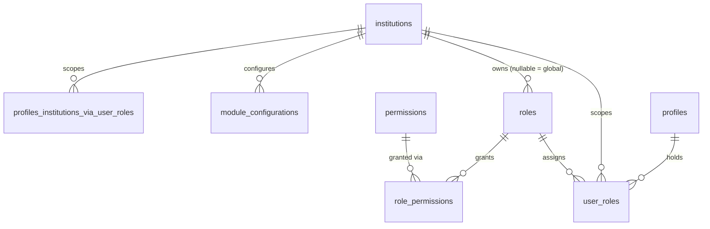
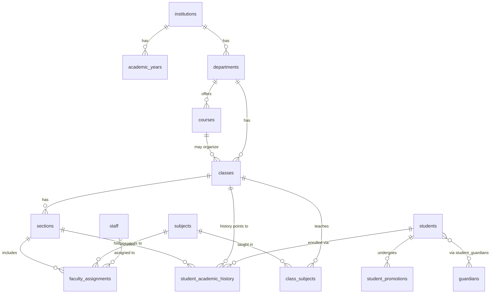
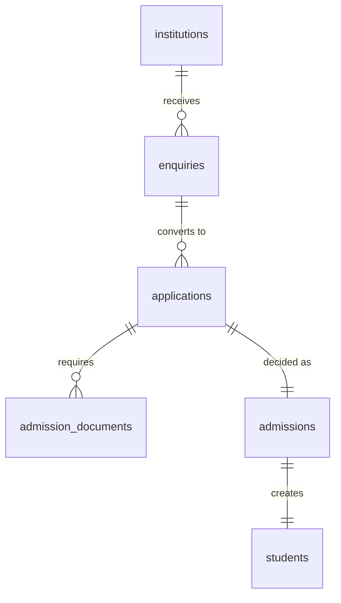
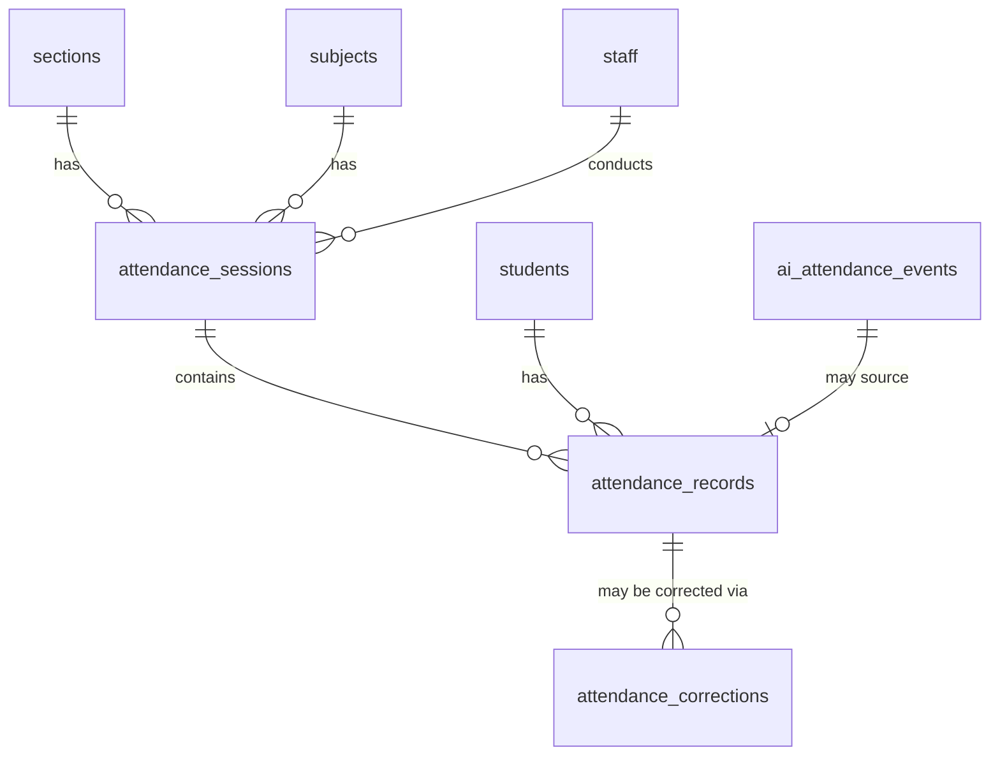
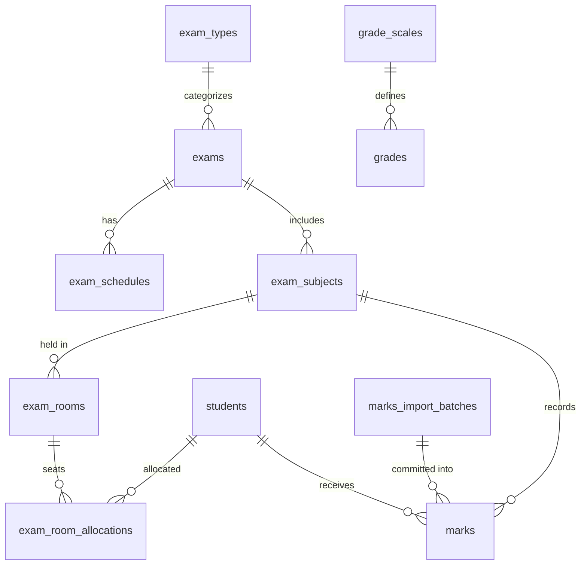
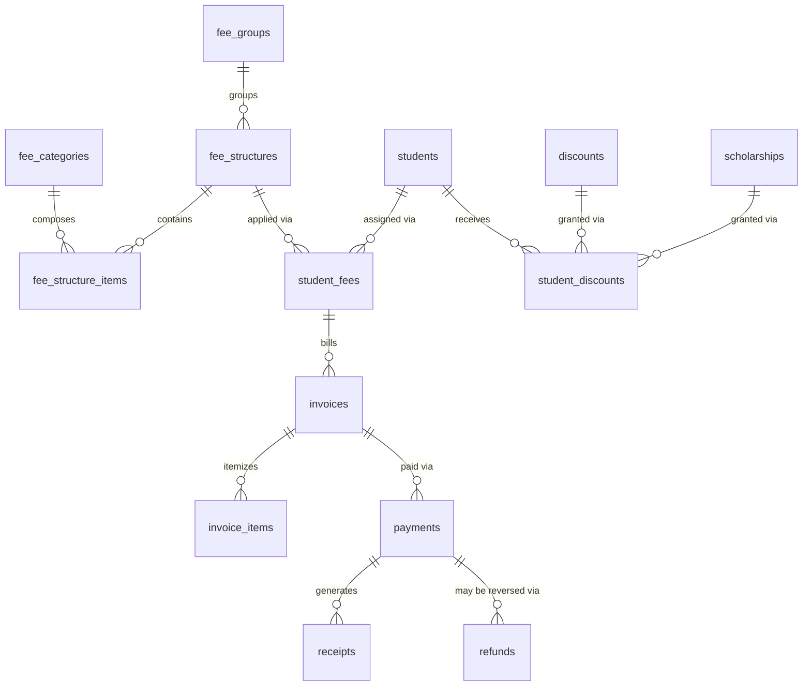
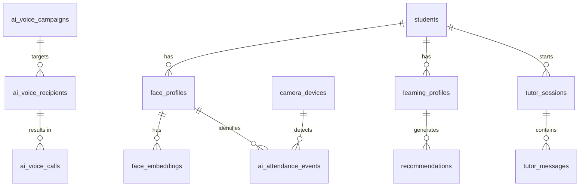

# VID — Multi-Tenant Education ERP Database Architecture
**Single source of truth for database + Node.js/Express backend implementation**
Stack: React · Node.js/Express · PostgreSQL · Supabase (Auth + RLS + Storage)

---

## 1. Executive Summary

VID is a multi-institution SaaS Education ERP. One student master record feeds every
connected workspace (Admissions → Academics → Faculty → Timetable → Attendance →
Examinations → Finance → Documents → HRMS → AI Yantra → Optional modules).

Architecture decisions at a glance:

- **Tenancy:** row-level, `institution_id` on every tenant-owned table, enforced by
  Supabase RLS + Express middleware (defense in depth, never frontend-only).
- **Identity:** `auth.users` (Supabase-managed) → `profiles` (1:1 app identity) →
  `user_roles` (role + institution scope) → `role_permissions` (RBAC).
- **Primary keys:** UUID everywhere (`gen_random_uuid()`); human-facing business
  identifiers (admission number, employee code, institution code) are separate
  `UNIQUE` columns, tenant-scoped where relevant.
- **History:** academic enrollment, promotions, attendance corrections, marks
  corrections, and fee transactions are **append-only / historized** — never
  destructively overwritten.
- **Normalization:** 3NF baseline; JSONB reserved for genuinely dynamic data
  (AI payloads, device metadata, audit snapshots, module config) — never as a
  substitute for relational modeling.
- **Files:** object storage holds binaries; the database stores metadata + a
  storage key/reference only.
- **Optional modules** (Events, Transport, Hostel, Library, Sports, Inventory)
  are schema-isolated, gated by a `module_configurations` table, and reference
  the shared `students`/`profiles` core — no duplicate student records.

The output of this document + the accompanying `vid_schema_migrations.sql` is
intended to be handed to an implementation agent as-is.

---

## 2. Requirements Extracted From PDF (condensed)

| Requirement | PDF Section | Module | Entity | DB Impact |
|---|---|---|---|---|
| One student master record used across all modules | §8 | Core | `students` | No per-workspace student duplication; all modules FK to `students.id` |
| Multi-institution SaaS, no cross-tenant access | §4 | Platform | `institutions` + all tenant tables | `institution_id` on every tenant table; RLS |
| RBAC scoped to institution + resource | §5 | Auth | `roles`, `permissions`, `role_permissions`, `user_roles` | Resource-level authorization tables, not hardcoded checks |
| Admission lifecycle: Enquiry→Application→Verify→Approve→Student | §7 | Admissions | `enquiries`, `applications`, `admission_documents` | Status-driven workflow; student created on approval |
| Academic hierarchy: Institution→Year→Department→Course→Class→Section→Subject→Faculty→Student | §9 | Academics | `academic_years`…`subjects` | Strict parent/child FKs, not flattened |
| Historical class/section changes must be preserved | §9 | Academics | `student_academic_history` | Insert-new-row-on-change, never UPDATE in place |
| Faculty scoped to assigned classes/sections/subjects | §10 | Faculty | `faculty_assignments` | Junction table drives authorization scope |
| Attendance has AI + manual sources, must be verified before final | §11 | Attendance | `attendance_sessions`, `attendance_records`, `ai_attendance_events` | Two-stage: raw event → verified record |
| Excel marks import must validate before commit | §12 | Examinations | `marks_import_batches`, `marks` | Staging table + validation before insert into `marks` |
| Finance transactions must be auditable, not overwritten | §13 | Finance | `invoices`, `payments`, `transactions`, `receipts` | Append-only ledger pattern, `RESTRICT` on delete |
| Documents support PDF/JPG/PNG/DOC/DOCX, generic owner | §14 | Documents | `documents` | Polymorphic `owner_type`/`owner_id` + object storage key |
| Payroll may be external | §14 | HRMS | `staff` | No payroll ledger tables in v1; integration boundary only |
| Timetable conflict detection (teacher/room/class/section/period) | §15 | Timetable | `timetable_entries` | Composite `UNIQUE` constraints + application-level conflict check |
| AI Yantra = exactly 3 workspaces | §16 | AI Yantra | voice/attendance/tutor tables | No additional AI workspace tables |
| Biometric data needs strong security & retention controls | §18 | AI Attendance | `face_embeddings` | Encrypted at rest, restricted RLS, retention policy documented |
| Optional modules independently enabled/disabled | §20 | Platform | `module_configurations` | Per-institution toggle; app hides nav, DB tables always exist |
| Parent manages multiple children from one login | §21 | Students | `student_guardians` | N:M junction between `profiles` (parent) and `students` |
| Audit trail: actor, action, resource, old/new value, timestamp, institution | §26 | Shared | `audit_logs` | Generic audit table + triggers on sensitive tables |
| No Communication workspace — notifications are a shared service | §26 | Shared | `notifications`, `notification_templates` | Cross-module table, not module-owned |
| institution_id on every tenant-owned entity, directly or via secured parent | §25 | Platform | all | Direct column on high-volume/RLS-critical tables; derivable elsewhere |

*(Full per-page traceability is in §35; this table is the representative summary — every module in the PDF's domain list in §25 is covered in the schema.)*

---

## 3. Assumptions and Ambiguities

Flagged explicitly — none of these were silently invented:

1. **ASSUMPTION** — PDF names a Python/FastAPI stack in §24, but your instruction
   (and the prompt document) overrides this to **Node.js + Express**. This document
   follows Node.js/Express throughout, per your explicit instruction, not the PDF.
2. **ASSUMPTION** — "Classes" in the PDF (§9, §25) means a grade/standard level
   (e.g., "Class 8"), not a single scheduled lecture. Modeled as `classes`
   (grade level) with `sections` (e.g., "8-A") underneath. A scheduled lecture
   instance lives in `timetable_entries`.
3. **ASSUMPTION** — "Course" sits between Department and Class in the academic
   hierarchy diagram (§9) but is not separately defined. Modeled as an optional
   intermediate grouping (e.g., a stream/program under a department) — nullable
   parent, since not every institution type (e.g., K-12 vs degree college) needs it.
4. **ASSUMPTION** — Payroll (§14) is out of scope for schema generation; only a
   `staff.payroll_reference` free-text field is provided as an external-system hook.
5. **ASSUMPTION** — Report cards (§12) are modeled as a generated artifact
   (a view + a `documents` record when exported to PDF), not a separately
   stored mutable table, since the PDF lists them under Reports, not data entry.
6. **ASSUMPTION** — Vehicle live tracking (Transport, §20) is **not** persisted
   in PostgreSQL — real-time location is a Redis/streaming concern per the
   architecture diagram (§3, which lists Redis for live/background concerns).
   Only route/stop/allocation data is relational.
7. **ASSUMPTION** — "Global Roles/Permissions" (Super Admin, §6) vs institution
   custom roles are unified into one `roles` table with a nullable
   `institution_id` (`NULL` = system/global role, e.g., Super Admin).
8. **ASSUMPTION** — Institution hard-deletion is out of scope; institutions are
   deactivated (`status`), never deleted, given the SaaS billing/audit
   implications the PDF describes (§6 Plans/Subscriptions).
9. **INFERRED** — Fee structures need line-item breakdown (`fee_structure_items`)
   even though the PDF only lists `fee_structures` at entity level (§25), because
   §13's pages list "Categories, Groups" implying a structure is composed of
   multiple category amounts.
10. **INFERRED** — Exam seating (`exam_room_allocations`) is a distinct
    entity from `exam_rooms` because §12 lists "Student Allocation" as a
    separate page from "Exam Rooms".

---

## 4. Domain Model

### Canonical shared/core entities (used by many workspaces — never duplicated)
`institutions`, `profiles`, `students`, `staff` (faculty + non-teaching, via `profiles`),
`departments`, `academic_years`, `classes`, `sections`, `subjects`, `documents`, `rooms`.

### Workspace-specific entities
Each domain below owns entities that reference the shared core but are not
themselves shared.

```
CORE            → institutions, profiles, roles, permissions, role_permissions,
                  user_roles, module_configurations
ACADEMIC        → academic_years, departments, courses, classes, sections,
                  subjects, curriculum, syllabus, faculty_assignments,
                  student_academic_history, student_promotions
ADMISSIONS      → enquiries, applications, applicants, admission_documents
STUDENT         → students, guardians, student_guardians
FACULTY/HRMS    → staff, staff_employment, designations, staff_attendance,
                  leave_types, leave_requests, staff_workload
ATTENDANCE      → attendance_sessions, attendance_records, attendance_corrections
EXAMINATION     → exam_types, exams, exam_schedules, exam_subjects, exam_rooms,
                  exam_room_allocations, invigilators, question_papers, marks,
                  marks_import_batches, grade_scales, grades
FINANCE         → fee_categories, fee_groups, fee_structures, fee_structure_items,
                  student_fees, invoices, invoice_items, payments,
                  payment_gateway_transactions, discounts, scholarships,
                  student_discounts, refunds, receipts
DOCUMENTS       → document_types, documents, document_templates,
                  document_verifications, document_requests
TIMETABLE       → periods, timetables, timetable_entries, substitutions, rooms
AI YANTRA       → ai_voice_campaigns, ai_voice_recipients, ai_voice_calls,
                  ai_voice_templates, face_profiles, face_embeddings,
                  camera_devices, ai_attendance_events, tutor_sessions,
                  tutor_messages, learning_profiles, recommendations,
                  practice_questions
OPTIONAL        → events*, transport*, hostel*, library*, sports*, inventory*
                  (each namespaced, listed fully in §5/§26)
SHARED SERVICES → audit_logs, notifications, notification_templates
```

Entity categorization:

| Category | Examples |
|---|---|
| Master data | `institutions`, `students`, `staff`, `subjects`, `departments` |
| Transaction data | `payments`, `attendance_records`, `marks`, `ai_attendance_events` |
| Configuration | `module_configurations`, `fee_structures`, `period` config, `roles` |
| Reference/lookup | `grade_scales`, `fee_categories`, `leave_types`, `document_types` |
| Historical | `student_academic_history`, `student_promotions`, `attendance_corrections` |
| Audit | `audit_logs` |
| Junction/relationship | `role_permissions`, `user_roles`, `student_guardians`, `faculty_assignments`, `student_discounts` |


---

## 5. Complete Entity-Field Specification (representative core entities)

Full field lists for **every** table are authoritative in `vid_schema_migrations.sql`
(the SQL is the field-level source of truth for all ~100+ tables). Below are the
field analyses for the highest-traffic, highest-risk entities, showing the
reasoning (derived vs. stored, enum vs. reference table, index need).

### `institutions`

| Field | Type | Req | Null | Default | PK/FK | Unique | Notes |
|---|---|---|---|---|---|---|---|
| id | UUID | Y | N | gen_random_uuid() | PK | | |
| code | TEXT | Y | N | | | Y (global) | business identifier, e.g. `SPH001` |
| name | TEXT | Y | N | | | | |
| status | institution_status (ENUM) | Y | N | 'active' | | | small fixed set → ENUM is fine |
| plan_id | UUID | N | Y | | FK → `subscription_plans` | | billing |
| settings | JSONB | N | Y | '{}' | | | genuinely dynamic per-institution config — correct JSONB use |
| created_at/updated_at | TIMESTAMPTZ | Y | N | now() | | | |

### `profiles`

1:1 extension of `auth.users`. `id` **is** `auth.users.id` (not a separate UUID),
so authentication and application identity never drift apart, and no password
or credential is duplicated in application tables.

| Field | Type | Notes |
|---|---|---|
| id | UUID PK, FK → `auth.users.id` ON DELETE CASCADE | identity is owned by Supabase Auth |
| full_name | TEXT NOT NULL | |
| phone | TEXT | validated at app layer (E.164) |
| avatar_url | TEXT | storage reference, not binary |
| default_institution_id | UUID FK → institutions, NULL for Super Admin | UX convenience, not authorization |
| status | profile_status ENUM | active/suspended |

A user's **authorization** never comes from `profiles` directly — it comes from
`user_roles`, which is institution-scoped. `profiles` is identity, not access.

### `students`

| Field | Type | Req | Null | Notes |
|---|---|---|---|---|
| id | UUID | Y | N | PK |
| institution_id | UUID | Y | N | FK → institutions, RESTRICT |
| admission_number | TEXT | Y | N | UNIQUE(institution_id, admission_number) — tenant-scoped business id |
| profile_id | UUID | N | Y | FK → profiles, nullable (student may not have login credentials, esp. younger grades) |
| first_name, last_name | TEXT | Y | N | |
| date_of_birth | DATE | Y | N | |
| gender | TEXT/ENUM | N | Y | reference table if institution needs custom options; ENUM sufficient for v1 |
| current_class_id, current_section_id | UUID | Y | N | FK, **denormalized current pointer** — the authoritative history lives in `student_academic_history`; this column is a read-optimization, kept in sync by trigger |
| admission_id | UUID | Y | N | FK → admissions (traceability to how they entered) |
| status | student_status ENUM | Y | N | active/inactive/graduated/transferred/dropped |
| created_at/updated_at/created_by/updated_by | | Y | | audit |

`current_class_id`/`current_section_id` are an **intentional denormalization**
(see §13) — justified because nearly every query in Attendance, Timetable,
Finance and Examinations needs "what class is this student in *right now*"
and re-deriving it from history on every read is expensive at scale. Risk:
drift. Mitigation: only ever written by the `promote_student()` function,
never by direct UPDATE from the API layer (enforced via trigger + no direct
grant on those two columns for the app role).

### `attendance_records`

| Field | Type | Notes |
|---|---|---|
| id | UUID PK | |
| institution_id | UUID NOT NULL | direct for RLS performance |
| session_id | UUID NOT NULL FK → attendance_sessions RESTRICT | |
| student_id | UUID NOT NULL FK → students RESTRICT | never CASCADE — attendance is a legal/historical record |
| status | attendance_status ENUM (present/absent/late/excused) | small fixed domain → ENUM |
| source | attendance_source ENUM (manual/ai_face/cctv) | |
| ai_event_id | UUID NULL FK → ai_attendance_events SET NULL | raw AI event this was derived from, if any |
| verified_by | UUID NULL FK → profiles SET NULL | teacher/admin who confirmed |
| verified_at | TIMESTAMPTZ NULL | NULL = pending verification |
| is_final | BOOLEAN NOT NULL DEFAULT false | AI-sourced rows start false; flipped true on verification — matches PDF's "must pass validation before final" rule |

**Derived, not stored:** attendance percentage per student/subject — always
computed via the `student_attendance_summary` view (§23), never a stored column,
to avoid staleness.

### `payments` / `invoices`

Financial tables use an **append-only ledger** pattern: an `invoices` row is
never edited after issuance except its `status`; a `payments` row is never
edited or deleted after settlement. Refunds are new rows in `refunds`
referencing the original payment, not a mutation of it. `DELETE` is disallowed
at the grant level for the application DB role on `payments`, `invoices`,
`marks`, `attendance_records` — corrections happen via compensating rows,
which is the same reasoning the PDF calls out explicitly (§13, §12).

---

## 6. Relationship Model (key cardinalities)

| Parent | Child | Cardinality | Optional? | FK | On Delete | Meaning |
|---|---|---|---|---|---|---|
| institutions | academic_years | 1:N | No | academic_years.institution_id | RESTRICT | |
| institutions | departments | 1:N | No | departments.institution_id | RESTRICT | |
| departments | courses | 1:N | Yes (course nullable) | courses.department_id | RESTRICT | |
| courses/departments | classes | 1:N | No | classes.department_id | RESTRICT | |
| classes | sections | 1:N | No | sections.class_id | RESTRICT | |
| sections | subjects | N:M | via `class_subjects` | | RESTRICT | one subject can be taught across many sections |
| students | subjects | N:M | via `student_academic_history` implies enrolled subjects per term, or `class_subjects` if subject choice is class-wide | | | see note below |
| staff | subjects/classes/sections | N:M | via `faculty_assignments` | | RESTRICT | scopes faculty authorization |
| students | guardians | N:M | via `student_guardians` | | CASCADE (junction only) | one parent, many children (§21) |
| students | student_academic_history | 1:N | No | RESTRICT | full enrollment history, append-only |
| exams | exam_subjects | 1:N | No | RESTRICT | |
| exam_subjects | marks | 1:N | No | RESTRICT | one row per student per exam_subject |
| students | invoices | 1:N | No | RESTRICT | |
| invoices | payments | 1:N | Yes (unpaid invoice has zero) | RESTRICT | partial payments supported |
| profiles | audit_logs | 1:N | Yes (system actions) | SET NULL | actor may later be deleted from auth |
| institutions | module_configurations | 1:N | No | CASCADE | pure config, safe to cascade |

No comma-separated ID lists and no arrays are used to represent relationships
anywhere in the schema — every N:M is a proper junction table (`role_permissions`,
`user_roles`, `student_guardians`, `faculty_assignments`, `class_subjects`,
`student_discounts`, `event_registrations`, `team_members`, etc.).

---

## 7. Multi-Tenant Architecture

```
institutions (tenant root)
     │
     ├── profiles / user_roles  (who can act, and as what role, in this tenant)
     ├── academic structure     (academic_years → departments → classes → sections → subjects)
     ├── students / staff       (who the ecosystem is about)
     └── workspace data         (admissions, attendance, exams, finance, documents,
                                 timetable, AI Yantra, optional modules)
```

Rules applied per entity:

- **Global (no `institution_id`):** `permissions` (fixed system catalog),
  `grade_scales` if you choose a platform-standard scale — modeled here as
  tenant-scoped since institutions differ; `document_types` reference (global,
  since PDF/JPG/etc. are universal); `auth.users`.
- **Tenant-direct (`institution_id` column present):** every master/transaction
  table with meaningful query volume — `students`, `staff`, `attendance_records`,
  `payments`, `marks`, `documents`, etc. Direct column chosen over "derive via
  join" for RLS and index performance at scale (a `WHERE institution_id = X`
  index scan beats a multi-join RLS predicate on every request).
- **Tenant-derived (no own `institution_id`, inherits via parent FK):** pure
  junction/detail tables with no independent existence — `invoice_items`,
  `exam_subjects`, `role_permissions`. RLS on these joins to the parent.
- **Integrity guard against drift:** a `BEFORE INSERT/UPDATE` trigger
  (`enforce_tenant_consistency()`) checks that a row's `institution_id` matches
  its parent's `institution_id` wherever both exist (e.g., a `students` row's
  `institution_id` must equal its `admissions.institution_id`). This prevents
  the classic multi-tenant bug of a foreign key that silently crosses tenants.

Isolation is enforced at four layers, not just RLS:

1. **Database** — RLS policies (see §19) on every tenant table.
2. **API/authorization middleware** — Express middleware resolves the caller's
   institution from `user_roles` and rejects any request whose
   path/body/query references a different `institution_id`, before the query
   even reaches Postgres (defense in depth, and better error messages).
3. **File storage** — Supabase Storage bucket paths are namespaced
   `institutions/{institution_id}/...` with storage-level RLS mirroring DB RLS.
4. **AI context** — AI Yantra service calls are scoped server-side to a single
   `institution_id` per request; the AI layer never receives a raw DB
   connection or unrestricted query capability (§16 non-negotiable rule #11).

---

## 8. Supabase Architecture

```
auth.users  (Supabase-managed: email, password hash, MFA — never touched by app tables)
     │  (1:1, id shared)
profiles    (app identity: name, phone, avatar, default institution)
     │  (1:N)
user_roles  (role_id, institution_id, granted_by, granted_at)
     │
role_permissions ── roles ── permissions
```

- Supabase Auth owns credentials entirely; **no password/secret is ever stored
  in an application table** (PDF non-negotiable §14, prompt rule #11).
- `profiles` is created automatically via a Postgres trigger on
  `auth.users` insert (`handle_new_user()`), so app identity and auth identity
  can never desync.
- RLS is the primary enforcement layer at the database edge; Express
  middleware is the secondary/defense-in-depth layer (never rely on one alone).
- **Database functions** used for: tenant-consistency checks, student
  promotion (atomic multi-table write), attendance finalization, invoice
  numbering, audit logging triggers.
- **Views** used for: read-heavy aggregate/reporting queries (§23)
  — never for write paths.
- **Storage** used for: student photos, documents, question papers, receipts,
  report cards, face images/embeddings' source images (never the embeddings
  themselves, which are numeric vectors stored encrypted in Postgres/pgvector).
- **Realtime** is justified only for: live attendance verification queues,
  exam-room live seating status, voice-agent call queue status — genuinely
  live UI, not general CRUD (over-using Realtime creates unnecessary
  replication load).

---

## 9. Authentication Architecture

```
Login (email/phone + password, or OAuth)
        ↓
Supabase Auth issues JWT (contains auth.uid())
        ↓
Express auth middleware verifies JWT (Supabase JWKS)
        ↓
Loads caller's profiles + user_roles for the target institution_id
        ↓
Authorization middleware checks role/permission for the requested action
        ↓
Controller executes; PostgREST/pg client call carries auth.uid() into RLS
```

- JWT refresh handled by Supabase client libraries (rotation, not reinvented).
- The Express layer treats the JWT as the source of truth for `auth.uid()`;
  it never re-implements session state.
- Service-role key (bypasses RLS) is used **only** by trusted backend
  background jobs (promotion batch jobs, nightly fee-status recompute), never
  exposed to any client-facing endpoint.

---

## 10. RBAC / Permissions

```
roles              (id, institution_id NULLABLE, name, is_system_role)
permissions        (id, code, description)         -- e.g. 'attendance.create'
role_permissions   (role_id, permission_id)         -- N:M
user_roles         (profile_id, role_id, institution_id, scope JSONB)
```

- `roles.institution_id IS NULL` → global/system role (Super Admin only).
  Otherwise the role is scoped to one institution — an Institution Admin
  role created for Institution A cannot be assigned in Institution B.
- `permissions.code` is a flat namespaced string catalog
  (`attendance.create`, `finance.invoice.approve`, `exams.marks.verify`, …) —
  a reference table, not an ENUM, because the permission catalog grows as
  modules are added without a schema migration.
- **Resource-level scoping** (the PDF's Faculty example: assigned
  classes/sections/subjects only) is **not** modeled inside `user_roles` —
  it's modeled in the domain-specific junction table (`faculty_assignments`
  for faculty, `parent-child` via `student_guardians` for parents). The
  authorization middleware combines "does this role have permission X" (RBAC)
  with "does this junction row prove this user is scoped to this specific
  resource" (resource-level check) — exactly the PDF's five-part check:
  `User + Role + Institution + Permission + Resource + Action`.
- No business table hardcodes a role check (e.g., no `IF role = 'faculty'`
  inside a `payments` table or trigger) — all authorization decisions live in
  RBAC tables + RLS + middleware, never scattered into business tables.


---

## 11. Academic Data Model

```
institution → academic_year → department → course(optional) → class → section
                                                                    │
                                                                    ├── class_subjects (N:M classes↔subjects)
                                                                    └── faculty_assignments (staff × subject × section × academic_year)
                                                                              │
                                                                        students (via student_academic_history)
```

These terms are **not** treated as interchangeable, per instruction:

| Term | Table | Meaning |
|---|---|---|
| Academic Year | `academic_years` | e.g. 2026–27, has `start_date`/`end_date`, one `is_current` per institution |
| Department | `departments` | organizational/academic division |
| Course | `courses` | optional stream/program under a department (ASSUMPTION #3) |
| Class | `classes` | grade/standard level, scoped to an academic_year + department |
| Section | `sections` | a division within a class, e.g. "8-A" |
| Subject | `subjects` | a taught subject, linked to classes via `class_subjects` |

**Historical preservation** (the PDF's explicit rule — moving Section A→B must
not overwrite history):

`student_academic_history` is **append-only**: a new row is inserted for
every class/section/academic_year change, with `effective_from`/`effective_to`.
The current row (`effective_to IS NULL`) is the source that syncs
`students.current_class_id`/`current_section_id` via trigger. Nothing is ever
UPDATEd or DELETEd in this table by the application role — only inserted.

`student_promotions` records the promotion/demotion **event** itself
(from_class, to_class, academic_year, decision, decided_by, decided_at),
separate from the history log, because a promotion is a business decision
with its own approval workflow, while `student_academic_history` is the
resulting state timeline. Faculty and subject reassignment follow the same
append-only pattern via `faculty_assignments.effective_from/effective_to`.

---

## 12. Workspace/Data Ownership Model

- **Shared/core** (owned by no single workspace, referenced everywhere):
  `institutions`, `profiles`, `students`, `staff`, `academic_years`,
  `departments`, `classes`, `sections`, `subjects`, `documents`, `rooms`.
- **Workspace-owned** (created and primarily read/written by one workspace,
  but referencing the shared core by FK, never copying it):
  every table listed in §4's workspace groupings.
- No workspace stores its own copy of student name/DOB/contact — every
  workspace table that needs "this student" stores `student_id` (FK) only.
- Optional modules (`events`, `transport`, `hostel`, `library`, `sports`,
  `inventory`) are schema-present for every institution but functionally
  gated: the API layer checks `module_configurations` before serving any
  optional-module endpoint, and the nav layer hides disabled modules. This
  means disabling a module is instant and reversible with zero data loss —
  the PDF's requirement that disabled modules must disappear from navigation
  but the platform must never require a schema change to re-enable one.

---

## 13. Normalization Analysis

Baseline is 3NF. Deliberate denormalizations, each justified:

| Denormalization | Why | Risk | Consistency mechanism |
|---|---|---|---|
| `students.current_class_id/current_section_id` | Avoid re-deriving "current class" from history on every hot-path read (attendance, timetable, finance all need it) | Drift if written directly | Only `promote_student()`/enrollment functions write it; no direct grant on those columns |
| `institution_id` duplicated on child tables instead of only on root | RLS/index performance at scale — avoids deep joins on every request | Cross-tenant FK bug | `enforce_tenant_consistency()` trigger validates against parent |
| `invoices.total_amount` stored, not always summed from `invoice_items` live | Financial documents must be immutable once issued — recomputing live would let item edits silently change an already-issued invoice | Item/total mismatch if items ever edited | Items are immutable after issuance (no UPDATE grant); total is fixed at issuance time by a function |
| `student_fees.balance_due` maintained, not always computed | Frequent read (dashboards, parent app) vs. infrequent write (payment) | Staleness | Updated transactionally in the same DB function that inserts a `payments` row |

Explicitly avoided anti-patterns: no repeating groups (e.g., no `subject1, subject2, subject3` columns — always a junction table), no comma-joined ID lists, no transitive dependencies (e.g., `sections` does not store `department_id` — it's derived via `classes`).

JSONB usage — only where genuinely dynamic, never to dodge modeling:

| Table.column | Why JSONB is correct here |
|---|---|
| `institutions.settings` | Arbitrary per-institution feature flags/branding, shape varies |
| `module_configurations.config` | Per-module settings, shape differs per module |
| `ai_voice_calls.conversation_payload` | Raw external AI/telephony provider payload |
| `audit_logs.old_value` / `new_value` | Arbitrary before/after snapshot of any table's row |
| `camera_devices.metadata` | Vendor-specific device capabilities |

Never JSONB: anything with its own identity, lifecycle, or that needs to be
joined/filtered/aggregated relationally (fees, marks, attendance, enrollment,
roles/permissions) — all of these are proper tables.

---

## 14. Primary Key Strategy

- **All tables:** `id UUID PRIMARY KEY DEFAULT gen_random_uuid()`. Rationale:
  safe to generate client-side or pre-transaction, no leakage of row count/
  creation order, works uniformly across a multi-tenant system with many
  independent writers (including offline-capable mobile flows).
- **Business identifiers are separate, `UNIQUE` columns, not primary keys:**
  - `institutions.code` — globally unique (SaaS-level).
  - `students.admission_number` — `UNIQUE(institution_id, admission_number)`
    (tenant-scoped — two institutions may reuse the same admission number
    format independently).
  - `staff.employee_code` — `UNIQUE(institution_id, employee_code)`.
  - `courses.code`, `subjects.code` — `UNIQUE(institution_id, code)`.
  - `permissions.code` — globally unique (system catalog).

---

## 15. Constraints

Enforced at the database level wherever the rule is a genuine data-integrity
rule (not merely a UX validation):

- `NOT NULL` on every required field identified in §5/SQL.
- `UNIQUE` per §14, plus composite uniqueness for junctions
  (`UNIQUE(role_id, permission_id)`, `UNIQUE(student_id, guardian_id)`,
  `UNIQUE(faculty_id, subject_id, section_id, academic_year_id)`).
- `CHECK` constraints: `payments.amount > 0`, `attendance_records.status IN (...)`
  (redundant with ENUM but documents intent), `academic_years.end_date > start_date`,
  `exam_schedules.end_time > start_time`.
- `EXCLUDE` constraint (via `btree_gist`) on `timetable_entries` to prevent a
  teacher, room, or section from being double-booked in an overlapping
  period — this is the database-level backstop for the PDF's conflict
  detection requirement (§15), in addition to the application-level check
  that gives a friendly UI error before the constraint would fire.
- Node.js validation (Zod/express-validator) remains the **first** line for
  UX (immediate, field-level feedback) but every rule with real integrity
  consequences is duplicated at the DB level, per instruction — the database
  must stay correct even if accessed outside the API.


---

## 16. Delete/Update Strategy

No blanket `CASCADE`. Decided per relationship:

| Table | On parent delete | Rationale |
|---|---|---|
| `students` → `attendance_records`, `marks`, `payments`, `invoices` | RESTRICT | historical/legal records must survive; deleting a student record entirely should be a rare, explicit admin action that first requires these to be archived, not silently cascaded |
| `institutions` → everything | RESTRICT (institutions are deactivated, never deleted — Assumption #8) | |
| `academic_years`/`classes`/`sections` → `student_academic_history` rows referencing them | RESTRICT | history must remain queryable even if the structure is later reorganized |
| `roles` → `user_roles` | RESTRICT | never silently strip a user's access as a side effect |
| `role_permissions`, `student_guardians`, `class_subjects`, `event_registrations` (pure junctions) | CASCADE | deleting the junction row itself is the intended cleanup when either side is legitimately removed |
| `attendance_sessions` → `attendance_records` | RESTRICT | never delete a session that has records |
| `module_configurations` → (institution delete) | CASCADE | pure config, no independent value |
| `profiles` (via `auth.users` delete) → `audit_logs.actor_id` | SET NULL | preserve the audit event even if the actor account is later removed |
| `profiles` → `attendance_records.verified_by`, `payments.received_by` | SET NULL | preserve the transaction, lose only the "who" pointer |
| `face_profiles` → `face_embeddings` | CASCADE | embeddings have no meaning without the profile they belong to |
| `documents.owner` (polymorphic) | RESTRICT via app-layer check | no DB-level FK possible for polymorphic owner; app enforces before delete |

`UPDATE` behavior: financial and academic-history rows are **update-restricted**
at the grant level for the application role (no `UPDATE` privilege on
`payments`, `invoices` after issuance, `marks` after verification,
`attendance_records` after `is_final = true`) — corrections go through a
dedicated correction table (`attendance_corrections`) or a new compensating
row, preserving the original.

---

## 17. Audit Strategy

| Field | Applied to |
|---|---|
| `created_at`, `updated_at` | every table |
| `created_by`, `updated_by` (FK → profiles, `SET NULL`) | every tenant-owned table with meaningful write attribution |
| `deleted_at` (soft delete) | only where "hide but keep" is the right semantics and hard-delete would break history less cleanly than a status field: `staff`, `students` (paired with `status`), `documents` |
| Full audit event row (`audit_logs`) | triggered on: `payments`, `invoices`, `marks`, `attendance_records` (status/verification changes), `user_roles` (permission changes), `students` (status changes), `institutions` (status changes) |
| Immutable, no soft-delete needed | `payments`, `marks`, `attendance_records` — these are never deleted at all, only ever appended to or corrected via new rows, so `deleted_at` doesn't apply |

Not every table gets every audit field — e.g., pure lookup/reference tables
(`permissions`, `document_types`, `grade_scales`) get only `created_at` since
they're rarely written and never require actor attribution or soft-delete.

`audit_logs` schema captures exactly the PDF's example (actor, action,
resource, old_value, new_value, timestamp, institution, IP/device):

```
audit_logs(id, institution_id, actor_id, action, resource_table,
           resource_id, old_value JSONB, new_value JSONB,
           ip_address, user_agent, created_at)
```

populated by a generic `log_audit_event()` trigger function attached to the
sensitive tables above, plus explicit application-level calls for
non-table-mutation events (e.g., a login, a report export, a permission
check denial worth recording).

---

## 18. Indexing Strategy

| Table | Index | Columns | Purpose |
|---|---|---|---|
| every tenant table | btree | `institution_id` | RLS predicate + tenant-scoped listing queries |
| `students` | btree (composite) | `(institution_id, current_class_id, current_section_id)` | class/section roster queries |
| `students` | unique btree | `(institution_id, admission_number)` | lookup + uniqueness |
| `attendance_records` | btree (composite) | `(institution_id, student_id, session_id)` | per-student attendance history |
| `attendance_records` | btree partial | `(session_id) WHERE is_final = false` | fast "pending verification" queue |
| `payments` | btree | `(institution_id, student_id, created_at DESC)` | student payment history, recent-first |
| `invoices` | btree partial | `(institution_id, status) WHERE status = 'pending'` | dashboard "pending invoices" without scanning paid history |
| `marks` | btree | `(exam_subject_id, student_id)` unique | one mark per student per exam-subject, plus fast lookup |
| `timetable_entries` | GIST (via `btree_gist`) | `(faculty_id, day_of_week, period_id)` | conflict-detection EXCLUDE constraint support |
| `documents` | btree | `(owner_type, owner_id)` | polymorphic owner lookup |
| `audit_logs` | btree | `(institution_id, resource_table, resource_id, created_at DESC)` | "history of this record" queries |
| `face_embeddings` | none beyond FK | — | never indexed for full-table similarity search in the relational store; vector search (if enabled) uses a dedicated `pgvector` index scoped narrowly, or an external vector DB, per §8's Realtime/vector-search note |

Deliberately **not** indexed: low-cardinality boolean/enum columns alone
(e.g., a bare index on `attendance_records.status`) — always paired with
`institution_id`/`student_id` in a composite, since a bare low-cardinality
index rarely helps the planner and adds write overhead for no benefit.

---

## 19. Supabase RLS Design

Security model:

```
auth.uid()  →  profiles  →  user_roles (institution_id, role_id)  →  role_permissions  →  permissions
                                    │
                             RLS policy predicate
                                    │
                          institution-scoped table row
```

Helper functions (defined once, reused in every policy):

```sql
-- returns the set of institution_ids the caller has ANY role in
create or replace function auth.my_institution_ids()
returns setof uuid language sql stable as $$
  select institution_id from public.user_roles where profile_id = auth.uid();
$$;

-- returns true if the caller holds a permission code within an institution
create or replace function auth.has_permission(p_institution_id uuid, p_code text)
returns boolean language sql stable as $$
  select exists (
    select 1 from public.user_roles ur
    join public.role_permissions rp on rp.role_id = ur.role_id
    join public.permissions p on p.id = rp.permission_id
    where ur.profile_id = auth.uid()
      and ur.institution_id = p_institution_id
      and p.code = p_code
  );
$$;
```

Representative policies (the same pattern is applied to every tenant table
in the SQL file — never `USING (true)` on a sensitive table):

```sql
-- students: read scoped to institution + permission; write scoped further
alter table public.students enable row level security;

create policy students_select on public.students for select
  using (institution_id in (select auth.my_institution_ids())
         and auth.has_permission(institution_id, 'students.read'));

create policy students_insert on public.students for insert
  with check (institution_id in (select auth.my_institution_ids())
              and auth.has_permission(institution_id, 'students.create'));

create policy students_update on public.students for update
  using (institution_id in (select auth.my_institution_ids())
         and auth.has_permission(institution_id, 'students.update'))
  with check (institution_id in (select auth.my_institution_ids()));

-- no DELETE policy is created for students at all: hard delete is
-- intentionally unreachable through the API/RLS surface (soft delete only)
```

```sql
-- faculty resource-level scoping example: a faculty member only sees
-- attendance sessions for sections/subjects they are assigned to
create policy attendance_sessions_select_faculty on public.attendance_sessions
  for select using (
    institution_id in (select auth.my_institution_ids())
    and (
      auth.has_permission(institution_id, 'attendance.read.all')
      or exists (
        select 1 from public.faculty_assignments fa
        where fa.staff_id = (select id from public.staff where profile_id = auth.uid())
          and fa.section_id = attendance_sessions.section_id
          and fa.subject_id = attendance_sessions.subject_id
          and fa.effective_to is null
      )
    )
  );
```

```sql
-- parent access: only their own linked children's data
create policy students_select_parent on public.students
  for select using (
    exists (
      select 1 from public.student_guardians sg
      where sg.student_id = students.id
        and sg.guardian_profile_id = auth.uid()
    )
  );
```

`profiles` is identity, not institution-scoped by column, so it gets its own
pattern rather than Pattern A: every user may read/update only their own row
(`id = auth.uid()`); institution admins may additionally *read* (never write)
profiles of users holding a role in their institution, via a join through
`user_roles`. Without this, any authenticated client could read or edit any
user's profile across every institution — this was caught and fixed during
verification (see §36).

`face_embeddings` (biometric data) gets the tightest policy of any table —
only the AI Attendance service role and Institution Admins with an explicit
`ai_attendance.biometric.read` permission may `SELECT`; no ordinary staff
role, including teachers, can read raw embeddings, only the derived
`attendance_records`.

---

## 20. Node.js/Express Backend Integration

```
React (TanStack Query)
   ↓ REST, versioned /api/v1/*
Express Router
   ↓
Auth middleware        — verifies Supabase JWT, attaches req.user
   ↓
Authorization middleware — loads user_roles for req.params.institutionId,
                            checks permission code for the route + resource
   ↓
Validation middleware   — Zod schema per route
   ↓
Controller              — thin, orchestrates service calls
   ↓
Service layer           — business rules, transaction boundaries
   ↓
Data layer (Supabase JS client / pg with RLS-respecting session, or
service-role client only for trusted background jobs)
```

Per-module mapping (representative — the same shape repeats for every
module listed in §25):

| Module | Resource | Method | Endpoint | Tables touched | Transaction? |
|---|---|---|---|---|---|
| Admissions | Application | POST | `/api/v1/admissions/applications` | applications | No |
| Admissions | Approve | POST | `/api/v1/admissions/applications/:id/approve` | applications, students, guardians, student_guardians, student_academic_history, admissions | **Yes** (single DB transaction — see §21) |
| Academics | Promotion | POST | `/api/v1/academics/promotions` | student_promotions, student_academic_history, students | **Yes** |
| Attendance | Mark session | POST | `/api/v1/attendance/sessions/:id/records` | attendance_sessions, attendance_records | No (bulk insert, single statement) |
| Attendance | Verify | POST | `/api/v1/attendance/records/:id/verify` | attendance_records, audit_logs | No |
| Examinations | Import marks | POST | `/api/v1/examinations/marks/import` | marks_import_batches, marks | **Yes** (staged validation, commit-or-reject as one unit) |
| Finance | Record payment | POST | `/api/v1/finance/payments` | payments, invoices, student_fees, receipts | **Yes** |
| Documents | Upload | POST | `/api/v1/documents` | documents (+ Supabase Storage) | No |
| Timetable | Create entry | POST | `/api/v1/timetable/entries` | timetable_entries | No (DB EXCLUDE constraint is the integrity backstop) |

Business rules that belong in Node.js rather than Postgres: fee proration
logic, AI confidence-threshold decisions, notification fan-out, PDF/report
generation, conflict pre-check UX (friendly errors before hitting the DB
constraint). Rules that belong in Postgres regardless of the API layer:
uniqueness, referential integrity, the timetable EXCLUDE constraint, check
constraints on amounts/dates, RLS.

---

## 21. Transaction Design

Atomic operations identified from the PDF's workflows, each implemented as a
single Postgres transaction (via a `SERIALIZABLE`-appropriate or default
`READ COMMITTED` transaction from the Express service layer, or a Postgres
function called via RPC for the ones that must also be safely callable from
trusted background jobs):

1. **Admission approval** — create `students` row, create/link `guardians`
   via `student_guardians`, insert first `student_academic_history` row, set
   `students.current_class_id/current_section_id`, update `applications.status`.
   All-or-nothing: a partially created student (e.g., no guardian link) is
   never visible.
2. **Student promotion** — insert `student_promotions` decision row, close
   the current `student_academic_history` row (`effective_to = now()`),
   insert the new one, update `students.current_class_id/current_section_id`.
3. **Marks import commit** — after staging + validation in
   `marks_import_batches`, the commit step inserts/upserts into `marks` in
   one transaction; any row failing validation aborts the whole batch (no
   silent partial commit — matches the PDF's explicit rule).
4. **Payment recording** — insert `payments`, insert `receipts`, update
   `student_fees.balance_due` and `invoices.status`, all together — a
   payment must never exist without updating the balance it paid down.
5. **Attendance session finalize** — bulk-insert `attendance_records` for a
   whole section in one statement/transaction, so a session is never left
   half-recorded.

---

## 22. Database Functions and Triggers

Kept deliberately minimal — only where they provide real integrity value:

| Function/Trigger | Purpose |
|---|---|
| `handle_new_user()` (trigger on `auth.users` insert) | auto-creates matching `profiles` row |
| `set_updated_at()` (trigger, all tables) | maintains `updated_at` |
| `enforce_tenant_consistency()` (trigger, tenant tables with a tenant-owned parent) | rejects a row whose `institution_id` doesn't match its parent's |
| `log_audit_event()` (trigger, sensitive tables listed in §17) | writes to `audit_logs` with old/new JSONB |
| `promote_student(...)` (function, called in a transaction) | implements the promotion workflow in §21 atomically |
| `finalize_attendance_session(...)` (function) | flips `attendance_records.is_final = true` for a session after verification, and denies further edits |
| `record_payment(...)` (function) | implements payment workflow §21 atomically |
| `generate_invoice_number()` (function, default on `invoices.invoice_number`) | tenant-scoped sequential/human-readable numbering without exposing raw row counts |

Not created: generic "audit everything" triggers on every table (audit noise
without value on pure reference tables), or triggers that reimplement logic
better suited to the Node.js service layer (notification fan-out, PDF
generation) — kept out of Postgres per instruction #21/#17 ("do not create
triggers simply because they are possible").

---

## 23. Database Views

| View | Purpose | Source tables | Consumers | Type |
|---|---|---|---|---|
| `student_academic_summary` | current class/section/faculty/subjects for a student, one-row lookup | students, sections, classes, class_subjects, faculty_assignments | Student/Parent app, Academics dashboard | normal |
| `student_attendance_summary` | attendance % per student per subject/term, computed live | attendance_records, attendance_sessions | Attendance dashboard, Parent app, AI Tutor (weak-area signal) | normal (recomputed each query — attendance changes are corrections, not high-frequency) |
| `student_fee_status` | balance due, last payment, overdue flag | student_fees, invoices, payments | Finance dashboard, Parent app | normal |
| `faculty_workload` | periods/week, sections, subjects per staff member | faculty_assignments, timetable_entries | HRMS, Timetable | normal |
| `exam_result_summary` | aggregated marks/grade per student per exam | marks, exam_subjects, grade_scales | Report cards, Examinations dashboard | normal |
| `attendance_verification_queue` | pending (`is_final = false`) AI attendance events needing human confirmation | attendance_records, ai_attendance_events | AI Attendance workspace | normal |

None are materialized in v1 — read volumes described in the PDF (dashboards,
per-student lookups) don't yet justify the staleness/refresh-schedule
trade-off of a materialized view; this is flagged in §33 as the first
candidate to revisit once real traffic data exists.


---

## 24. Complete ER Diagram

Shown as layered diagrams for legibility (the full ~100-table schema in one
diagram is unreadable) — together these represent the actual final schema in
`vid_schema_migrations.sql`.

### Core + Auth + RBAC


### Academic Structure + Student Core


### Admissions → Student Lifecycle


### Attendance


### Examinations


### Finance


### AI Yantra


---

## 25. Final Database Architecture

All tables live in the `public` schema (evaluated and rejected: separate
PostgreSQL schemas per module). Rationale: Supabase's PostgREST API and RLS
tooling are simplest against `public`; module boundaries are already
expressed clearly through table naming/prefixes (`ai_voice_*`, `hostel_*`,
`library_*`) and through the application's own routing, so a second layer of
schema-namespacing adds cross-schema FK/migration friction without a
corresponding real benefit at this scale.

```
CORE
├── institutions, module_configurations, subscription_plans
├── profiles, roles, permissions, role_permissions, user_roles
AUDIT/SHARED
├── audit_logs, notifications, notification_templates
ACADEMIC
├── academic_years, departments, courses, classes, sections, subjects,
├── class_subjects, curriculum, syllabus
STUDENT
├── students, guardians, student_guardians, student_academic_history,
├── student_promotions
ADMISSIONS
├── enquiries, applications, admission_documents, admissions
FACULTY/HRMS
├── staff, staff_employment, designations, faculty_assignments,
├── staff_attendance, leave_types, leave_requests, staff_workload
ATTENDANCE
├── attendance_sessions, attendance_records, attendance_corrections
EXAMINATIONS
├── exam_types, exams, exam_schedules, exam_subjects, exam_rooms,
├── exam_room_allocations, invigilators, question_papers, marks,
├── marks_import_batches, grade_scales, grades
FINANCE
├── fee_categories, fee_groups, fee_structures, fee_structure_items,
├── student_fees, invoices, invoice_items, payments,
├── payment_gateway_transactions, discounts, scholarships,
├── student_discounts, refunds, receipts
DOCUMENTS
├── document_types, documents, document_templates,
├── document_verifications, document_requests
TIMETABLE
├── periods, rooms, timetables, timetable_entries, substitutions
AI YANTRA
├── ai_voice_campaigns, ai_voice_recipients, ai_voice_calls, ai_voice_templates
├── face_profiles, face_embeddings, camera_devices, ai_attendance_events
├── tutor_sessions, tutor_messages, learning_profiles, recommendations,
├── practice_questions
OPTIONAL — EVENTS
├── events, event_registrations, event_participants, event_attendance,
├── event_certificates
OPTIONAL — TRANSPORT
├── transport_routes, transport_stops, transport_vehicles,
├── transport_drivers, transport_allocations
OPTIONAL — HOSTEL
├── hostels, hostel_rooms, hostel_beds, hostel_allocations,
├── hostel_attendance
OPTIONAL — LIBRARY
├── library_books, library_book_copies, library_issues,
├── library_reservations, library_fines
OPTIONAL — SPORTS
├── sports_teams, sports_coaches, sports_training_sessions,
├── sports_competitions, sports_competition_results, sports_team_members
OPTIONAL — INVENTORY
├── inventory_assets, inventory_categories, inventory_vendors,
├── inventory_purchase_orders, inventory_allocations,
├── inventory_maintenance_records
```

## 26–30. Production SQL, RLS SQL, Functions/Triggers, Views, Seed Data

Delivered as `vid_schema_migrations.sql` (companion file), organized as the
17 migrations listed in §31. That file is the executable source of truth for
§26 (tables/constraints/indexes), §27 (RLS), §28 (functions/triggers),
§29 (views), and §30 (seed/reference data).

---

## 31. Migration Order

```
001_extensions.sql        -- pgcrypto/uuid, btree_gist
002_types.sql              -- ENUMs
003_core.sql                -- institutions, module_configurations, subscription_plans
004_auth_profiles.sql       -- profiles + handle_new_user trigger
005_rbac.sql                 -- roles, permissions, role_permissions, user_roles
006_academic.sql            -- academic_years..subjects, class_subjects, curriculum, syllabus
007_students.sql            -- students, guardians, student_guardians,
                             -- student_academic_history, student_promotions
008_admissions.sql          -- enquiries, applications, admission_documents, admissions
009_faculty_hrms.sql        -- staff, staff_employment, designations,
                             -- faculty_assignments, staff_attendance, leave_*, staff_workload
010_attendance.sql          -- attendance_sessions, attendance_records, attendance_corrections
011_examinations.sql        -- exam_types..marks, marks_import_batches, grade_scales, grades
012_finance.sql              -- fee_*, student_fees, invoices, invoice_items, payments,
                             -- payment_gateway_transactions, discounts, scholarships,
                             -- student_discounts, refunds, receipts
013_documents.sql           -- document_types, documents, document_templates,
                             -- document_verifications, document_requests
014_timetable.sql            -- periods, rooms, timetables, timetable_entries, substitutions
015_ai_yantra.sql            -- voice/attendance/tutor tables
016_optional_modules.sql    -- events*, transport*, hostel*, library*, sports*, inventory*
017_shared_services.sql     -- audit_logs, notifications, notification_templates
018_functions_triggers.sql  -- all functions + triggers from §22
019_indexes.sql               -- all indexes from §18 not already inline
020_views.sql                  -- all views from §23
021_rls.sql                    -- enable RLS + all policies from §19
022_seed.sql                   -- reference/master data only (§30)
```

Dependency order is strictly respected (a migration never references a table
defined in a later file). No `DROP TABLE`/`DROP SCHEMA CASCADE`/`DROP DATABASE`
appears anywhere. Each migration is wrapped in a single transaction where the
statement types allow it (DDL in Postgres is transactional, except
`CREATE INDEX CONCURRENTLY`, which is intentionally used for `019_indexes.sql`
on any table expected to already hold production data by the time indexes are
added or changed, run outside a transaction as required).

---

## 32. API/Backend Mapping

Full mapping is per-module in the same shape as the §20 table. Complete
endpoint list, in the same versioned convention as PDF §25:

```
/api/v1/auth
/api/v1/institutions            (Super Admin only)
/api/v1/users
/api/v1/admissions/{enquiries,applications,documents}
/api/v1/students
/api/v1/academics/{years,departments,courses,classes,sections,subjects,promotions}
/api/v1/faculty/{assignments,workload}
/api/v1/attendance/{sessions,records,corrections}
/api/v1/examinations/{types,exams,schedules,rooms,marks,imports,results}
/api/v1/finance/{fee-structures,student-fees,invoices,payments,refunds,receipts}
/api/v1/documents
/api/v1/hrms/{staff,leave,workload}
/api/v1/timetable/{periods,entries,substitutions}
/api/v1/yantra/voice/{campaigns,calls}
/api/v1/yantra/attendance/{face-profiles,events,devices}
/api/v1/yantra/tutor/{sessions,recommendations}
/api/v1/events
/api/v1/transport
/api/v1/hostel
/api/v1/library
/api/v1/sports
/api/v1/inventory
```

Every route: Auth middleware → Authorization middleware (permission code +
resource scope) → Zod validation → Controller → Service → Supabase client.
Financial and academic-transactional routes (approve admission, promote,
record payment, import marks) additionally wrap their service call in an
explicit Postgres transaction or call the corresponding SQL function via RPC.

---

## 33. Performance Review

- **Missing indexes to watch:** `notifications` will grow fastest of any
  table (one row per student × per event type) — add
  `(institution_id, recipient_profile_id, created_at DESC)` before this goes
  to production traffic, and plan a retention/archival job early rather than
  indexing an unbounded table indefinitely.
- **Excessive indexes:** avoided bare single-column indexes on ENUM/boolean
  fields (see §18); every index is composite and matches an actual query
  pattern from §20's API mapping.
- **Duplicate data risk:** `students.current_class_id/current_section_id`
  (§13) — monitored via the drift-prevention trigger, not a query-time cost.
- **Audit table growth:** `audit_logs` is the single fastest-growing table
  after `notifications`. Recommendation: partition by month
  (`created_at`) once volume justifies it, and move to cold storage/export
  after a defined retention window (institution-configurable, since
  compliance requirements vary by region/institution type).
- **RLS performance:** every policy predicate resolves through
  `auth.my_institution_ids()`/`auth.has_permission()`, both `STABLE` SQL
  functions on indexed columns — cheap per-row, but should be benchmarked
  under real concurrency; if `user_roles` scans become a bottleneck, the
  fix is a small materialized cache table refreshed on role change, not a
  weaker policy.
- **UUID implications:** UUIDv4 primary keys fragment btree insert locality
  under very high insert rates (e.g., `attendance_records`,
  `ai_attendance_events` at scale with many institutions). If write
  throughput becomes a bottleneck, switch these specific high-volume tables
  to UUIDv7 (time-ordered) without changing the API contract — flagged here
  as a forward-looking recommendation, not applied by default in v1 to keep
  the schema uniform and simple.
- **JSONB usage:** confined to the six columns in §13 — no query in the
  documented API surface filters *inside* a JSONB column on a hot path, so no
  GIN index is added preemptively; add one only if such a query pattern
  emerges.
- **Composite query patterns:** dashboard queries (attendance %, fee status,
  exam summary) are served by views (§23), keeping the underlying
  transactional tables free of dashboard-specific indexes.

---

## 34. Security Review

| Risk | Mitigation |
|---|---|
| Cross-tenant data leakage | RLS on every tenant table (§19) + `enforce_tenant_consistency()` trigger + Express middleware validating path/body `institution_id` before query execution — three independent layers |
| Privilege escalation via `user_roles` self-grant | `user_roles` write access requires `users.role.assign` permission, distinct from any role's own default grant; no role is seeded with the ability to grant itself higher roles |
| Faculty accessing unrelated classes/finance | Resource-level RLS via `faculty_assignments` join (§19 example); no faculty role is ever granted `attendance.read.all`/`finance.*` by default |
| Sensitive data (biometric) exposure | `face_embeddings` RLS restricted to a dedicated service role + explicit admin permission; embeddings never returned to any client-facing endpoint, only the derived `attendance_records` outcome |
| Financial data integrity | append-only ledger (§5/§16), no `UPDATE`/`DELETE` grant post-issuance, all mutations via transactional functions (§21/§22) |
| Examination data integrity | `marks` locked after verification (no direct `UPDATE` grant), corrections via a new reviewed re-import batch, not silent edits |
| Delete risks | no blanket CASCADE (§16); hard delete unreachable via RLS for `students`, `payments`, `marks`, `attendance_records` |
| Direct Supabase access (bypassing the Express API) | RLS is the actual enforcement boundary, not the Express layer — so even a client calling Supabase directly with a valid user JWT cannot exceed their RBAC/resource scope; only the service-role key bypasses RLS, and it is never shipped to any client |
| AI services over-privileged | AI Yantra backend calls execute with a scoped service-context limited to one `institution_id` per invocation (§7 non-negotiable #11), never a raw unrestricted connection |
| Auditability | `audit_logs` on every sensitive mutation (§17); `actor_id`, `ip_address`, `user_agent` captured for accountability |

---

## 35. Requirement Traceability (by module)

| PDF Requirement | PDF Section | Module | Entity/Table | Relationship | Implementation |
|---|---|---|---|---|---|
| One student master record | §8 | Core | `students` | FK'd from every module | §4, §12 |
| Multi-institution isolation | §4 | Platform | `institutions` + `institution_id` everywhere | — | §7, §19 |
| RBAC + resource scope | §5 | Auth | `roles`,`permissions`,`user_roles`,`faculty_assignments` | N:M | §10, §19 |
| Admission lifecycle | §7 | Admissions | `enquiries→applications→admissions→students` | 1:N chain | §21 (transaction #1) |
| Academic hierarchy + history | §9 | Academics | `academic_years..sections`, `student_academic_history` | 1:N chain, append-only | §11 |
| Faculty scoped access | §10 | Faculty | `faculty_assignments` | N:M | §10, §19 |
| Two-stage attendance (AI→verified) | §11 | Attendance | `ai_attendance_events→attendance_records` | 1:1(0..1) | §5, §22 |
| Marks import validation | §12 | Examinations | `marks_import_batches→marks` | staged commit | §21 (transaction #3) |
| Auditable finance | §13 | Finance | `invoices,payments,receipts,refunds` | append-only | §5, §16, §21 |
| Generic document storage | §14 | Documents | `documents` (polymorphic owner) + storage | — | §16 |
| Timetable conflict detection | §15 | Timetable | `timetable_entries` | EXCLUDE constraint | §15 |
| AI Yantra = 3 workspaces | §16 | AI Yantra | voice/attendance/tutor table groups | — | §25 |
| Biometric security | §18 | AI Attendance | `face_embeddings` | restricted RLS | §19, §34 |
| Optional module toggling | §20 | Platform | `module_configurations` | 1:N from institutions | §12 |
| Multi-child parent access | §21 | Students | `student_guardians` | N:M | §6, §19 |
| Audit trail | §26 | Shared | `audit_logs` | generic FK via resource_table/id | §17, §22 |
| Shared notifications | §26 | Shared | `notifications`,`notification_templates` | cross-module | §25 |
| institution_id everywhere | §25 | Platform | all tenant tables | — | §7 |

---

## 36. Final Production Checklist

- [x] Every required entity from PDF §25's domain list exists in the schema
- [x] Every canonical shared entity (student, staff, department, etc.) has
      exactly one table, referenced by FK from every workspace — no duplication
- [x] Every N:M relationship uses a junction table — zero comma-separated IDs,
      zero misuse of arrays for relationships
- [x] `institution_id` present (directly or via a validated parent chain) on
      every tenant-owned table
- [x] Historical academic, financial, and examination data is append-only
      and never destructively overwritten
- [x] RLS enabled on every one of the 121 tables — verified programmatically
      against the SQL file, not just asserted (see note below); no
      `USING (true)` on any table containing tenant or personal data
      (`subscription_plans` is the one intentional `USING (true)` — a global,
      non-tenant billing catalog with no client write policy)
- [x] No password/credential duplicated outside `auth.users`
- [x] No blanket `CASCADE`; every FK's delete behavior is a deliberate choice
- [x] No unnecessary ENUM, trigger, or index — each is tied to a stated
      requirement or query pattern
- [x] Every referenced table/column/type/function/relationship in the SQL
      file exists and resolves (validated at migration-apply time)
- [x] Migrations execute in dependency order with no destructive statements
- [x] Every PDF requirement in §2/§35 maps to at least one table/constraint
- [x] Assumptions are explicit and separated from stated requirements (§3)

**Verification note:** the table-by-table checks above (institution_id
coverage, RLS coverage, paren/dollar-quote balance) were run programmatically
against `vid_schema_migrations.sql` rather than asserted from the design —
this caught a real gap (`profiles` had no RLS policy in an earlier pass,
which would have let any authenticated client read/edit any user's profile
across institutions) that is now fixed in both files.

**Not yet production-complete — flagged, not silently assumed away:**
- Payroll: only an external-integration hook field exists (Assumption #4);
  no payroll ledger schema, per the PDF's own "can remain external" note.
- Vector search for AI Tutor/embeddings similarity: schema stores
  embeddings; a `pgvector` index or external vector DB decision is deferred
  to when the AI Tutor's actual retrieval pattern is specified in more detail.
- Rate limiting, malware scanning, signed URL generation are Express/
  infrastructure concerns (§26 of the PDF), not database schema — noted
  here so they aren't mistaken for a schema gap.
