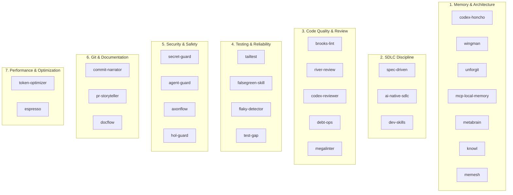

# VID Platform: Agent Plugin & Skill Directory

**Document:** `/docs/about_plugins.md`  
**Scope:** Complete catalog of all 28 custom agent plugins, workflows, and skills configured in `.agents/plugins/`  
**Governing Rule:** [`.agents/rules/plugin-orchestrator.md`](file:///c:/Users/Jagan%20Mohan%20Reddy/OneDrive/Desktop/VID_School/vidforum/.agents/rules/plugin-orchestrator.md)  
**Last Updated:** 2026-09-25  

---

## 1. Overview & Architecture

The VID Platform repository incorporates an agentic customization suite located under [`.agents/`](file:///c:/Users/Jagan%20Mohan%20Reddy/OneDrive/Desktop/VID_School/vidforum/.agents). These plugins equip the AI pair-programmer (Antigravity) with specialized domain knowledge, pre-edit data contract verification, security guardrails, test generation, and automated documentation upkeep.



---

## 2. Complete Plugin Matrix (28 Plugins)

| # | Plugin Name | Category | Skill ID | Primary Trigger / When to Use |
| :---: | :--- | :--- | :--- | :--- |
| **1** | **`mcp-local-memory`** | Memory | `local-memory` | Querying entity relationships and database dependencies. |
| **2** | **`codex-honcho`** | Memory | `honcho-memory` | Session kickoff, remembering user preferences and durable decisions. |
| **3** | **`metabrain`** | Memory | `metabrain` | Identifying recurring code patterns and graduating them into repo rules. |
| **4** | **`knowl`** | Memory | `knowl` | Retiring obsolete assumptions when architecture evolves. |
| **5** | **`memesh`** | Memory | `memesh` | Cross-subagent state sharing via SQLite event bus. |
| **6** | **`wingman`** | Memory | `wingman` | Pre-edit verification of schema, `institution_id`, and Student Master. |
| **7** | **`unforgit`** | Memory | `unforgit` | Recalling past architectural lessons and known gotchas. |
| **8** | **`brooks-lint`** | Code Quality | `brooks-lint` | Conceptual integrity check; stops over-engineering & monolithic sprawl. |
| **9** | **`river-review`** | Code Quality | `river-review` | 4-lens diff review: Security, Performance, Architecture, and Testing. |
| **10** | **`codex-reviewer`** | Code Quality | `codex-reviewer` | Adversarial second-pass code review before milestone handoff. |
| **11** | **`debt-ops`** | Code Quality | `debt-ops` | Flags silent shortcuts, unlogged exceptions, and orphan `TODO`s. |
| **12** | **`megalinter`** | Code Quality | `megalinter` | Automated TypeScript, linting, and formatting checks (`tsc`, `eslint`). |
| **13** | **`tailtest`** | Testing | `tailtest` | Detects modified files in git diff and executes targeted test suites. |
| **14** | **`falsegreen-skill`**| Testing | `falsegreen` | Audits test assertions to eliminate hollow/tautological test passes. |
| **15** | **`flaky-detector`** | Testing | `flaky-detector` | Reruns test suites under load to detect race conditions & timing flaws. |
| **16** | **`test-gap`** | Testing | `test-gap` | Analyzes git diff to pinpoint newly added lines lacking unit test coverage. |
| **17** | **`agent-guard`** | Security | `agent-guard` | Prevents destructive terminal commands, uncontained writes, and leaks. |
| **18** | **`secret-guard`** | Security | `secret-guard` | Scans staged git diffs for high-entropy strings, API keys, and unmasked secrets. |
| **19** | **`axonflow`** | Security | `axonflow` | Enforces command-line execution policies and protects PII data. |
| **20** | **`hol-guard`** | Security | `hol-guard` | Scans third-party dependencies and plugins for malicious payloads. |
| **21** | **`spec-driven`** | SDLC Discipline | `spec-driven` | Enforces the Requirements $\to$ Design $\to$ Tasks $\to$ Implementation flow. |
| **22** | **`dev-skills`** | SDLC Discipline | `dev-skills` | Executes Test-Driven Development (Red-Green-Refactor) and systematic debug. |
| **23** | **`ai-native-sdlc`** | SDLC Discipline | `ai-native-sdlc` | Inserts human approval gates between major milestone transitions. |
| **24** | **`commit-narrator`** | Git Automation | `commit-narrator` | Authors conventional semantic git commits explaining the *why* and rationale. |
| **25** | **`pr-storyteller`** | Git Automation | `pr-storyteller` | Synthesizes comprehensive PR titles, change summaries, and test plans. |
| **26** | **`docflow`** | Git Automation | `docflow` | Enforces documentation freshness across `TASKS.md`, `PRD.md`, and `README.md`. |
| **27** | **`token-optimizer`**| Optimization | `token-optimizer`| Enforces line-range file slicing and surgical search queries to save tokens. |
| **28** | **`espresso`** | Optimization | `espresso` | Strips boilerplate and returns high-density, concise responses. |

---

## 3. Deep Dive: Plugins by Category

### 3.1 Memory & Context Persistence

#### 1. `wingman` (`wingman`)
- **Purpose**: Pre-edit data contract guardian.
- **When to Use**: Before altering any database table, SQL migration, backend model, or API response shape.
- **Rules Enforced**:
  1. Every tenant-owned database table must include an indexed `institution_id` column.
  2. The **Student Master Entity** must remain singular and central (no duplicate student tables).
  3. Changes to `/api/v1` routes must preserve backward compatibility with frontend consumers.
- **Example Prompt**: *"Run Wingman check on the new finance invoice schema."*

#### 2. `codex-honcho` (`honcho-memory`)
- **Purpose**: Long-term conversational and preference persistence.
- **When to Use**: Session start, when recalling project conventions or past user instructions.
- **Example Prompt**: *"Check Honcho memory for user design preferences."*

#### 3. `unforgit` (`unforgit`)
- **Purpose**: Durable architectural lessons learned and gotcha recall.
- **When to Use**: Troubleshooting recurring errors, handling PostgreSQL type conversions (`text = uuid`), or inspecting past ADRs in [`docs/DECISIONS.md`](file:///c:/Users/Jagan%20Mohan%20Reddy/OneDrive/Desktop/VID_School/vidforum/docs/DECISIONS.md).

#### 4. `mcp-local-memory` (`local-memory`)
- **Purpose**: Local graph-based relationship tracker for cross-module dependencies.

#### 5. `metabrain` (`metabrain`)
- **Purpose**: Pattern extractor that detects conventions implemented in 3+ places and proposes formal project rules.

#### 6. `knowl` (`knowl`)
- **Purpose**: Knowledge reconciler that retires invalid documentation facts when architectural pivots happen.

#### 7. `memesh` (`memesh`)
- **Purpose**: Asynchronous communication bridge for multi-agent workflows.

---

### 3.2 Code Quality & Architecture Review

#### 8. `river-review` (`river-review`)
- **Purpose**: Multi-perspective code review assessing code diffs through 4 explicit lenses:
  1. **Security**: SQL injection, authorization bypass, token exposure.
  2. **Performance**: N+1 queries, unindexed filters, heavy memory allocations.
  3. **Architecture**: Adherence to Layered MVC (`routes -> controllers -> services -> repositories`).
  4. **Testing**: Adequacy of test assertions and boundary condition checks.
- **Example Prompt**: *"Perform a River Review on my latest git diff."*

#### 9. `brooks-lint` (`brooks-lint`)
- **Purpose**: Architectural simplicity evaluator inspired by Fred Brooks (*The Mythical Man-Month*).
- **Core Directives**: Protects conceptual integrity, flags premature optimization, and rejects unnecessary abstractions.

#### 10. `codex-reviewer` (`codex-reviewer`)
- **Purpose**: Adversarial fresh-eyes code reviewer that scans code as a critical external auditor before production delivery.

#### 11. `debt-ops` (`debt-ops`)
- **Purpose**: Technical debt blocker. Prevents unrecorded `TODO`s, catch-all empty exception handlers, and silent console logs.

#### 12. `megalinter` (`megalinter`)
- **Purpose**: Code syntax and static typing enforcer (`tsc --noEmit`, ESLint, Prettier).

---

### 3.3 Testing & Quality Assurance

#### 13. `tailtest` (`tailtest`)
- **Purpose**: Smart test runner. Analyzes git status to identify modified files and runs only the relevant test specs to provide immediate feedback.
- **Example Prompt**: *"Run Tailtest on recent changes."*

#### 14. `falsegreen-skill` (`falsegreen`)
- **Purpose**: Eliminates hollow, tautological tests (e.g. tests that pass without actually verifying business logic or assertions like `expect(true).toBe(true)`).

#### 15. `flaky-detector` (`flaky-detector`)
- **Purpose**: Executes test suites iteratively to expose race conditions, async timeout leaks, or database connection pool starvation.

#### 16. `test-gap` (`test-gap`)
- **Purpose**: Computes differential test coverage across newly authored code lines.

---

### 3.4 Security & Threat Prevention

#### 17. `secret-guard` (`secret-guard`)
- **Purpose**: Pre-commit secret and entropy scanner.
- **Target Threats**: Hardcoded passwords, unmasked JWT secrets, private keys, database URLs, and untracked `.env` files.
- **Action**: Blocks git commits and alerts if sensitive tokens are exposed in diffs.
- **Example Prompt**: *"Run Secret Guard before I commit."*

#### 18. `agent-guard` (`agent-guard`)
- **Purpose**: Execution barrier that intercepts dangerous shell commands (e.g. `rm -rf /`, dropping database tables without backup) and blocks unauthorized writes outside workspace roots.

#### 29. `axonflow` (`axonflow`)
- **Purpose**: PII (Personally Identifiable Information) sanitizer ensuring student names, parent phone numbers, and addresses are masked in application logs.

#### 20. `hol-guard` (`hol-guard`)
- **Purpose**: Dependency integrity validator checking npm packages for known vulnerabilities or supply chain anomalies.

---

### 3.5 SDLC Discipline & Governance

#### 21. `spec-driven` (`spec-driven`)
- **Purpose**: Enforces the project lifecycle pipeline: Requirements (`PRD.md`) $\to$ Technical Architecture (`TECH_SPEC.md`) $\to$ Task Checklist (`TASKS.md`) $\to$ Implementation Code.

#### 22. `dev-skills` (`dev-skills`)
- **Purpose**: Enforces Test-Driven Development (TDD) best practices and systematic hypothesis-based debugging.

#### 23. `ai-native-sdlc` (`ai-native-sdlc`)
- **Purpose**: Milestone checkpoint manager that pauses execution for human user review at critical gates before proceeding with heavy implementation.

---

### 3.6 Git & Release Automation

#### 24. `commit-narrator` (`commit-narrator`)
- **Purpose**: Conventional semantic commit authoring engine. Generates structured commit messages explaining the architectural *why* rather than trivial *what*.
- **Example Prompt**: *"Use Commit Narrator to commit these changes."*

#### 25. `pr-storyteller` (`pr-storyteller`)
- **Purpose**: Release notes and Pull Request synthesizer that drafts PR summaries, risk assessments, and QA verification steps.

#### 26. `docflow` (`docflow`)
- **Purpose**: Documentation freshness enforcer.
- **Checklist**:
  - Updates [`docs/TASKS.md`](file:///c:/Users/Jagan%20Mohan%20Reddy/OneDrive/Desktop/VID_School/vidforum/docs/TASKS.md) upon task completion.
  - Synchronizes [`docs/TECH_SPEC.md`](file:///c:/Users/Jagan%20Mohan%20Reddy/OneDrive/Desktop/VID_School/vidforum/docs/TECH_SPEC.md) when schemas or endpoints change.
  - Updates [`README.md`](file:///c:/Users/Jagan%20Mohan%20Reddy/OneDrive/Desktop/VID_School/vidforum/README.md) and [`docs/DECISIONS.md`](file:///c:/Users/Jagan%20Mohan%20Reddy/OneDrive/Desktop/VID_School/vidforum/docs/DECISIONS.md).
- **Example Prompt**: *"Run Docflow on my recent changes."*

---

### 3.7 Token & Output Optimization

#### 27. `token-optimizer` (`token-optimizer`)
- **Purpose**: Token cost reducer. Instructs the agent to read targeted line ranges, avoid bulk file dumping, and use focused regex searches.

#### 28. `espresso` (`espresso`)
- **Purpose**: Conciseness enforcer. Filters out filler text and provides high-density, actionable answers.

---

## 4. How to Use Plugins in Daily Workflows

You do not need to memorize commands. You can invoke any plugin naturally in chat:

```text
# Before changing database models:
"Run Wingman check on the attendance schema"

# Before committing your code:
"Run Secret Guard"

# After completing a feature:
"Perform a River Review on my diff"

# To update documentation:
"Run Docflow"

# To write a meaningful git commit:
"Use Commit Narrator to commit and push"
```

---

*VID Educational Management Ecosystem &copy; 2026. Documented under `.agents/` customization suite.*
