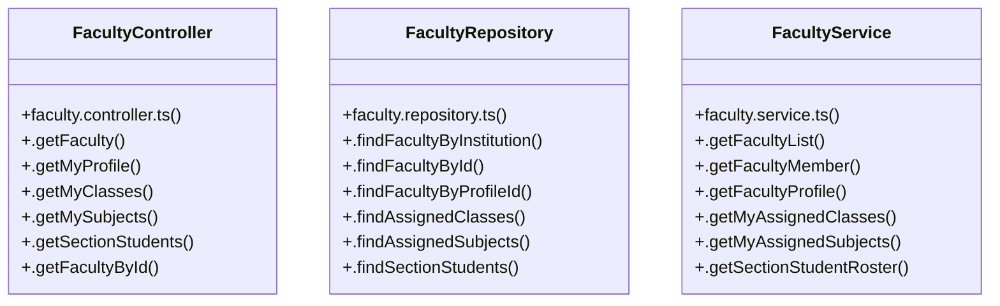

# [API_BASE_URL & DEFAULT_INST_ID] Cluster

> 24 nodes · cohesion 0.14

## Key Concepts

- [FacultyController](file:///C:/Antigravityyyyy/VID_School/backend/src/modules/faculty/faculty.controller.ts#L5) (7 connections)
- [FacultyRepository](file:///C:/Antigravityyyyy/VID_School/backend/src/modules/faculty/faculty.repository.ts#L3) (7 connections)
- [FacultyService](file:///C:/Antigravityyyyy/VID_School/backend/src/modules/faculty/faculty.service.ts#L3) (7 connections)
- [.getFacultyProfile()](file:///C:/Antigravityyyyy/VID_School/backend/src/modules/faculty/faculty.service.ts#L51) (6 connections)
- [.getFaculty()](file:///C:/Antigravityyyyy/VID_School/backend/src/modules/faculty/faculty.controller.ts#L6) (4 connections)
- [.findFacultyByProfileId()](file:///C:/Antigravityyyyy/VID_School/backend/src/modules/faculty/faculty.repository.ts#L54) (4 connections)
- [.getMyAssignedClasses()](file:///C:/Antigravityyyyy/VID_School/backend/src/modules/faculty/faculty.service.ts#L67) (4 connections)
- [.getMyAssignedSubjects()](file:///C:/Antigravityyyyy/VID_School/backend/src/modules/faculty/faculty.service.ts#L75) (4 connections)
- [.getFacultyById()](file:///C:/Antigravityyyyy/VID_School/backend/src/modules/faculty/faculty.controller.ts#L69) (3 connections)
- [.getMyClasses()](file:///C:/Antigravityyyyy/VID_School/backend/src/modules/faculty/faculty.controller.ts#L36) (3 connections)
- [.getMyProfile()](file:///C:/Antigravityyyyy/VID_School/backend/src/modules/faculty/faculty.controller.ts#L25) (3 connections)
- [.getMySubjects()](file:///C:/Antigravityyyyy/VID_School/backend/src/modules/faculty/faculty.controller.ts#L47) (3 connections)
- [.getSectionStudents()](file:///C:/Antigravityyyyy/VID_School/backend/src/modules/faculty/faculty.controller.ts#L58) (3 connections)
- [.findAssignedClasses()](file:///C:/Antigravityyyyy/VID_School/backend/src/modules/faculty/faculty.repository.ts#L67) (3 connections)
- [.findAssignedSubjects()](file:///C:/Antigravityyyyy/VID_School/backend/src/modules/faculty/faculty.repository.ts#L86) (3 connections)
- [.getFacultyList()](file:///C:/Antigravityyyyy/VID_School/backend/src/modules/faculty/faculty.service.ts#L4) (3 connections)
- [.getFacultyMember()](file:///C:/Antigravityyyyy/VID_School/backend/src/modules/faculty/faculty.service.ts#L43) (3 connections)
- [.getSectionStudentRoster()](file:///C:/Antigravityyyyy/VID_School/backend/src/modules/faculty/faculty.service.ts#L83) (3 connections)
- [.findFacultyById()](file:///C:/Antigravityyyyy/VID_School/backend/src/modules/faculty/faculty.repository.ts#L41) (2 connections)
- [.findFacultyByInstitution()](file:///C:/Antigravityyyyy/VID_School/backend/src/modules/faculty/faculty.repository.ts#L4) (2 connections)
- [.findSectionStudents()](file:///C:/Antigravityyyyy/VID_School/backend/src/modules/faculty/faculty.repository.ts#L105) (2 connections)
- [faculty.controller.ts](file:///C:/Antigravityyyyy/VID_School/backend/src/modules/faculty/faculty.controller.ts#L1) (1 connections)
- [faculty.repository.ts](file:///C:/Antigravityyyyy/VID_School/backend/src/modules/faculty/faculty.repository.ts#L1) (1 connections)
- [faculty.service.ts](file:///C:/Antigravityyyyy/VID_School/backend/src/modules/faculty/faculty.service.ts#L1) (1 connections)

## Class Diagram

## Relationships

- No strong cross-community connections detected

## Source Files

- [C:\Antigravityyyyy\VID_School\backend\src\modules\faculty\faculty.controller.ts](file:///C:/Antigravityyyyy/VID_School/backend/src/modules/faculty/faculty.controller.ts)
- [C:\Antigravityyyyy\VID_School\backend\src\modules\faculty\faculty.repository.ts](file:///C:/Antigravityyyyy/VID_School/backend/src/modules/faculty/faculty.repository.ts)
- [C:\Antigravityyyyy\VID_School\backend\src\modules\faculty\faculty.service.ts](file:///C:/Antigravityyyyy/VID_School/backend/src/modules/faculty/faculty.service.ts)

## Audit Trail

- EXTRACTED: 42 (51%)
- INFERRED: 40 (49%)
- AMBIGUOUS: 0 (0%)

---

*Part of the graphify knowledge wiki. See [[index]] to navigate.*