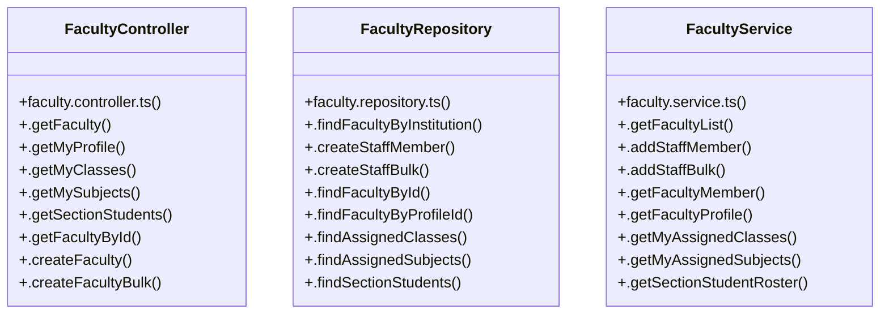

# [API_BASE_URL & DEFAULT_INST_ID] Cluster

> 30 nodes · cohesion 0.11

## Key Concepts

- [FacultyController](file:///C:/Antigravityyyyy/VID_School/backend/src/modules/faculty/faculty.controller.ts#L5) (9 connections)
- [FacultyRepository](file:///C:/Antigravityyyyy/VID_School/backend/src/modules/faculty/faculty.repository.ts#L24) (9 connections)
- [FacultyService](file:///C:/Antigravityyyyy/VID_School/backend/src/modules/faculty/faculty.service.ts#L3) (9 connections)
- [.getFacultyProfile()](file:///C:/Antigravityyyyy/VID_School/backend/src/modules/faculty/faculty.service.ts#L68) (6 connections)
- [.findFacultyByProfileId()](file:///C:/Antigravityyyyy/VID_School/backend/src/modules/faculty/faculty.repository.ts#L231) (5 connections)
- [.getFaculty()](file:///C:/Antigravityyyyy/VID_School/backend/src/modules/faculty/faculty.controller.ts#L6) (4 connections)
- [.createStaffMember()](file:///C:/Antigravityyyyy/VID_School/backend/src/modules/faculty/faculty.repository.ts#L72) (4 connections)
- [.findAssignedClasses()](file:///C:/Antigravityyyyy/VID_School/backend/src/modules/faculty/faculty.repository.ts#L245) (4 connections)
- [.findAssignedSubjects()](file:///C:/Antigravityyyyy/VID_School/backend/src/modules/faculty/faculty.repository.ts#L264) (4 connections)
- [.getMyAssignedClasses()](file:///C:/Antigravityyyyy/VID_School/backend/src/modules/faculty/faculty.service.ts#L84) (4 connections)
- [.getMyAssignedSubjects()](file:///C:/Antigravityyyyy/VID_School/backend/src/modules/faculty/faculty.service.ts#L92) (4 connections)
- [.createFaculty()](file:///C:/Antigravityyyyy/VID_School/backend/src/modules/faculty/faculty.controller.ts#L80) (3 connections)
- [.createFacultyBulk()](file:///C:/Antigravityyyyy/VID_School/backend/src/modules/faculty/faculty.controller.ts#L90) (3 connections)
- [.getFacultyById()](file:///C:/Antigravityyyyy/VID_School/backend/src/modules/faculty/faculty.controller.ts#L69) (3 connections)
- [.getMyClasses()](file:///C:/Antigravityyyyy/VID_School/backend/src/modules/faculty/faculty.controller.ts#L36) (3 connections)
- [.getMyProfile()](file:///C:/Antigravityyyyy/VID_School/backend/src/modules/faculty/faculty.controller.ts#L25) (3 connections)
- [.getMySubjects()](file:///C:/Antigravityyyyy/VID_School/backend/src/modules/faculty/faculty.controller.ts#L47) (3 connections)
- [.getSectionStudents()](file:///C:/Antigravityyyyy/VID_School/backend/src/modules/faculty/faculty.controller.ts#L58) (3 connections)
- [.createStaffBulk()](file:///C:/Antigravityyyyy/VID_School/backend/src/modules/faculty/faculty.repository.ts#L191) (3 connections)
- [.findFacultyById()](file:///C:/Antigravityyyyy/VID_School/backend/src/modules/faculty/faculty.repository.ts#L218) (3 connections)
- [.findFacultyByInstitution()](file:///C:/Antigravityyyyy/VID_School/backend/src/modules/faculty/faculty.repository.ts#L25) (3 connections)
- [.findSectionStudents()](file:///C:/Antigravityyyyy/VID_School/backend/src/modules/faculty/faculty.repository.ts#L283) (3 connections)
- [.addStaffBulk()](file:///C:/Antigravityyyyy/VID_School/backend/src/modules/faculty/faculty.service.ts#L56) (3 connections)
- [.addStaffMember()](file:///C:/Antigravityyyyy/VID_School/backend/src/modules/faculty/faculty.service.ts#L52) (3 connections)
- [.getFacultyList()](file:///C:/Antigravityyyyy/VID_School/backend/src/modules/faculty/faculty.service.ts#L4) (3 connections)
- *... and 5 more nodes in this community*

## Class Diagram

## Relationships

- No strong cross-community connections detected

## Source Files

- [C:\Antigravityyyyy\VID_School\backend\src\modules\faculty\faculty.controller.ts](file:///C:/Antigravityyyyy/VID_School/backend/src/modules/faculty/faculty.controller.ts)
- [C:\Antigravityyyyy\VID_School\backend\src\modules\faculty\faculty.repository.ts](file:///C:/Antigravityyyyy/VID_School/backend/src/modules/faculty/faculty.repository.ts)
- [C:\Antigravityyyyy\VID_School\backend\src\modules\faculty\faculty.service.ts](file:///C:/Antigravityyyyy/VID_School/backend/src/modules/faculty/faculty.service.ts)

## Audit Trail

- EXTRACTED: 56 (50%)
- INFERRED: 57 (50%)
- AMBIGUOUS: 0 (0%)

---

*Part of the graphify knowledge wiki. See [[index]] to navigate.*