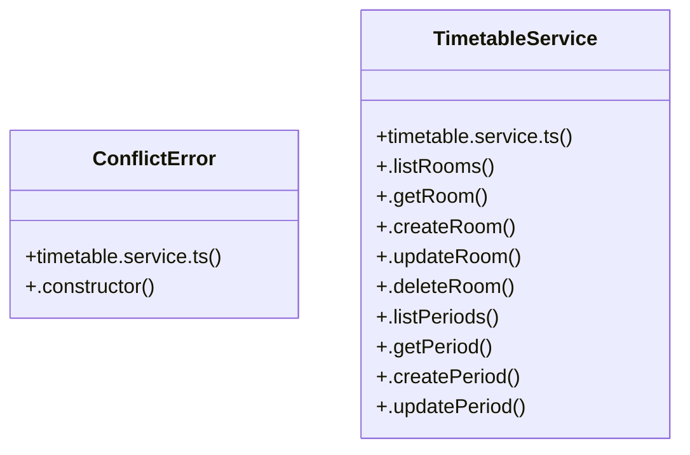

# [API_BASE_URL & DEFAULT_INST_ID] Cluster

> 30 nodes · cohesion 0.08

## Key Concepts

- [TimetableService](file:///C:/Antigravityyyyy/VID_School/backend/src/modules/timetable/timetable.service.ts#L15) (25 connections)
- [.checkTimetableConflicts()](file:///C:/Antigravityyyyy/VID_School/backend/src/modules/timetable/timetable.repository.ts#L493) (5 connections)
- [.publishTimetable()](file:///C:/Antigravityyyyy/VID_School/backend/src/modules/timetable/timetable.service.ts#L142) (5 connections)
- [.checkConflict()](file:///C:/Antigravityyyyy/VID_School/backend/src/modules/timetable/timetable.controller.ts#L188) (4 connections)
- [.getTimetableById()](file:///C:/Antigravityyyyy/VID_School/backend/src/modules/timetable/timetable.repository.ts#L257) (4 connections)
- [.setPublishStatus()](file:///C:/Antigravityyyyy/VID_School/backend/src/modules/timetable/timetable.repository.ts#L525) (4 connections)
- [.checkCandidateConflict()](file:///C:/Antigravityyyyy/VID_School/backend/src/modules/timetable/timetable.service.ts#L94) (4 connections)
- [.getTimetable()](file:///C:/Antigravityyyyy/VID_School/backend/src/modules/timetable/timetable.service.ts#L72) (3 connections)
- [.unpublishTimetable()](file:///C:/Antigravityyyyy/VID_School/backend/src/modules/timetable/timetable.service.ts#L171) (3 connections)
- [timetable.service.ts](file:///C:/Antigravityyyyy/VID_School/backend/src/modules/timetable/timetable.service.ts#L1) (2 connections)
- [ConflictError](file:///C:/Antigravityyyyy/VID_School/backend/src/modules/timetable/timetable.service.ts#L4) (2 connections)
- [.auditTimetableConflicts()](file:///C:/Antigravityyyyy/VID_School/backend/src/modules/timetable/timetable.service.ts#L106) (2 connections)
- [.createEntry()](file:///C:/Antigravityyyyy/VID_School/backend/src/modules/timetable/timetable.service.ts#L115) (2 connections)
- [.createSubstitution()](file:///C:/Antigravityyyyy/VID_School/backend/src/modules/timetable/timetable.service.ts#L191) (2 connections)
- [.listEntries()](file:///C:/Antigravityyyyy/VID_School/backend/src/modules/timetable/timetable.service.ts#L111) (2 connections)
- [.constructor()](file:///C:/Antigravityyyyy/VID_School/backend/src/modules/timetable/timetable.service.ts#L7) (1 connections)
- [.createPeriod()](file:///C:/Antigravityyyyy/VID_School/backend/src/modules/timetable/timetable.service.ts#L49) (1 connections)
- [.createRoom()](file:///C:/Antigravityyyyy/VID_School/backend/src/modules/timetable/timetable.service.ts#L25) (1 connections)
- [.createTimetable()](file:///C:/Antigravityyyyy/VID_School/backend/src/modules/timetable/timetable.service.ts#L82) (1 connections)
- [.deleteEntry()](file:///C:/Antigravityyyyy/VID_School/backend/src/modules/timetable/timetable.service.ts#L137) (1 connections)
- [.deletePeriod()](file:///C:/Antigravityyyyy/VID_School/backend/src/modules/timetable/timetable.service.ts#L63) (1 connections)
- [.deleteRoom()](file:///C:/Antigravityyyyy/VID_School/backend/src/modules/timetable/timetable.service.ts#L36) (1 connections)
- [.deleteTimetable()](file:///C:/Antigravityyyyy/VID_School/backend/src/modules/timetable/timetable.service.ts#L89) (1 connections)
- [.getScopedSchedule()](file:///C:/Antigravityyyyy/VID_School/backend/src/modules/timetable/timetable.service.ts#L217) (1 connections)
- [.listPeriods()](file:///C:/Antigravityyyyy/VID_School/backend/src/modules/timetable/timetable.service.ts#L41) (1 connections)
- *... and 5 more nodes in this community*

## Class Diagram

## Relationships

- No strong cross-community connections detected

## Source Files

- [C:\Antigravityyyyy\VID_School\backend\src\modules\timetable\timetable.controller.ts](file:///C:/Antigravityyyyy/VID_School/backend/src/modules/timetable/timetable.controller.ts)
- [C:\Antigravityyyyy\VID_School\backend\src\modules\timetable\timetable.repository.ts](file:///C:/Antigravityyyyy/VID_School/backend/src/modules/timetable/timetable.repository.ts)
- [C:\Antigravityyyyy\VID_School\backend\src\modules\timetable\timetable.service.ts](file:///C:/Antigravityyyyy/VID_School/backend/src/modules/timetable/timetable.service.ts)

## Audit Trail

- EXTRACTED: 62 (74%)
- INFERRED: 22 (26%)
- AMBIGUOUS: 0 (0%)

---

*Part of the graphify knowledge wiki. See [[index]] to navigate.*