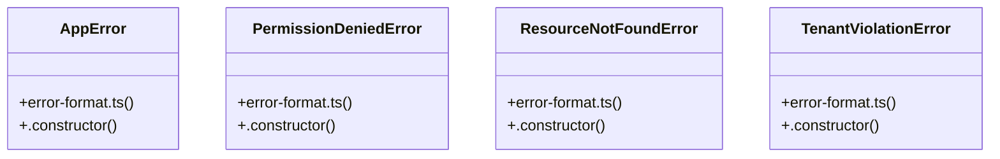

# [Document: Agents & 1. Operating Mode & Standards] Cluster

> 10 nodes · cohesion 0.20

## Key Concepts

- [error-format.ts](file:///C:/Antigravityyyyy/VID_School/backend/src/common/error-format.ts#L1) (5 connections)
- [AppError](file:///C:/Antigravityyyyy/VID_School/backend/src/common/error-format.ts#L25) (2 connections)
- [PermissionDeniedError](file:///C:/Antigravityyyyy/VID_School/backend/src/common/error-format.ts#L47) (2 connections)
- [ResourceNotFoundError](file:///C:/Antigravityyyyy/VID_School/backend/src/common/error-format.ts#L54) (2 connections)
- [TenantViolationError](file:///C:/Antigravityyyyy/VID_School/backend/src/common/error-format.ts#L40) (2 connections)
- [.constructor()](file:///C:/Antigravityyyyy/VID_School/backend/src/common/error-format.ts#L30) (1 connections)
- [formatErrorResponse()](file:///C:/Antigravityyyyy/VID_School/backend/src/common/error-format.ts#L61) (1 connections)
- [.constructor()](file:///C:/Antigravityyyyy/VID_School/backend/src/common/error-format.ts#L48) (1 connections)
- [.constructor()](file:///C:/Antigravityyyyy/VID_School/backend/src/common/error-format.ts#L55) (1 connections)
- [.constructor()](file:///C:/Antigravityyyyy/VID_School/backend/src/common/error-format.ts#L41) (1 connections)

## Class Diagram

## Relationships

- No strong cross-community connections detected

## Source Files

- [C:\Antigravityyyyy\VID_School\backend\src\common\error-format.ts](file:///C:/Antigravityyyyy/VID_School/backend/src/common/error-format.ts)

## Audit Trail

- EXTRACTED: 18 (100%)
- INFERRED: 0 (0%)
- AMBIGUOUS: 0 (0%)

---

*Part of the graphify knowledge wiki. See [[index]] to navigate.*