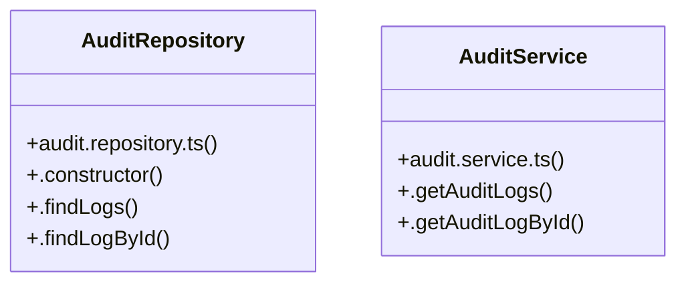

# [Document: Agents & 1. Operating Mode & Standards] Cluster

> 9 nodes · cohesion 0.25

## Key Concepts

- [AuditRepository](file:///C:/Antigravityyyyy/VID_School/backend/src/modules/audit/audit.repository.ts#L18) (4 connections)
- [AuditService](file:///C:/Antigravityyyyy/VID_School/backend/src/modules/audit/audit.service.ts#L3) (3 connections)
- [.getAuditLogById()](file:///C:/Antigravityyyyy/VID_School/backend/src/modules/audit/audit.service.ts#L15) (3 connections)
- [.getAuditLogs()](file:///C:/Antigravityyyyy/VID_School/backend/src/modules/audit/audit.service.ts#L4) (3 connections)
- [.findLogById()](file:///C:/Antigravityyyyy/VID_School/backend/src/modules/audit/audit.repository.ts#L98) (2 connections)
- [.findLogs()](file:///C:/Antigravityyyyy/VID_School/backend/src/modules/audit/audit.repository.ts#L23) (2 connections)
- [.constructor()](file:///C:/Antigravityyyyy/VID_School/backend/src/modules/audit/audit.repository.ts#L19) (1 connections)
- [audit.repository.ts](file:///C:/Antigravityyyyy/VID_School/backend/src/modules/audit/audit.repository.ts#L1) (1 connections)
- [audit.service.ts](file:///C:/Antigravityyyyy/VID_School/backend/src/modules/audit/audit.service.ts#L1) (1 connections)

## Class Diagram

## Relationships

- No strong cross-community connections detected

## Source Files

- [C:\Antigravityyyyy\VID_School\backend\src\modules\audit\audit.repository.ts](file:///C:/Antigravityyyyy/VID_School/backend/src/modules/audit/audit.repository.ts)
- [C:\Antigravityyyyy\VID_School\backend\src\modules\audit\audit.service.ts](file:///C:/Antigravityyyyy/VID_School/backend/src/modules/audit/audit.service.ts)

## Audit Trail

- EXTRACTED: 14 (70%)
- INFERRED: 6 (30%)
- AMBIGUOUS: 0 (0%)

---

*Part of the graphify knowledge wiki. See [[index]] to navigate.*