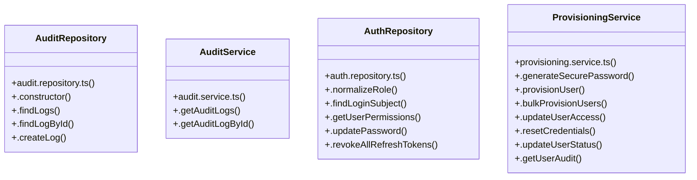

# [Document: Antigravity Master Prompt & 0. ROLE & OPERATING MODE] Cluster

> 31 nodes · cohesion 0.10

## Key Concepts

- [runR4Verification()](file:///C:/Antigravityyyyy/VID_School/backend/src/scripts/verify-r4-provisioning.ts#L22) (10 connections)
- [ProvisioningService](file:///C:/Antigravityyyyy/VID_School/backend/src/modules/users/provisioning.service.ts#L54) (8 connections)
- [.createLog()](file:///C:/Antigravityyyyy/VID_School/backend/src/modules/audit/audit.repository.ts#L117) (7 connections)
- [.provisionUser()](file:///C:/Antigravityyyyy/VID_School/backend/src/modules/users/provisioning.service.ts#L80) (7 connections)
- [AuthRepository](file:///C:/Antigravityyyyy/VID_School/backend/src/modules/auth/auth.repository.ts#L22) (6 connections)
- [AuditRepository](file:///C:/Antigravityyyyy/VID_School/backend/src/modules/audit/audit.repository.ts#L18) (5 connections)
- [.resetCredentials()](file:///C:/Antigravityyyyy/VID_School/backend/src/modules/users/provisioning.service.ts#L467) (5 connections)
- [.updateUserAccess()](file:///C:/Antigravityyyyy/VID_School/backend/src/modules/users/provisioning.service.ts#L360) (5 connections)
- [.findLoginSubject()](file:///C:/Antigravityyyyy/VID_School/backend/src/modules/auth/auth.repository.ts#L42) (4 connections)
- [.bulkProvisionUsers()](file:///C:/Antigravityyyyy/VID_School/backend/src/modules/users/provisioning.service.ts#L277) (4 connections)
- [.updateUserStatus()](file:///C:/Antigravityyyyy/VID_School/backend/src/modules/users/provisioning.service.ts#L545) (4 connections)
- [resolveRoleTemplate()](file:///C:/Antigravityyyyy/VID_School/backend/src/modules/users/role-templates.ts#L99) (4 connections)
- [.findLogById()](file:///C:/Antigravityyyyy/VID_School/backend/src/modules/audit/audit.repository.ts#L98) (3 connections)
- [.findLogs()](file:///C:/Antigravityyyyy/VID_School/backend/src/modules/audit/audit.repository.ts#L23) (3 connections)
- [AuditService](file:///C:/Antigravityyyyy/VID_School/backend/src/modules/audit/audit.service.ts#L3) (3 connections)
- [.getAuditLogById()](file:///C:/Antigravityyyyy/VID_School/backend/src/modules/audit/audit.service.ts#L15) (3 connections)
- [.getAuditLogs()](file:///C:/Antigravityyyyy/VID_School/backend/src/modules/audit/audit.service.ts#L4) (3 connections)
- [.generateSecurePassword()](file:///C:/Antigravityyyyy/VID_School/backend/src/modules/users/provisioning.service.ts#L59) (3 connections)
- [.getUserAudit()](file:///C:/Antigravityyyyy/VID_School/backend/src/modules/users/provisioning.service.ts#L605) (3 connections)
- [.getUserPermissions()](file:///C:/Antigravityyyyy/VID_School/backend/src/modules/auth/auth.repository.ts#L112) (2 connections)
- [.normalizeRole()](file:///C:/Antigravityyyyy/VID_School/backend/src/modules/auth/auth.repository.ts#L23) (2 connections)
- [.revokeAllRefreshTokens()](file:///C:/Antigravityyyyy/VID_School/backend/src/modules/auth/auth.repository.ts#L203) (2 connections)
- [.updatePassword()](file:///C:/Antigravityyyyy/VID_School/backend/src/modules/auth/auth.repository.ts#L156) (2 connections)
- [role-templates.ts](file:///C:/Antigravityyyyy/VID_School/backend/src/modules/users/role-templates.ts#L1) (2 connections)
- [.constructor()](file:///C:/Antigravityyyyy/VID_School/backend/src/modules/audit/audit.repository.ts#L19) (1 connections)
- *... and 6 more nodes in this community*

## Class Diagram

## Relationships

- No strong cross-community connections detected

## Source Files

- [C:\Antigravityyyyy\VID_School\backend\src\modules\audit\audit.repository.ts](file:///C:/Antigravityyyyy/VID_School/backend/src/modules/audit/audit.repository.ts)
- [C:\Antigravityyyyy\VID_School\backend\src\modules\audit\audit.service.ts](file:///C:/Antigravityyyyy/VID_School/backend/src/modules/audit/audit.service.ts)
- [C:\Antigravityyyyy\VID_School\backend\src\modules\auth\auth.repository.ts](file:///C:/Antigravityyyyy/VID_School/backend/src/modules/auth/auth.repository.ts)
- [C:\Antigravityyyyy\VID_School\backend\src\modules\users\provisioning.service.ts](file:///C:/Antigravityyyyy/VID_School/backend/src/modules/users/provisioning.service.ts)
- [C:\Antigravityyyyy\VID_School\backend\src\modules\users\role-templates.ts](file:///C:/Antigravityyyyy/VID_School/backend/src/modules/users/role-templates.ts)
- [C:\Antigravityyyyy\VID_School\backend\src\scripts\verify-r4-provisioning.ts](file:///C:/Antigravityyyyy/VID_School/backend/src/scripts/verify-r4-provisioning.ts)

## Audit Trail

- EXTRACTED: 58 (54%)
- INFERRED: 49 (46%)
- AMBIGUOUS: 0 (0%)

---

*Part of the graphify knowledge wiki. See [[index]] to navigate.*