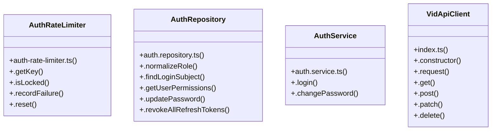

# [Document: Appflow & 1. Overview & Navigation Architecture] Cluster

> 39 nodes · cohesion 0.07

## Key Concepts

- [.login()](file:///C:/Antigravityyyyy/VID_School/backend/src/modules/auth/auth.service.ts#L24) (10 connections)
- [page.tsx](file:///C:/Antigravityyyyy/VID_School/frontend/app/%28auth%29/login/page.tsx#L1) (10 connections)
- [VidApiClient](file:///C:/Antigravityyyyy/VID_School/packages/api-client/src/index.ts#L7) (7 connections)
- [.reset()](file:///C:/Antigravityyyyy/VID_School/backend/src/modules/auth/auth-rate-limiter.ts#L103) (6 connections)
- [AuthRepository](file:///C:/Antigravityyyyy/VID_School/backend/src/modules/auth/auth.repository.ts#L22) (6 connections)
- [AuthRateLimiter](file:///C:/Antigravityyyyy/VID_School/backend/src/modules/auth/auth-rate-limiter.ts#L9) (5 connections)
- [.isLocked()](file:///C:/Antigravityyyyy/VID_School/backend/src/modules/auth/auth-rate-limiter.ts#L19) (5 connections)
- [.recordFailure()](file:///C:/Antigravityyyyy/VID_School/backend/src/modules/auth/auth-rate-limiter.ts#L52) (5 connections)
- [.findLoginSubject()](file:///C:/Antigravityyyyy/VID_School/backend/src/modules/auth/auth.repository.ts#L42) (5 connections)
- [.changePassword()](file:///C:/Antigravityyyyy/VID_School/backend/src/modules/auth/auth.service.ts#L143) (5 connections)
- [.get()](file:///C:/Antigravityyyyy/VID_School/packages/api-client/src/index.ts#L51) (5 connections)
- [.request()](file:///C:/Antigravityyyyy/VID_School/packages/api-client/src/index.ts#L18) (5 connections)
- [.getKey()](file:///C:/Antigravityyyyy/VID_School/backend/src/modules/auth/auth-rate-limiter.ts#L15) (4 connections)
- [.getUserPermissions()](file:///C:/Antigravityyyyy/VID_School/backend/src/modules/auth/auth.repository.ts#L112) (3 connections)
- [.updatePassword()](file:///C:/Antigravityyyyy/VID_School/backend/src/modules/auth/auth.repository.ts#L156) (3 connections)
- [AuthService](file:///C:/Antigravityyyyy/VID_School/backend/src/modules/auth/auth.service.ts#L23) (3 connections)
- [.delete()](file:///C:/Antigravityyyyy/VID_School/packages/api-client/src/index.ts#L71) (3 connections)
- [router](file:///C:/Antigravityyyyy/VID_School/frontend/app/students/page.tsx#L45) (3 connections)
- [runTests()](file:///C:/Antigravityyyyy/VID_School/backend/src/scripts/verify-r2-auth.ts#L8) (3 connections)
- [.normalizeRole()](file:///C:/Antigravityyyyy/VID_School/backend/src/modules/auth/auth.repository.ts#L23) (2 connections)
- [.revokeAllRefreshTokens()](file:///C:/Antigravityyyyy/VID_School/backend/src/modules/auth/auth.repository.ts#L203) (2 connections)
- [auth.service.ts](file:///C:/Antigravityyyyy/VID_School/backend/src/modules/auth/auth.service.ts#L1) (2 connections)
- [.patch()](file:///C:/Antigravityyyyy/VID_School/packages/api-client/src/index.ts#L63) (2 connections)
- [.post()](file:///C:/Antigravityyyyy/VID_School/packages/api-client/src/index.ts#L55) (2 connections)
- [handleLoginSubmit()](file:///C:/Antigravityyyyy/VID_School/frontend/app/%28auth%29/login/page.tsx#L32) (2 connections)
- *... and 14 more nodes in this community*

## Class Diagram

## Relationships

- No strong cross-community connections detected

## Source Files

- [C:\Antigravityyyyy\VID_School\backend\src\modules\auth\auth-rate-limiter.ts](file:///C:/Antigravityyyyy/VID_School/backend/src/modules/auth/auth-rate-limiter.ts)
- [C:\Antigravityyyyy\VID_School\backend\src\modules\auth\auth.repository.ts](file:///C:/Antigravityyyyy/VID_School/backend/src/modules/auth/auth.repository.ts)
- [C:\Antigravityyyyy\VID_School\backend\src\modules\auth\auth.service.ts](file:///C:/Antigravityyyyy/VID_School/backend/src/modules/auth/auth.service.ts)
- [C:\Antigravityyyyy\VID_School\backend\src\scripts\verify-r2-auth.ts](file:///C:/Antigravityyyyy/VID_School/backend/src/scripts/verify-r2-auth.ts)
- [C:\Antigravityyyyy\VID_School\frontend\app\(auth)\login\page.tsx](file:///C:/Antigravityyyyy/VID_School/frontend/app/%28auth%29/login/page.tsx)
- [C:\Antigravityyyyy\VID_School\frontend\app\dashboard\page.tsx](file:///C:/Antigravityyyyy/VID_School/frontend/app/dashboard/page.tsx)
- [C:\Antigravityyyyy\VID_School\frontend\app\students\page.tsx](file:///C:/Antigravityyyyy/VID_School/frontend/app/students/page.tsx)
- [C:\Antigravityyyyy\VID_School\packages\api-client\src\index.ts](file:///C:/Antigravityyyyy/VID_School/packages/api-client/src/index.ts)

## Audit Trail

- EXTRACTED: 85 (69%)
- INFERRED: 38 (31%)
- AMBIGUOUS: 0 (0%)

---

*Part of the graphify knowledge wiki. See [[index]] to navigate.*