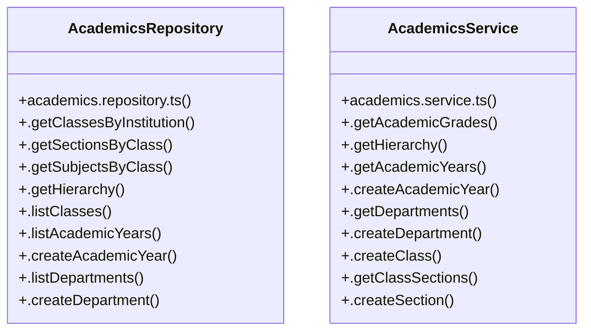

# [Document: Appflow & 1. Overview & Navigation Architecture] Cluster

> 34 nodes · cohesion 0.07

## Key Concepts

- [AcademicsRepository](file:///C:/Antigravityyyyy/VID_School/backend/src/modules/academics/academics.repository.ts#L3) (16 connections)
- [AcademicsService](file:///C:/Antigravityyyyy/VID_School/backend/src/modules/academics/academics.service.ts#L3) (15 connections)
- [.getGrades()](file:///C:/Antigravityyyyy/VID_School/backend/src/modules/academics/academics.controller.ts#L6) (3 connections)
- [.getAcademicGrades()](file:///C:/Antigravityyyyy/VID_School/backend/src/modules/academics/academics.service.ts#L4) (3 connections)
- [.getClassesByInstitution()](file:///C:/Antigravityyyyy/VID_School/backend/src/modules/academics/academics.repository.ts#L4) (2 connections)
- [.getSectionsByClass()](file:///C:/Antigravityyyyy/VID_School/backend/src/modules/academics/academics.repository.ts#L16) (2 connections)
- [.getSubjectsByClass()](file:///C:/Antigravityyyyy/VID_School/backend/src/modules/academics/academics.repository.ts#L31) (2 connections)
- [.listAcademicYears()](file:///C:/Antigravityyyyy/VID_School/backend/src/modules/academics/academics.repository.ts#L73) (2 connections)
- [.listAllocations()](file:///C:/Antigravityyyyy/VID_School/backend/src/modules/academics/academics.repository.ts#L165) (2 connections)
- [.listDepartments()](file:///C:/Antigravityyyyy/VID_School/backend/src/modules/academics/academics.repository.ts#L95) (2 connections)
- [.getAcademicYears()](file:///C:/Antigravityyyyy/VID_School/backend/src/modules/academics/academics.service.ts#L43) (2 connections)
- [.getAllocations()](file:///C:/Antigravityyyyy/VID_School/backend/src/modules/academics/academics.service.ts#L83) (2 connections)
- [.getClassSections()](file:///C:/Antigravityyyyy/VID_School/backend/src/modules/academics/academics.service.ts#L63) (2 connections)
- [.getClassSubjects()](file:///C:/Antigravityyyyy/VID_School/backend/src/modules/academics/academics.service.ts#L71) (2 connections)
- [.getDepartments()](file:///C:/Antigravityyyyy/VID_School/backend/src/modules/academics/academics.service.ts#L51) (2 connections)
- [.createAcademicYear()](file:///C:/Antigravityyyyy/VID_School/backend/src/modules/academics/academics.repository.ts#L81) (1 connections)
- [.createAllocation()](file:///C:/Antigravityyyyy/VID_School/backend/src/modules/academics/academics.repository.ts#L183) (1 connections)
- [.createClass()](file:///C:/Antigravityyyyy/VID_School/backend/src/modules/academics/academics.repository.ts#L121) (1 connections)
- [.createDepartment()](file:///C:/Antigravityyyyy/VID_School/backend/src/modules/academics/academics.repository.ts#L110) (1 connections)
- [.createSection()](file:///C:/Antigravityyyyy/VID_School/backend/src/modules/academics/academics.repository.ts#L132) (1 connections)
- [.createSubject()](file:///C:/Antigravityyyyy/VID_School/backend/src/modules/academics/academics.repository.ts#L143) (1 connections)
- [.getHierarchy()](file:///C:/Antigravityyyyy/VID_School/backend/src/modules/academics/academics.repository.ts#L44) (1 connections)
- [.linkSubjectToClass()](file:///C:/Antigravityyyyy/VID_School/backend/src/modules/academics/academics.repository.ts#L154) (1 connections)
- [.listClasses()](file:///C:/Antigravityyyyy/VID_School/backend/src/modules/academics/academics.repository.ts#L60) (1 connections)
- [.createAcademicYear()](file:///C:/Antigravityyyyy/VID_School/backend/src/modules/academics/academics.service.ts#L47) (1 connections)
- *... and 9 more nodes in this community*

## Class Diagram

## Relationships

- No strong cross-community connections detected

## Source Files

- [C:\Antigravityyyyy\VID_School\backend\src\modules\academics\academics.controller.ts](file:///C:/Antigravityyyyy/VID_School/backend/src/modules/academics/academics.controller.ts)
- [C:\Antigravityyyyy\VID_School\backend\src\modules\academics\academics.repository.ts](file:///C:/Antigravityyyyy/VID_School/backend/src/modules/academics/academics.repository.ts)
- [C:\Antigravityyyyy\VID_School\backend\src\modules\academics\academics.service.ts](file:///C:/Antigravityyyyy/VID_School/backend/src/modules/academics/academics.service.ts)

## Audit Trail

- EXTRACTED: 63 (81%)
- INFERRED: 15 (19%)
- AMBIGUOUS: 0 (0%)

---

*Part of the graphify knowledge wiki. See [[index]] to navigate.*