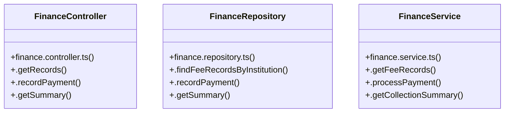

# [Document: Decisions & ADR-001 Strict Separation of Phase Deliverables] Cluster

> 15 nodes · cohesion 0.17

## Key Concepts

- [FinanceController](file:///C:/Antigravityyyyy/VID_School/backend/src/modules/finance/finance.controller.ts#L5) (4 connections)
- [FinanceRepository](file:///C:/Antigravityyyyy/VID_School/backend/src/modules/finance/finance.repository.ts#L3) (4 connections)
- [FinanceService](file:///C:/Antigravityyyyy/VID_School/backend/src/modules/finance/finance.service.ts#L3) (4 connections)
- [.getRecords()](file:///C:/Antigravityyyyy/VID_School/backend/src/modules/finance/finance.controller.ts#L6) (3 connections)
- [.getSummary()](file:///C:/Antigravityyyyy/VID_School/backend/src/modules/finance/finance.controller.ts#L35) (3 connections)
- [.recordPayment()](file:///C:/Antigravityyyyy/VID_School/backend/src/modules/finance/finance.controller.ts#L16) (3 connections)
- [.findFeeRecordsByInstitution()](file:///C:/Antigravityyyyy/VID_School/backend/src/modules/finance/finance.repository.ts#L4) (3 connections)
- [.getSummary()](file:///C:/Antigravityyyyy/VID_School/backend/src/modules/finance/finance.repository.ts#L51) (3 connections)
- [.recordPayment()](file:///C:/Antigravityyyyy/VID_School/backend/src/modules/finance/finance.repository.ts#L36) (3 connections)
- [.getCollectionSummary()](file:///C:/Antigravityyyyy/VID_School/backend/src/modules/finance/finance.service.ts#L34) (3 connections)
- [.getFeeRecords()](file:///C:/Antigravityyyyy/VID_School/backend/src/modules/finance/finance.service.ts#L4) (3 connections)
- [.processPayment()](file:///C:/Antigravityyyyy/VID_School/backend/src/modules/finance/finance.service.ts#L8) (3 connections)
- [finance.controller.ts](file:///C:/Antigravityyyyy/VID_School/backend/src/modules/finance/finance.controller.ts#L1) (1 connections)
- [finance.repository.ts](file:///C:/Antigravityyyyy/VID_School/backend/src/modules/finance/finance.repository.ts#L1) (1 connections)
- [finance.service.ts](file:///C:/Antigravityyyyy/VID_School/backend/src/modules/finance/finance.service.ts#L1) (1 connections)

## Class Diagram

## Relationships

- No strong cross-community connections detected

## Source Files

- [C:\Antigravityyyyy\VID_School\backend\src\modules\finance\finance.controller.ts](file:///C:/Antigravityyyyy/VID_School/backend/src/modules/finance/finance.controller.ts)
- [C:\Antigravityyyyy\VID_School\backend\src\modules\finance\finance.repository.ts](file:///C:/Antigravityyyyy/VID_School/backend/src/modules/finance/finance.repository.ts)
- [C:\Antigravityyyyy\VID_School\backend\src\modules\finance\finance.service.ts](file:///C:/Antigravityyyyy/VID_School/backend/src/modules/finance/finance.service.ts)

## Audit Trail

- EXTRACTED: 24 (57%)
- INFERRED: 18 (43%)
- AMBIGUOUS: 0 (0%)

---

*Part of the graphify knowledge wiki. See [[index]] to navigate.*