# [Document: Design & 10. Accessibility Baseline] Cluster

> 159 nodes · cohesion 0.02

## Key Concepts

- [.dispatch()](file:///C:/Antigravityyyyy/VID_School/backend/src/common/audit-dispatcher.ts#L23) (81 connections)
- [AcademicsService](file:///C:/Antigravityyyyy/VID_School/backend/src/modules/academics/academics.service.ts#L5) (49 connections)
- [HrmsService](file:///C:/Antigravityyyyy/VID_School/backend/src/modules/hrms/hrms.service.ts#L16) (30 connections)
- [ExaminationsService](file:///C:/Antigravityyyyy/VID_School/backend/src/modules/examinations/examinations.service.ts#L6) (26 connections)
- [runVerification()](file:///C:/Antigravityyyyy/VID_School/backend/src/scripts/verify-1b-hrms.ts#L11) (23 connections)
- [runVerification()](file:///C:/Antigravityyyyy/VID_School/backend/src/scripts/verify-2-academics.ts#L4) (21 connections)
- [AdmissionsRepository](file:///C:/Antigravityyyyy/VID_School/backend/src/modules/admissions/admissions.repository.ts#L25) (18 connections)
- [runVerification()](file:///C:/Antigravityyyyy/VID_School/backend/src/scripts/verify-3-admissions.ts#L6) (16 connections)
- [AdmissionsService](file:///C:/Antigravityyyyy/VID_School/backend/src/modules/admissions/admissions.service.ts#L16) (15 connections)
- [.approveApplication()](file:///C:/Antigravityyyyy/VID_School/backend/src/modules/admissions/admissions.service.ts#L91) (11 connections)
- [StudentRepository](file:///C:/Antigravityyyyy/VID_School/backend/src/modules/students/student.repository.ts#L14) (9 connections)
- [StudentService](file:///C:/Antigravityyyyy/VID_School/backend/src/modules/students/student.service.ts#L3) (8 connections)
- [.changePassword()](file:///C:/Antigravityyyyy/VID_School/backend/src/modules/auth/auth.service.ts#L143) (5 connections)
- [.createDepartment()](file:///C:/Antigravityyyyy/VID_School/backend/src/modules/hrms/hrms.service.ts#L68) (5 connections)
- [.softDeleteStaff()](file:///C:/Antigravityyyyy/VID_School/backend/src/modules/hrms/hrms.service.ts#L435) (5 connections)
- [.getClassesByInstitution()](file:///C:/Antigravityyyyy/VID_School/backend/src/modules/academics/academics.repository.ts#L332) (4 connections)
- [.createAcademicYear()](file:///C:/Antigravityyyyy/VID_School/backend/src/modules/academics/academics.service.ts#L18) (4 connections)
- [.createClass()](file:///C:/Antigravityyyyy/VID_School/backend/src/modules/academics/academics.service.ts#L165) (4 connections)
- [.generateClassMatrix()](file:///C:/Antigravityyyyy/VID_School/backend/src/modules/academics/academics.service.ts#L270) (4 connections)
- [.convertEnquiry()](file:///C:/Antigravityyyyy/VID_School/backend/src/modules/admissions/admissions.controller.ts#L32) (4 connections)
- [.executeApprovalTransaction()](file:///C:/Antigravityyyyy/VID_School/backend/src/modules/admissions/admissions.repository.ts#L295) (4 connections)
- [.findApplicationById()](file:///C:/Antigravityyyyy/VID_School/backend/src/modules/admissions/admissions.repository.ts#L157) (4 connections)
- [.updateApplicationStage()](file:///C:/Antigravityyyyy/VID_School/backend/src/modules/admissions/admissions.repository.ts#L277) (4 connections)
- [.convertToApplication()](file:///C:/Antigravityyyyy/VID_School/backend/src/modules/admissions/admissions.service.ts#L26) (4 connections)
- [.updateStage()](file:///C:/Antigravityyyyy/VID_School/backend/src/modules/admissions/admissions.service.ts#L84) (4 connections)
- *... and 134 more nodes in this community*

## Class Diagram

```mermaid
classDiagram
    class AcademicsService {
        +academics.service.ts()
        +.getAcademicYears()
        +.getAcademicYearById()
        +.createAcademicYear()
        +.updateAcademicYear()
        +.setCurrentAcademicYear()
        +.closeAcademicYear()
        +.cloneAcademicYear()
        +.getAcademicGrades()
        +.getClasses()
    }
    class AdmissionsRepository {
        +admissions.repository.ts()
        +.findEnquiries()
        +.createEnquiry()
        +.convertEnquiryToApplication()
        +.findApplicantsByInstitution()
        +.findApplicationById()
        +.createApplication()
        +.bulkInsertApplicants()
        +.updateApplicationStage()
        +.executeApprovalTransaction()
    }
    class AdmissionsService {
        +admissions.service.ts()
        +.getEnquiries()
        +.createEnquiry()
        +.convertToApplication()
        +.getApplicants()
        +.getApplicationById()
        +.createApplication()
        +.bulkImport()
        +.updateStage()
        +.approveApplication()
    }
    class AuditDispatcher {
        +audit-dispatcher.ts()
        +.dispatch()
    }
    class ExaminationsService {
        +examinations.service.ts()
        +.createExamType()
        +.listExamTypes()
        +.createExam()
        +.getExamById()
        +.listExams()
        +.updateExamStatus()
        +.addExamSubject()
        +.listExamSubjects()
        +.createExamSchedule()
    }
    class HrmsService {
        +hrms.service.ts()
        +.constructor()
        +.listDesignations()
        +.createDesignation()
        +.deleteDesignation()
        +.listDepartments()
        +.createDepartment()
        +.deleteDepartment()
        +.listStaff()
        +.getStaffDetails()
    }
    class StudentRepository {
        +student.repository.ts()
        +.findStudents()
        +.findStudentMasterById()
        +.createStudent()
        +.updateStudent()
        +.promote()
        +.countStudents()
        +.getClassEnrollmentCounts()
        +.bulkInsertStudents()
    }
    class StudentService {
        +student.service.ts()
        +.listStudents()
        +.getStudentMaster()
        +.createStudent()
        +.updateStudent()
        +.promoteStudent()
        +.getClassEnrollmentCounts()
        +.bulkImport()
    }
```

## Relationships

- No strong cross-community connections detected

## Source Files

- [C:\Antigravityyyyy\VID_School\backend\src\common\audit-dispatcher.ts](file:///C:/Antigravityyyyy/VID_School/backend/src/common/audit-dispatcher.ts)
- [C:\Antigravityyyyy\VID_School\backend\src\middleware\tenant.middleware.ts](file:///C:/Antigravityyyyy/VID_School/backend/src/middleware/tenant.middleware.ts)
- [C:\Antigravityyyyy\VID_School\backend\src\modules\academics\academics.repository.ts](file:///C:/Antigravityyyyy/VID_School/backend/src/modules/academics/academics.repository.ts)
- [C:\Antigravityyyyy\VID_School\backend\src\modules\academics\academics.service.ts](file:///C:/Antigravityyyyy/VID_School/backend/src/modules/academics/academics.service.ts)
- [C:\Antigravityyyyy\VID_School\backend\src\modules\admissions\admissions.controller.ts](file:///C:/Antigravityyyyy/VID_School/backend/src/modules/admissions/admissions.controller.ts)
- [C:\Antigravityyyyy\VID_School\backend\src\modules\admissions\admissions.repository.ts](file:///C:/Antigravityyyyy/VID_School/backend/src/modules/admissions/admissions.repository.ts)
- [C:\Antigravityyyyy\VID_School\backend\src\modules\admissions\admissions.service.ts](file:///C:/Antigravityyyyy/VID_School/backend/src/modules/admissions/admissions.service.ts)
- [C:\Antigravityyyyy\VID_School\backend\src\modules\auth\auth.repository.ts](file:///C:/Antigravityyyyy/VID_School/backend/src/modules/auth/auth.repository.ts)
- [C:\Antigravityyyyy\VID_School\backend\src\modules\auth\auth.service.ts](file:///C:/Antigravityyyyy/VID_School/backend/src/modules/auth/auth.service.ts)
- [C:\Antigravityyyyy\VID_School\backend\src\modules\examinations\examinations.service.ts](file:///C:/Antigravityyyyy/VID_School/backend/src/modules/examinations/examinations.service.ts)
- [C:\Antigravityyyyy\VID_School\backend\src\modules\hrms\hrms.service.ts](file:///C:/Antigravityyyyy/VID_School/backend/src/modules/hrms/hrms.service.ts)
- [C:\Antigravityyyyy\VID_School\backend\src\modules\students\student.controller.ts](file:///C:/Antigravityyyyy/VID_School/backend/src/modules/students/student.controller.ts)
- [C:\Antigravityyyyy\VID_School\backend\src\modules\students\student.repository.ts](file:///C:/Antigravityyyyy/VID_School/backend/src/modules/students/student.repository.ts)
- [C:\Antigravityyyyy\VID_School\backend\src\modules\students\student.service.ts](file:///C:/Antigravityyyyy/VID_School/backend/src/modules/students/student.service.ts)
- [C:\Antigravityyyyy\VID_School\backend\src\scripts\verify-1b-hrms.ts](file:///C:/Antigravityyyyy/VID_School/backend/src/scripts/verify-1b-hrms.ts)
- [C:\Antigravityyyyy\VID_School\backend\src\scripts\verify-2-academics.ts](file:///C:/Antigravityyyyy/VID_School/backend/src/scripts/verify-2-academics.ts)
- [C:\Antigravityyyyy\VID_School\backend\src\scripts\verify-3-admissions.ts](file:///C:/Antigravityyyyy/VID_School/backend/src/scripts/verify-3-admissions.ts)
- [C:\Antigravityyyyy\VID_School\frontend\app\admissions\page.tsx](file:///C:/Antigravityyyyy/VID_School/frontend/app/admissions/page.tsx)

## Audit Trail

- EXTRACTED: 326 (50%)
- INFERRED: 326 (50%)
- AMBIGUOUS: 0 (0%)

---

*Part of the graphify knowledge wiki. See [[index]] to navigate.*