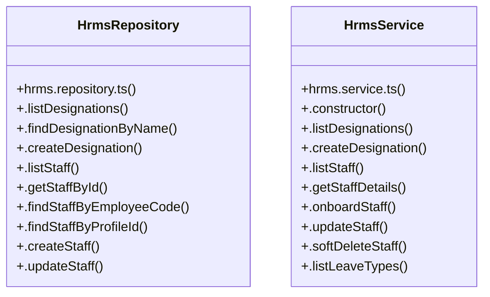

# [Document: Design & 10. Accessibility Baseline] Cluster

> 59 nodes · cohesion 0.05

## Key Concepts

- [HrmsRepository](file:///C:/Antigravityyyyy/VID_School/backend/src/modules/hrms/hrms.repository.ts#L90) (31 connections)
- [HrmsService](file:///C:/Antigravityyyyy/VID_School/backend/src/modules/hrms/hrms.service.ts#L14) (22 connections)
- [.actionLeaveRequest()](file:///C:/Antigravityyyyy/VID_School/backend/src/modules/hrms/hrms.service.ts#L375) (7 connections)
- [.applyLeave()](file:///C:/Antigravityyyyy/VID_School/backend/src/modules/hrms/hrms.service.ts#L277) (7 connections)
- [.onboardStaff()](file:///C:/Antigravityyyyy/VID_School/backend/src/modules/hrms/hrms.service.ts#L77) (7 connections)
- [.updateStaff()](file:///C:/Antigravityyyyy/VID_School/backend/src/modules/hrms/hrms.service.ts#L166) (7 connections)
- [.getStaffById()](file:///C:/Antigravityyyyy/VID_School/backend/src/modules/hrms/hrms.repository.ts#L190) (6 connections)
- [.getStaffAttendance()](file:///C:/Antigravityyyyy/VID_School/backend/src/modules/hrms/hrms.controller.ts#L321) (5 connections)
- [.deleteStaff()](file:///C:/Antigravityyyyy/VID_School/backend/src/modules/hrms/hrms.controller.ts#L166) (4 connections)
- [.getMonthlyAttendanceSummary()](file:///C:/Antigravityyyyy/VID_School/backend/src/modules/hrms/hrms.controller.ts#L349) (4 connections)
- [.getPayrollExport()](file:///C:/Antigravityyyyy/VID_School/backend/src/modules/hrms/hrms.controller.ts#L413) (4 connections)
- [.markStaffAttendance()](file:///C:/Antigravityyyyy/VID_School/backend/src/modules/hrms/hrms.controller.ts#L298) (4 connections)
- [.markStaffAttendanceBatch()](file:///C:/Antigravityyyyy/VID_School/backend/src/modules/hrms/hrms.service.ts#L474) (4 connections)
- [.softDeleteStaff()](file:///C:/Antigravityyyyy/VID_School/backend/src/modules/hrms/hrms.service.ts#L225) (4 connections)
- [.getStaffLeaveUsageByYear()](file:///C:/Antigravityyyyy/VID_School/backend/src/modules/hrms/hrms.repository.ts#L550) (3 connections)
- [.linkFacultyRecord()](file:///C:/Antigravityyyyy/VID_School/backend/src/modules/hrms/hrms.repository.ts#L364) (3 connections)
- [.recordEmploymentHistory()](file:///C:/Antigravityyyyy/VID_School/backend/src/modules/hrms/hrms.repository.ts#L316) (3 connections)
- [.generatePayrollExport()](file:///C:/Antigravityyyyy/VID_School/backend/src/modules/hrms/hrms.service.ts#L581) (3 connections)
- [.getMonthlyAttendanceAggregates()](file:///C:/Antigravityyyyy/VID_School/backend/src/modules/hrms/hrms.service.ts#L535) (3 connections)
- [.getStaffDetails()](file:///C:/Antigravityyyyy/VID_School/backend/src/modules/hrms/hrms.service.ts#L61) (3 connections)
- [.checkOverlappingLeave()](file:///C:/Antigravityyyyy/VID_School/backend/src/modules/hrms/hrms.repository.ts#L512) (2 connections)
- [.closeActiveEmploymentHistory()](file:///C:/Antigravityyyyy/VID_School/backend/src/modules/hrms/hrms.repository.ts#L339) (2 connections)
- [.createLeaveRequest()](file:///C:/Antigravityyyyy/VID_School/backend/src/modules/hrms/hrms.repository.ts#L416) (2 connections)
- [.createStaff()](file:///C:/Antigravityyyyy/VID_School/backend/src/modules/hrms/hrms.repository.ts#L229) (2 connections)
- [.findStaffByEmployeeCode()](file:///C:/Antigravityyyyy/VID_School/backend/src/modules/hrms/hrms.repository.ts#L211) (2 connections)
- *... and 34 more nodes in this community*

## Class Diagram

## Relationships

- No strong cross-community connections detected

## Source Files

- [C:\Antigravityyyyy\VID_School\backend\src\modules\hrms\hrms.controller.ts](file:///C:/Antigravityyyyy/VID_School/backend/src/modules/hrms/hrms.controller.ts)
- [C:\Antigravityyyyy\VID_School\backend\src\modules\hrms\hrms.repository.ts](file:///C:/Antigravityyyyy/VID_School/backend/src/modules/hrms/hrms.repository.ts)
- [C:\Antigravityyyyy\VID_School\backend\src\modules\hrms\hrms.service.ts](file:///C:/Antigravityyyyy/VID_School/backend/src/modules/hrms/hrms.service.ts)

## Audit Trail

- EXTRACTED: 114 (60%)
- INFERRED: 77 (40%)
- AMBIGUOUS: 0 (0%)

---

*Part of the graphify knowledge wiki. See [[index]] to navigate.*