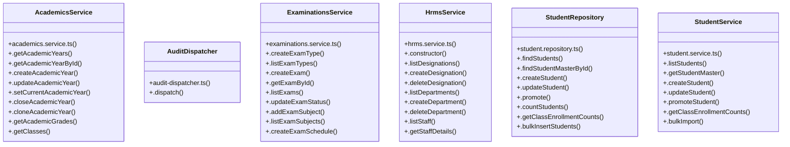

# [Document: Design & 10. Accessibility Baseline] Cluster

> 128 nodes · cohesion 0.03

## Key Concepts

- [.dispatch()](file:///C:/Antigravityyyyy/VID_School/backend/src/common/audit-dispatcher.ts#L23) (81 connections)
- [AcademicsService](file:///C:/Antigravityyyyy/VID_School/backend/src/modules/academics/academics.service.ts#L4) (49 connections)
- [HrmsService](file:///C:/Antigravityyyyy/VID_School/backend/src/modules/hrms/hrms.service.ts#L16) (30 connections)
- [ExaminationsService](file:///C:/Antigravityyyyy/VID_School/backend/src/modules/examinations/examinations.service.ts#L6) (26 connections)
- [runVerification()](file:///C:/Antigravityyyyy/VID_School/backend/src/scripts/verify-1b-hrms.ts#L11) (23 connections)
- [runVerification()](file:///C:/Antigravityyyyy/VID_School/backend/src/scripts/verify-2-academics.ts#L4) (21 connections)
- [runVerification()](file:///C:/Antigravityyyyy/VID_School/backend/src/scripts/verify-3-admissions.ts#L6) (16 connections)
- [StudentRepository](file:///C:/Antigravityyyyy/VID_School/backend/src/modules/students/student.repository.ts#L14) (9 connections)
- [StudentService](file:///C:/Antigravityyyyy/VID_School/backend/src/modules/students/student.service.ts#L3) (8 connections)
- [.createDepartment()](file:///C:/Antigravityyyyy/VID_School/backend/src/modules/hrms/hrms.service.ts#L68) (5 connections)
- [.softDeleteStaff()](file:///C:/Antigravityyyyy/VID_School/backend/src/modules/hrms/hrms.service.ts#L435) (5 connections)
- [.getClassesByInstitution()](file:///C:/Antigravityyyyy/VID_School/backend/src/modules/academics/academics.repository.ts#L331) (4 connections)
- [.createAcademicYear()](file:///C:/Antigravityyyyy/VID_School/backend/src/modules/academics/academics.service.ts#L17) (4 connections)
- [.generateClassMatrix()](file:///C:/Antigravityyyyy/VID_School/backend/src/modules/academics/academics.service.ts#L210) (4 connections)
- [verify-1b-hrms.ts](file:///C:/Antigravityyyyy/VID_School/backend/src/scripts/verify-1b-hrms.ts#L1) (4 connections)
- [.commitImportBatch()](file:///C:/Antigravityyyyy/VID_School/backend/src/modules/examinations/examinations.repository.ts#L807) (4 connections)
- [.upsertMarksBatch()](file:///C:/Antigravityyyyy/VID_School/backend/src/modules/examinations/examinations.repository.ts#L560) (4 connections)
- [.commitExcelImport()](file:///C:/Antigravityyyyy/VID_School/backend/src/modules/examinations/examinations.service.ts#L315) (4 connections)
- [.getStudentReportCard()](file:///C:/Antigravityyyyy/VID_School/backend/src/modules/examinations/examinations.service.ts#L448) (4 connections)
- [.submitMarksBatch()](file:///C:/Antigravityyyyy/VID_School/backend/src/modules/examinations/examinations.service.ts#L193) (4 connections)
- [.promote()](file:///C:/Antigravityyyyy/VID_School/backend/src/modules/students/student.controller.ts#L77) (4 connections)
- [.createStudent()](file:///C:/Antigravityyyyy/VID_School/backend/src/modules/students/student.repository.ts#L139) (4 connections)
- [.getStudentMaster()](file:///C:/Antigravityyyyy/VID_School/backend/src/modules/students/student.service.ts#L8) (4 connections)
- [.promoteStudent()](file:///C:/Antigravityyyyy/VID_School/backend/src/modules/students/student.service.ts#L22) (4 connections)
- [tenantMiddleware()](file:///C:/Antigravityyyyy/VID_School/backend/src/middleware/tenant.middleware.ts#L12) (4 connections)
- *... and 103 more nodes in this community*

## Class Diagram

## Relationships

- No strong cross-community connections detected

## Source Files

- [C:\Antigravityyyyy\VID_School\backend\src\common\audit-dispatcher.ts](file:///C:/Antigravityyyyy/VID_School/backend/src/common/audit-dispatcher.ts)
- [C:\Antigravityyyyy\VID_School\backend\src\middleware\tenant.middleware.ts](file:///C:/Antigravityyyyy/VID_School/backend/src/middleware/tenant.middleware.ts)
- [C:\Antigravityyyyy\VID_School\backend\src\modules\academics\academics.repository.ts](file:///C:/Antigravityyyyy/VID_School/backend/src/modules/academics/academics.repository.ts)
- [C:\Antigravityyyyy\VID_School\backend\src\modules\academics\academics.service.ts](file:///C:/Antigravityyyyy/VID_School/backend/src/modules/academics/academics.service.ts)
- [C:\Antigravityyyyy\VID_School\backend\src\modules\examinations\examinations.repository.ts](file:///C:/Antigravityyyyy/VID_School/backend/src/modules/examinations/examinations.repository.ts)
- [C:\Antigravityyyyy\VID_School\backend\src\modules\examinations\examinations.service.ts](file:///C:/Antigravityyyyy/VID_School/backend/src/modules/examinations/examinations.service.ts)
- [C:\Antigravityyyyy\VID_School\backend\src\modules\hrms\hrms.service.ts](file:///C:/Antigravityyyyy/VID_School/backend/src/modules/hrms/hrms.service.ts)
- [C:\Antigravityyyyy\VID_School\backend\src\modules\students\student.controller.ts](file:///C:/Antigravityyyyy/VID_School/backend/src/modules/students/student.controller.ts)
- [C:\Antigravityyyyy\VID_School\backend\src\modules\students\student.repository.ts](file:///C:/Antigravityyyyy/VID_School/backend/src/modules/students/student.repository.ts)
- [C:\Antigravityyyyy\VID_School\backend\src\modules\students\student.service.ts](file:///C:/Antigravityyyyy/VID_School/backend/src/modules/students/student.service.ts)
- [C:\Antigravityyyyy\VID_School\backend\src\scripts\verify-1b-hrms.ts](file:///C:/Antigravityyyyy/VID_School/backend/src/scripts/verify-1b-hrms.ts)
- [C:\Antigravityyyyy\VID_School\backend\src\scripts\verify-2-academics.ts](file:///C:/Antigravityyyyy/VID_School/backend/src/scripts/verify-2-academics.ts)
- [C:\Antigravityyyyy\VID_School\backend\src\scripts\verify-3-admissions.ts](file:///C:/Antigravityyyyy/VID_School/backend/src/scripts/verify-3-admissions.ts)

## Audit Trail

- EXTRACTED: 259 (48%)
- INFERRED: 279 (52%)
- AMBIGUOUS: 0 (0%)

---

*Part of the graphify knowledge wiki. See [[index]] to navigate.*