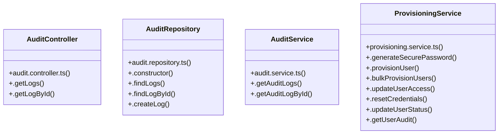

# [Document: Memory & 1.1 Architecture & Stack Contract] Cluster

> 28 nodes · cohesion 0.11

## Key Concepts

- [runR4Verification()](file:///C:/Antigravityyyyy/VID_School/backend/src/scripts/verify-r4-provisioning.ts#L22) (10 connections)
- [ProvisioningService](file:///C:/Antigravityyyyy/VID_School/backend/src/modules/users/provisioning.service.ts#L54) (8 connections)
- [.provisionUser()](file:///C:/Antigravityyyyy/VID_School/backend/src/modules/users/provisioning.service.ts#L80) (8 connections)
- [.createLog()](file:///C:/Antigravityyyyy/VID_School/backend/src/modules/audit/audit.repository.ts#L117) (7 connections)
- [AuditRepository](file:///C:/Antigravityyyyy/VID_School/backend/src/modules/audit/audit.repository.ts#L18) (5 connections)
- [.resetCredentials()](file:///C:/Antigravityyyyy/VID_School/backend/src/modules/users/provisioning.service.ts#L482) (5 connections)
- [.updateUserAccess()](file:///C:/Antigravityyyyy/VID_School/backend/src/modules/users/provisioning.service.ts#L375) (5 connections)
- [.updateUserStatus()](file:///C:/Antigravityyyyy/VID_School/backend/src/modules/users/provisioning.service.ts#L560) (5 connections)
- [.getLogById()](file:///C:/Antigravityyyyy/VID_School/backend/src/modules/audit/audit.controller.ts#L38) (4 connections)
- [.getLogs()](file:///C:/Antigravityyyyy/VID_School/backend/src/modules/audit/audit.controller.ts#L6) (4 connections)
- [.bulkProvisionUsers()](file:///C:/Antigravityyyyy/VID_School/backend/src/modules/users/provisioning.service.ts#L292) (4 connections)
- [resolveRoleTemplate()](file:///C:/Antigravityyyyy/VID_School/backend/src/modules/users/role-templates.ts#L99) (4 connections)
- [AuditController](file:///C:/Antigravityyyyy/VID_School/backend/src/modules/audit/audit.controller.ts#L5) (3 connections)
- [.findLogById()](file:///C:/Antigravityyyyy/VID_School/backend/src/modules/audit/audit.repository.ts#L98) (3 connections)
- [.findLogs()](file:///C:/Antigravityyyyy/VID_School/backend/src/modules/audit/audit.repository.ts#L23) (3 connections)
- [AuditService](file:///C:/Antigravityyyyy/VID_School/backend/src/modules/audit/audit.service.ts#L3) (3 connections)
- [.getAuditLogById()](file:///C:/Antigravityyyyy/VID_School/backend/src/modules/audit/audit.service.ts#L15) (3 connections)
- [.getAuditLogs()](file:///C:/Antigravityyyyy/VID_School/backend/src/modules/audit/audit.service.ts#L4) (3 connections)
- [.generateSecurePassword()](file:///C:/Antigravityyyyy/VID_School/backend/src/modules/users/provisioning.service.ts#L59) (3 connections)
- [.getUserAudit()](file:///C:/Antigravityyyyy/VID_School/backend/src/modules/users/provisioning.service.ts#L641) (3 connections)
- [role-templates.ts](file:///C:/Antigravityyyyy/VID_School/backend/src/modules/users/role-templates.ts#L1) (2 connections)
- [.constructor()](file:///C:/Antigravityyyyy/VID_School/backend/src/modules/audit/audit.repository.ts#L19) (1 connections)
- [audit.controller.ts](file:///C:/Antigravityyyyy/VID_School/backend/src/modules/audit/audit.controller.ts#L1) (1 connections)
- [audit.repository.ts](file:///C:/Antigravityyyyy/VID_School/backend/src/modules/audit/audit.repository.ts#L1) (1 connections)
- [audit.service.ts](file:///C:/Antigravityyyyy/VID_School/backend/src/modules/audit/audit.service.ts#L1) (1 connections)
- *... and 3 more nodes in this community*

## Class Diagram

## Relationships

- No strong cross-community connections detected

## Source Files

- [C:\Antigravityyyyy\VID_School\backend\src\modules\audit\audit.controller.ts](file:///C:/Antigravityyyyy/VID_School/backend/src/modules/audit/audit.controller.ts)
- [C:\Antigravityyyyy\VID_School\backend\src\modules\audit\audit.repository.ts](file:///C:/Antigravityyyyy/VID_School/backend/src/modules/audit/audit.repository.ts)
- [C:\Antigravityyyyy\VID_School\backend\src\modules\audit\audit.service.ts](file:///C:/Antigravityyyyy/VID_School/backend/src/modules/audit/audit.service.ts)
- [C:\Antigravityyyyy\VID_School\backend\src\modules\users\provisioning.service.ts](file:///C:/Antigravityyyyy/VID_School/backend/src/modules/users/provisioning.service.ts)
- [C:\Antigravityyyyy\VID_School\backend\src\modules\users\role-templates.ts](file:///C:/Antigravityyyyy/VID_School/backend/src/modules/users/role-templates.ts)
- [C:\Antigravityyyyy\VID_School\backend\src\scripts\verify-r4-provisioning.ts](file:///C:/Antigravityyyyy/VID_School/backend/src/scripts/verify-r4-provisioning.ts)

## Audit Trail

- EXTRACTED: 50 (49%)
- INFERRED: 52 (51%)
- AMBIGUOUS: 0 (0%)

---

*Part of the graphify knowledge wiki. See [[index]] to navigate.*