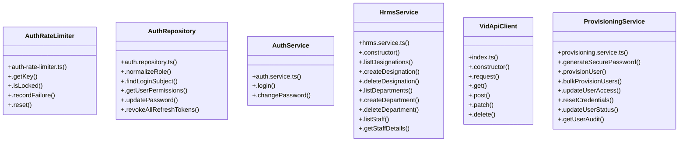

# [Document: Prd & 1.1 Problem Statement] Cluster

> 72 nodes · cohesion 0.04

## Key Concepts

- [HrmsService](file:///C:/Antigravityyyyy/VID_School/backend/src/modules/hrms/hrms.service.ts#L16) (30 connections)
- [runVerification()](file:///C:/Antigravityyyyy/VID_School/backend/src/scripts/verify-1b-hrms.ts#L11) (23 connections)
- [.login()](file:///C:/Antigravityyyyy/VID_School/backend/src/modules/auth/auth.service.ts#L24) (10 connections)
- [runR4Verification()](file:///C:/Antigravityyyyy/VID_School/backend/src/scripts/verify-r4-provisioning.ts#L22) (10 connections)
- [ProvisioningService](file:///C:/Antigravityyyyy/VID_School/backend/src/modules/users/provisioning.service.ts#L54) (8 connections)
- [.provisionUser()](file:///C:/Antigravityyyyy/VID_School/backend/src/modules/users/provisioning.service.ts#L80) (8 connections)
- [.createLog()](file:///C:/Antigravityyyyy/VID_School/backend/src/modules/audit/audit.repository.ts#L117) (7 connections)
- [VidApiClient](file:///C:/Antigravityyyyy/VID_School/packages/api-client/src/index.ts#L7) (7 connections)
- [.reset()](file:///C:/Antigravityyyyy/VID_School/backend/src/modules/auth/auth-rate-limiter.ts#L103) (6 connections)
- [AuthRepository](file:///C:/Antigravityyyyy/VID_School/backend/src/modules/auth/auth.repository.ts#L22) (6 connections)
- [AuthRateLimiter](file:///C:/Antigravityyyyy/VID_School/backend/src/modules/auth/auth-rate-limiter.ts#L9) (5 connections)
- [.isLocked()](file:///C:/Antigravityyyyy/VID_School/backend/src/modules/auth/auth-rate-limiter.ts#L19) (5 connections)
- [.recordFailure()](file:///C:/Antigravityyyyy/VID_School/backend/src/modules/auth/auth-rate-limiter.ts#L52) (5 connections)
- [.findLoginSubject()](file:///C:/Antigravityyyyy/VID_School/backend/src/modules/auth/auth.repository.ts#L42) (5 connections)
- [.changePassword()](file:///C:/Antigravityyyyy/VID_School/backend/src/modules/auth/auth.service.ts#L143) (5 connections)
- [.getStaffAttendance()](file:///C:/Antigravityyyyy/VID_School/backend/src/modules/hrms/hrms.controller.ts#L406) (5 connections)
- [.softDeleteStaff()](file:///C:/Antigravityyyyy/VID_School/backend/src/modules/hrms/hrms.service.ts#L435) (5 connections)
- [.get()](file:///C:/Antigravityyyyy/VID_School/packages/api-client/src/index.ts#L51) (5 connections)
- [.request()](file:///C:/Antigravityyyyy/VID_School/packages/api-client/src/index.ts#L18) (5 connections)
- [.resetCredentials()](file:///C:/Antigravityyyyy/VID_School/backend/src/modules/users/provisioning.service.ts#L482) (5 connections)
- [.updateUserAccess()](file:///C:/Antigravityyyyy/VID_School/backend/src/modules/users/provisioning.service.ts#L375) (5 connections)
- [.updateUserStatus()](file:///C:/Antigravityyyyy/VID_School/backend/src/modules/users/provisioning.service.ts#L560) (5 connections)
- [.getKey()](file:///C:/Antigravityyyyy/VID_School/backend/src/modules/auth/auth-rate-limiter.ts#L15) (4 connections)
- [verify-1b-hrms.ts](file:///C:/Antigravityyyyy/VID_School/backend/src/scripts/verify-1b-hrms.ts#L1) (4 connections)
- [.deleteStaff()](file:///C:/Antigravityyyyy/VID_School/backend/src/modules/hrms/hrms.controller.ts#L251) (4 connections)
- *... and 47 more nodes in this community*

## Class Diagram

## Relationships

- No strong cross-community connections detected

## Source Files

- [C:\Antigravityyyyy\VID_School\backend\src\modules\academics\academics.service.ts](file:///C:/Antigravityyyyy/VID_School/backend/src/modules/academics/academics.service.ts)
- [C:\Antigravityyyyy\VID_School\backend\src\modules\audit\audit.repository.ts](file:///C:/Antigravityyyyy/VID_School/backend/src/modules/audit/audit.repository.ts)
- [C:\Antigravityyyyy\VID_School\backend\src\modules\auth\auth-rate-limiter.ts](file:///C:/Antigravityyyyy/VID_School/backend/src/modules/auth/auth-rate-limiter.ts)
- [C:\Antigravityyyyy\VID_School\backend\src\modules\auth\auth.repository.ts](file:///C:/Antigravityyyyy/VID_School/backend/src/modules/auth/auth.repository.ts)
- [C:\Antigravityyyyy\VID_School\backend\src\modules\auth\auth.service.ts](file:///C:/Antigravityyyyy/VID_School/backend/src/modules/auth/auth.service.ts)
- [C:\Antigravityyyyy\VID_School\backend\src\modules\hrms\hrms.controller.ts](file:///C:/Antigravityyyyy/VID_School/backend/src/modules/hrms/hrms.controller.ts)
- [C:\Antigravityyyyy\VID_School\backend\src\modules\hrms\hrms.repository.ts](file:///C:/Antigravityyyyy/VID_School/backend/src/modules/hrms/hrms.repository.ts)
- [C:\Antigravityyyyy\VID_School\backend\src\modules\hrms\hrms.service.ts](file:///C:/Antigravityyyyy/VID_School/backend/src/modules/hrms/hrms.service.ts)
- [C:\Antigravityyyyy\VID_School\backend\src\modules\users\provisioning.service.ts](file:///C:/Antigravityyyyy/VID_School/backend/src/modules/users/provisioning.service.ts)
- [C:\Antigravityyyyy\VID_School\backend\src\modules\users\role-templates.ts](file:///C:/Antigravityyyyy/VID_School/backend/src/modules/users/role-templates.ts)
- [C:\Antigravityyyyy\VID_School\backend\src\scripts\verify-1b-hrms.ts](file:///C:/Antigravityyyyy/VID_School/backend/src/scripts/verify-1b-hrms.ts)
- [C:\Antigravityyyyy\VID_School\backend\src\scripts\verify-r2-auth.ts](file:///C:/Antigravityyyyy/VID_School/backend/src/scripts/verify-r2-auth.ts)
- [C:\Antigravityyyyy\VID_School\backend\src\scripts\verify-r4-provisioning.ts](file:///C:/Antigravityyyyy/VID_School/backend/src/scripts/verify-r4-provisioning.ts)
- [C:\Antigravityyyyy\VID_School\packages\api-client\src\index.ts](file:///C:/Antigravityyyyy/VID_School/packages/api-client/src/index.ts)

## Audit Trail

- EXTRACTED: 152 (53%)
- INFERRED: 136 (47%)
- AMBIGUOUS: 0 (0%)

---

*Part of the graphify knowledge wiki. See [[index]] to navigate.*