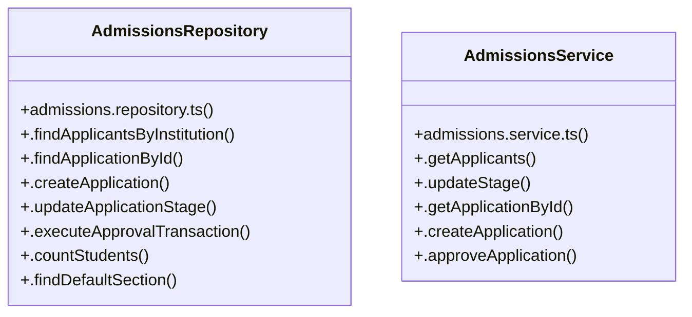

# [Document: Readme & 1. Prerequisites] Cluster

> 46 nodes · cohesion 0.05

## Key Concepts

- [page.tsx](file:///C:/Antigravityyyyy/VID_School/frontend/app/admissions/page.tsx#L1) (15 connections)
- [page.tsx](file:///C:/Antigravityyyyy/VID_School/frontend/app/%28auth%29/login/page.tsx#L1) (10 connections)
- [AdmissionsRepository](file:///C:/Antigravityyyyy/VID_School/backend/src/modules/admissions/admissions.repository.ts#L16) (8 connections)
- [AdmissionsService](file:///C:/Antigravityyyyy/VID_School/backend/src/modules/admissions/admissions.service.ts#L23) (6 connections)
- [.approveApplication()](file:///C:/Antigravityyyyy/VID_School/backend/src/modules/admissions/admissions.service.ts#L75) (6 connections)
- [.updateStage()](file:///C:/Antigravityyyyy/VID_School/backend/src/modules/admissions/admissions.service.ts#L44) (5 connections)
- [.executeApprovalTransaction()](file:///C:/Antigravityyyyy/VID_School/backend/src/modules/admissions/admissions.repository.ts#L98) (4 connections)
- [.findApplicationById()](file:///C:/Antigravityyyyy/VID_School/backend/src/modules/admissions/admissions.repository.ts#L48) (4 connections)
- [.countStudents()](file:///C:/Antigravityyyyy/VID_School/backend/src/modules/admissions/admissions.repository.ts#L229) (3 connections)
- [.findApplicantsByInstitution()](file:///C:/Antigravityyyyy/VID_School/backend/src/modules/admissions/admissions.repository.ts#L17) (3 connections)
- [.findDefaultSection()](file:///C:/Antigravityyyyy/VID_School/backend/src/modules/admissions/admissions.repository.ts#L234) (3 connections)
- [.updateApplicationStage()](file:///C:/Antigravityyyyy/VID_School/backend/src/modules/admissions/admissions.repository.ts#L90) (3 connections)
- [admissions.service.ts](file:///C:/Antigravityyyyy/VID_School/backend/src/modules/admissions/admissions.service.ts#L1) (3 connections)
- [page.tsx](file:///C:/Antigravityyyyy/VID_School/frontend/app/timetable/matrix/page.tsx#L1) (3 connections)
- [.createApplication()](file:///C:/Antigravityyyyy/VID_School/backend/src/modules/admissions/admissions.repository.ts#L56) (2 connections)
- [.getApplicants()](file:///C:/Antigravityyyyy/VID_School/backend/src/modules/admissions/admissions.service.ts#L24) (2 connections)
- [.getApplicationById()](file:///C:/Antigravityyyyy/VID_School/backend/src/modules/admissions/admissions.service.ts#L53) (2 connections)
- [handleAdvanceStage()](file:///C:/Antigravityyyyy/VID_School/frontend/app/admissions/page.tsx#L130) (2 connections)
- [handleEnroll()](file:///C:/Antigravityyyyy/VID_School/frontend/app/admissions/page.tsx#L120) (2 connections)
- [handleReject()](file:///C:/Antigravityyyyy/VID_School/frontend/app/admissions/page.tsx#L147) (2 connections)
- [router](file:///C:/Antigravityyyyy/VID_School/frontend/app/admissions/page.tsx#L45) (2 connections)
- [[selectedGrade, setSelectedGrade]](file:///C:/Antigravityyyyy/VID_School/frontend/app/timetable/matrix/page.tsx#L26) (2 connections)
- [[showPassword, setShowPassword]](file:///C:/Antigravityyyyy/VID_School/frontend/app/dashboard/page.tsx#L188) (2 connections)
- [.createApplication()](file:///C:/Antigravityyyyy/VID_School/backend/src/modules/admissions/admissions.service.ts#L61) (1 connections)
- [STAGE_MAP_TO_DB](file:///C:/Antigravityyyyy/VID_School/backend/src/modules/admissions/admissions.service.ts#L13) (1 connections)
- *... and 21 more nodes in this community*

## Class Diagram

## Relationships

- No strong cross-community connections detected

## Source Files

- [C:\Antigravityyyyy\VID_School\backend\src\modules\admissions\admissions.repository.ts](file:///C:/Antigravityyyyy/VID_School/backend/src/modules/admissions/admissions.repository.ts)
- [C:\Antigravityyyyy\VID_School\backend\src\modules\admissions\admissions.service.ts](file:///C:/Antigravityyyyy/VID_School/backend/src/modules/admissions/admissions.service.ts)
- [C:\Antigravityyyyy\VID_School\frontend\app\(auth)\login\page.tsx](file:///C:/Antigravityyyyy/VID_School/frontend/app/%28auth%29/login/page.tsx)
- [C:\Antigravityyyyy\VID_School\frontend\app\admissions\page.tsx](file:///C:/Antigravityyyyy/VID_School/frontend/app/admissions/page.tsx)
- [C:\Antigravityyyyy\VID_School\frontend\app\dashboard\page.tsx](file:///C:/Antigravityyyyy/VID_School/frontend/app/dashboard/page.tsx)
- [C:\Antigravityyyyy\VID_School\frontend\app\timetable\matrix\page.tsx](file:///C:/Antigravityyyyy/VID_School/frontend/app/timetable/matrix/page.tsx)

## Audit Trail

- EXTRACTED: 88 (75%)
- INFERRED: 29 (25%)
- AMBIGUOUS: 0 (0%)

---

*Part of the graphify knowledge wiki. See [[index]] to navigate.*