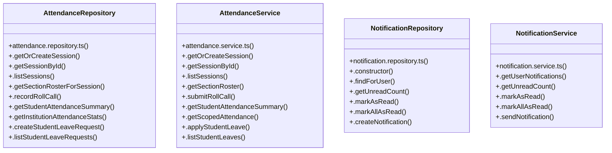

# [Document: Tasks & 1.1 Project Scaffolding & Infrastructure] Cluster

> 48 nodes · cohesion 0.05

## Key Concepts

- [AttendanceRepository](file:///C:/Antigravityyyyy/VID_School/backend/src/modules/attendance/attendance.repository.ts#L60) (14 connections)
- [AttendanceService](file:///C:/Antigravityyyyy/VID_School/backend/src/modules/attendance/attendance.service.ts#L6) (14 connections)
- [NotificationRepository](file:///C:/Antigravityyyyy/VID_School/backend/src/modules/notifications/notification.repository.ts#L17) (7 connections)
- [.submitRollCall()](file:///C:/Antigravityyyyy/VID_School/backend/src/modules/attendance/attendance.service.ts#L93) (6 connections)
- [NotificationService](file:///C:/Antigravityyyyy/VID_School/backend/src/modules/notifications/notification.service.ts#L3) (6 connections)
- [.sendNotification()](file:///C:/Antigravityyyyy/VID_School/backend/src/modules/notifications/notification.service.ts#L21) (6 connections)
- [.getStudentSummary()](file:///C:/Antigravityyyyy/VID_School/backend/src/modules/attendance/attendance.controller.ts#L94) (4 connections)
- [.verifyFacultySectionAccess()](file:///C:/Antigravityyyyy/VID_School/backend/src/modules/attendance/attendance.repository.ts#L642) (4 connections)
- [.decideStudentLeave()](file:///C:/Antigravityyyyy/VID_School/backend/src/modules/attendance/attendance.service.ts#L339) (4 connections)
- [.getNotifications()](file:///C:/Antigravityyyyy/VID_School/backend/src/modules/notifications/notification.controller.ts#L6) (4 connections)
- [.send()](file:///C:/Antigravityyyyy/VID_School/backend/src/modules/notifications/notification.controller.ts#L77) (4 connections)
- [.getInstitutionAttendanceStats()](file:///C:/Antigravityyyyy/VID_School/backend/src/modules/attendance/attendance.repository.ts#L402) (3 connections)
- [.applyStudentLeave()](file:///C:/Antigravityyyyy/VID_School/backend/src/modules/attendance/attendance.service.ts#L266) (3 connections)
- [.getOrCreateSession()](file:///C:/Antigravityyyyy/VID_School/backend/src/modules/attendance/attendance.service.ts#L8) (3 connections)
- [.getScopedAttendance()](file:///C:/Antigravityyyyy/VID_School/backend/src/modules/attendance/attendance.service.ts#L206) (3 connections)
- [.getSectionRoster()](file:///C:/Antigravityyyyy/VID_School/backend/src/modules/attendance/attendance.service.ts#L72) (3 connections)
- [.getStudentAttendanceSummary()](file:///C:/Antigravityyyyy/VID_School/backend/src/modules/attendance/attendance.service.ts#L168) (3 connections)
- [.getUserNotifications()](file:///C:/Antigravityyyyy/VID_School/backend/src/modules/notifications/notification.service.ts#L4) (3 connections)
- [.createStudentLeaveRequest()](file:///C:/Antigravityyyyy/VID_School/backend/src/modules/attendance/attendance.repository.ts#L432) (2 connections)
- [.decideStudentLeaveRequest()](file:///C:/Antigravityyyyy/VID_School/backend/src/modules/attendance/attendance.repository.ts#L515) (2 connections)
- [.getOrCreateSession()](file:///C:/Antigravityyyyy/VID_School/backend/src/modules/attendance/attendance.repository.ts#L62) (2 connections)
- [.getSectionRosterForSession()](file:///C:/Antigravityyyyy/VID_School/backend/src/modules/attendance/attendance.repository.ts#L221) (2 connections)
- [.getSessionById()](file:///C:/Antigravityyyyy/VID_School/backend/src/modules/attendance/attendance.repository.ts#L115) (2 connections)
- [.listStudentLeaveRequests()](file:///C:/Antigravityyyyy/VID_School/backend/src/modules/attendance/attendance.repository.ts#L454) (2 connections)
- [.recordRollCall()](file:///C:/Antigravityyyyy/VID_School/backend/src/modules/attendance/attendance.repository.ts#L262) (2 connections)
- *... and 23 more nodes in this community*

## Class Diagram

## Relationships

- No strong cross-community connections detected

## Source Files

- [C:\Antigravityyyyy\VID_School\backend\src\modules\attendance\attendance.controller.ts](file:///C:/Antigravityyyyy/VID_School/backend/src/modules/attendance/attendance.controller.ts)
- [C:\Antigravityyyyy\VID_School\backend\src\modules\attendance\attendance.repository.ts](file:///C:/Antigravityyyyy/VID_School/backend/src/modules/attendance/attendance.repository.ts)
- [C:\Antigravityyyyy\VID_School\backend\src\modules\attendance\attendance.service.ts](file:///C:/Antigravityyyyy/VID_School/backend/src/modules/attendance/attendance.service.ts)
- [C:\Antigravityyyyy\VID_School\backend\src\modules\notifications\notification.controller.ts](file:///C:/Antigravityyyyy/VID_School/backend/src/modules/notifications/notification.controller.ts)
- [C:\Antigravityyyyy\VID_School\backend\src\modules\notifications\notification.repository.ts](file:///C:/Antigravityyyyy/VID_School/backend/src/modules/notifications/notification.repository.ts)
- [C:\Antigravityyyyy\VID_School\backend\src\modules\notifications\notification.service.ts](file:///C:/Antigravityyyyy/VID_School/backend/src/modules/notifications/notification.service.ts)

## Audit Trail

- EXTRACTED: 91 (67%)
- INFERRED: 45 (33%)
- AMBIGUOUS: 0 (0%)

---

*Part of the graphify knowledge wiki. See [[index]] to navigate.*