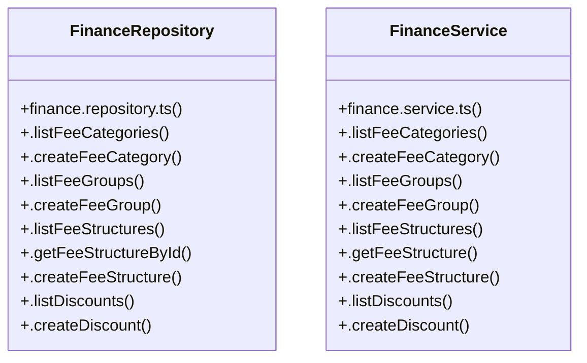

# [Document: Tasks & 1.1 Project Scaffolding & Infrastructure] Cluster

> 52 nodes · cohesion 0.05

## Key Concepts

- [FinanceRepository](file:///C:/Antigravityyyyy/VID_School/backend/src/modules/finance/finance.repository.ts#L88) (26 connections)
- [FinanceService](file:///C:/Antigravityyyyy/VID_School/backend/src/modules/finance/finance.service.ts#L4) (24 connections)
- [.getScopedFees()](file:///C:/Antigravityyyyy/VID_School/backend/src/modules/finance/finance.repository.ts#L781) (5 connections)
- [.getStudentFeeLedger()](file:///C:/Antigravityyyyy/VID_School/backend/src/modules/finance/finance.repository.ts#L433) (5 connections)
- [.handleGatewayWebhook()](file:///C:/Antigravityyyyy/VID_School/backend/src/modules/finance/finance.service.ts#L170) (5 connections)
- [.getInvoiceById()](file:///C:/Antigravityyyyy/VID_School/backend/src/modules/finance/finance.repository.ts#L489) (4 connections)
- [.getSummary()](file:///C:/Antigravityyyyy/VID_School/backend/src/modules/finance/finance.repository.ts#L765) (4 connections)
- [.listPayments()](file:///C:/Antigravityyyyy/VID_School/backend/src/modules/finance/finance.repository.ts#L608) (4 connections)
- [.listStudentFees()](file:///C:/Antigravityyyyy/VID_School/backend/src/modules/finance/finance.repository.ts#L381) (4 connections)
- [.processPayment()](file:///C:/Antigravityyyyy/VID_School/backend/src/modules/finance/finance.service.ts#L130) (4 connections)
- [.getFeeStructureById()](file:///C:/Antigravityyyyy/VID_School/backend/src/modules/finance/finance.repository.ts#L172) (3 connections)
- [.getReceiptByPaymentId()](file:///C:/Antigravityyyyy/VID_School/backend/src/modules/finance/finance.repository.ts#L646) (3 connections)
- [.isWebhookEventProcessed()](file:///C:/Antigravityyyyy/VID_School/backend/src/modules/finance/finance.repository.ts#L665) (3 connections)
- [.listInvoices()](file:///C:/Antigravityyyyy/VID_School/backend/src/modules/finance/finance.repository.ts#L456) (3 connections)
- [.recordPayment()](file:///C:/Antigravityyyyy/VID_School/backend/src/modules/finance/finance.repository.ts#L525) (3 connections)
- [.recordWebhookEvent()](file:///C:/Antigravityyyyy/VID_School/backend/src/modules/finance/finance.repository.ts#L673) (3 connections)
- [.getCollectionSummary()](file:///C:/Antigravityyyyy/VID_School/backend/src/modules/finance/finance.service.ts#L254) (3 connections)
- [.createDiscount()](file:///C:/Antigravityyyyy/VID_School/backend/src/modules/finance/finance.repository.ts#L256) (2 connections)
- [.createFeeCategory()](file:///C:/Antigravityyyyy/VID_School/backend/src/modules/finance/finance.repository.ts#L101) (2 connections)
- [.createFeeGroup()](file:///C:/Antigravityyyyy/VID_School/backend/src/modules/finance/finance.repository.ts#L122) (2 connections)
- [.createScholarship()](file:///C:/Antigravityyyyy/VID_School/backend/src/modules/finance/finance.repository.ts#L278) (2 connections)
- [.listDiscounts()](file:///C:/Antigravityyyyy/VID_School/backend/src/modules/finance/finance.repository.ts#L244) (2 connections)
- [.listFeeCategories()](file:///C:/Antigravityyyyy/VID_School/backend/src/modules/finance/finance.repository.ts#L90) (2 connections)
- [.listFeeGroups()](file:///C:/Antigravityyyyy/VID_School/backend/src/modules/finance/finance.repository.ts#L111) (2 connections)
- [.listFeeStructures()](file:///C:/Antigravityyyyy/VID_School/backend/src/modules/finance/finance.repository.ts#L133) (2 connections)
- *... and 27 more nodes in this community*

## Class Diagram

## Relationships

- No strong cross-community connections detected

## Source Files

- [C:\Antigravityyyyy\VID_School\backend\src\modules\finance\finance.repository.ts](file:///C:/Antigravityyyyy/VID_School/backend/src/modules/finance/finance.repository.ts)
- [C:\Antigravityyyyy\VID_School\backend\src\modules\finance\finance.service.ts](file:///C:/Antigravityyyyy/VID_School/backend/src/modules/finance/finance.service.ts)

## Audit Trail

- EXTRACTED: 114 (73%)
- INFERRED: 43 (27%)
- AMBIGUOUS: 0 (0%)

---

*Part of the graphify knowledge wiki. See [[index]] to navigate.*