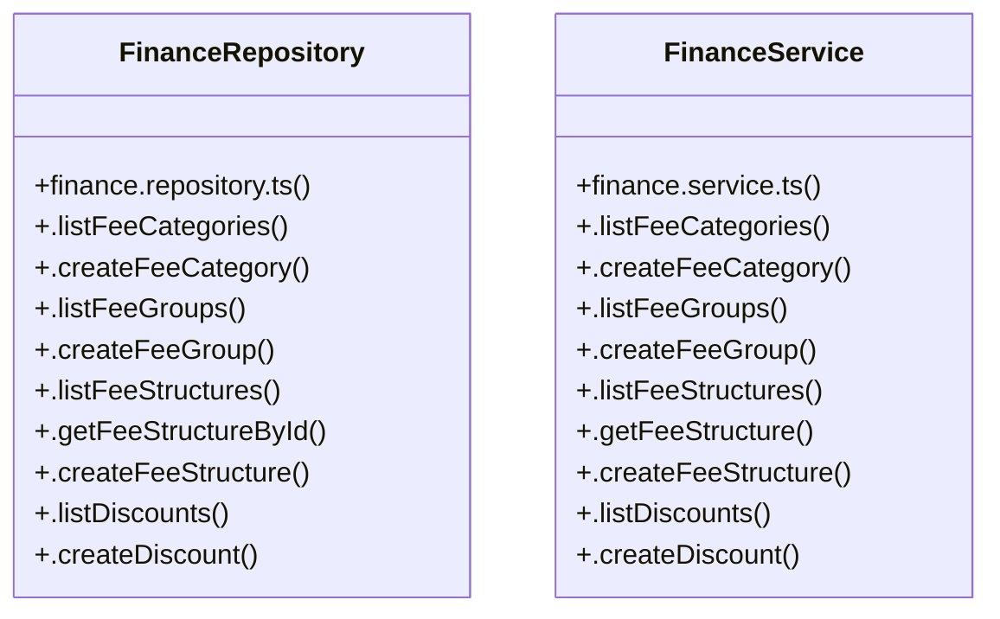

# [Document: Tech Spec & 1.1 Backend Architecture — Layered MVC] Cluster

> 52 nodes · cohesion 0.05

## Key Concepts

- [FinanceRepository](file:///C:/Antigravityyyyy/VID_School/backend/src/modules/finance/finance.repository.ts#L88) (26 connections)
- [FinanceService](file:///C:/Antigravityyyyy/VID_School/backend/src/modules/finance/finance.service.ts#L4) (24 connections)
- [.getStudentFeeLedger()](file:///C:/Antigravityyyyy/VID_School/backend/src/modules/finance/finance.repository.ts#L433) (5 connections)
- [.handleGatewayWebhook()](file:///C:/Antigravityyyyy/VID_School/backend/src/modules/finance/finance.service.ts#L170) (5 connections)
- [.getScopedFees()](file:///C:/Antigravityyyyy/VID_School/backend/src/modules/finance/finance.repository.ts#L781) (4 connections)
- [.processPayment()](file:///C:/Antigravityyyyy/VID_School/backend/src/modules/finance/finance.service.ts#L130) (4 connections)
- [.getInvoiceById()](file:///C:/Antigravityyyyy/VID_School/backend/src/modules/finance/finance.repository.ts#L489) (3 connections)
- [.getSummary()](file:///C:/Antigravityyyyy/VID_School/backend/src/modules/finance/finance.repository.ts#L765) (3 connections)
- [.listPayments()](file:///C:/Antigravityyyyy/VID_School/backend/src/modules/finance/finance.repository.ts#L608) (3 connections)
- [.listStudentFees()](file:///C:/Antigravityyyyy/VID_School/backend/src/modules/finance/finance.repository.ts#L381) (3 connections)
- [.recordPayment()](file:///C:/Antigravityyyyy/VID_School/backend/src/modules/finance/finance.repository.ts#L525) (3 connections)
- [.getCollectionSummary()](file:///C:/Antigravityyyyy/VID_School/backend/src/modules/finance/finance.service.ts#L254) (3 connections)
- [.getFeeStructureById()](file:///C:/Antigravityyyyy/VID_School/backend/src/modules/finance/finance.repository.ts#L172) (2 connections)
- [.getReceiptByPaymentId()](file:///C:/Antigravityyyyy/VID_School/backend/src/modules/finance/finance.repository.ts#L646) (2 connections)
- [.isWebhookEventProcessed()](file:///C:/Antigravityyyyy/VID_School/backend/src/modules/finance/finance.repository.ts#L665) (2 connections)
- [.listInvoices()](file:///C:/Antigravityyyyy/VID_School/backend/src/modules/finance/finance.repository.ts#L456) (2 connections)
- [.recordFailedGatewayPayment()](file:///C:/Antigravityyyyy/VID_School/backend/src/modules/finance/finance.repository.ts#L690) (2 connections)
- [.recordWebhookEvent()](file:///C:/Antigravityyyyy/VID_School/backend/src/modules/finance/finance.repository.ts#L673) (2 connections)
- [.assignFeeToStudent()](file:///C:/Antigravityyyyy/VID_School/backend/src/modules/finance/finance.service.ts#L81) (2 connections)
- [.createFeeStructure()](file:///C:/Antigravityyyyy/VID_School/backend/src/modules/finance/finance.service.ts#L33) (2 connections)
- [.getFeeStructure()](file:///C:/Antigravityyyyy/VID_School/backend/src/modules/finance/finance.service.ts#L29) (2 connections)
- [.getInvoice()](file:///C:/Antigravityyyyy/VID_School/backend/src/modules/finance/finance.service.ts#L125) (2 connections)
- [.getReceipt()](file:///C:/Antigravityyyyy/VID_School/backend/src/modules/finance/finance.service.ts#L165) (2 connections)
- [.processRefund()](file:///C:/Antigravityyyyy/VID_School/backend/src/modules/finance/finance.service.ts#L229) (2 connections)
- [finance.repository.ts](file:///C:/Antigravityyyyy/VID_School/backend/src/modules/finance/finance.repository.ts#L1) (1 connections)
- *... and 27 more nodes in this community*

## Class Diagram

## Relationships

- No strong cross-community connections detected

## Source Files

- [C:\Antigravityyyyy\VID_School\backend\src\modules\finance\finance.repository.ts](file:///C:/Antigravityyyyy/VID_School/backend/src/modules/finance/finance.repository.ts)
- [C:\Antigravityyyyy\VID_School\backend\src\modules\finance\finance.service.ts](file:///C:/Antigravityyyyy/VID_School/backend/src/modules/finance/finance.service.ts)

## Audit Trail

- EXTRACTED: 114 (83%)
- INFERRED: 24 (17%)
- AMBIGUOUS: 0 (0%)

---

*Part of the graphify knowledge wiki. See [[index]] to navigate.*