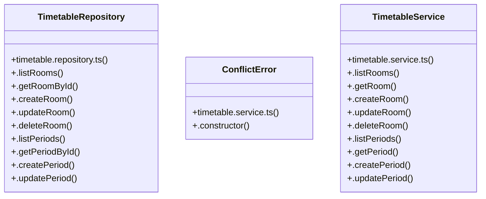

# [Document: Tech Spec & 1.1 Backend Architecture — Layered MVC] Cluster

> 55 nodes · cohesion 0.05

## Key Concepts

- [TimetableRepository](file:///C:/Antigravityyyyy/VID_School/backend/src/modules/timetable/timetable.repository.ts#L80) (25 connections)
- [TimetableService](file:///C:/Antigravityyyyy/VID_School/backend/src/modules/timetable/timetable.service.ts#L15) (25 connections)
- [normalizeDayOfWeek()](file:///C:/Antigravityyyyy/VID_School/backend/src/modules/timetable/timetable.repository.ts#L68) (5 connections)
- [.checkTimetableConflicts()](file:///C:/Antigravityyyyy/VID_School/backend/src/modules/timetable/timetable.repository.ts#L493) (5 connections)
- [.publishTimetable()](file:///C:/Antigravityyyyy/VID_School/backend/src/modules/timetable/timetable.service.ts#L142) (5 connections)
- [.checkCandidateConflicts()](file:///C:/Antigravityyyyy/VID_School/backend/src/modules/timetable/timetable.repository.ts#L386) (4 connections)
- [.listEntries()](file:///C:/Antigravityyyyy/VID_School/backend/src/modules/timetable/timetable.repository.ts#L289) (4 connections)
- [.checkCandidateConflict()](file:///C:/Antigravityyyyy/VID_School/backend/src/modules/timetable/timetable.service.ts#L94) (4 connections)
- [.createEntry()](file:///C:/Antigravityyyyy/VID_School/backend/src/modules/timetable/timetable.repository.ts#L358) (3 connections)
- [.getEntryById()](file:///C:/Antigravityyyyy/VID_School/backend/src/modules/timetable/timetable.repository.ts#L353) (3 connections)
- [.getPeriodById()](file:///C:/Antigravityyyyy/VID_School/backend/src/modules/timetable/timetable.repository.ts#L159) (3 connections)
- [.getRoomById()](file:///C:/Antigravityyyyy/VID_School/backend/src/modules/timetable/timetable.repository.ts#L93) (3 connections)
- [.getScopedSchedule()](file:///C:/Antigravityyyyy/VID_School/backend/src/modules/timetable/timetable.repository.ts#L598) (3 connections)
- [.getTimetableById()](file:///C:/Antigravityyyyy/VID_School/backend/src/modules/timetable/timetable.repository.ts#L257) (3 connections)
- [.setPublishStatus()](file:///C:/Antigravityyyyy/VID_School/backend/src/modules/timetable/timetable.repository.ts#L525) (3 connections)
- [.getTimetable()](file:///C:/Antigravityyyyy/VID_School/backend/src/modules/timetable/timetable.service.ts#L72) (3 connections)
- [.unpublishTimetable()](file:///C:/Antigravityyyyy/VID_School/backend/src/modules/timetable/timetable.service.ts#L171) (3 connections)
- [timetable.repository.ts](file:///C:/Antigravityyyyy/VID_School/backend/src/modules/timetable/timetable.repository.ts#L1) (2 connections)
- [timetable.service.ts](file:///C:/Antigravityyyyy/VID_School/backend/src/modules/timetable/timetable.service.ts#L1) (2 connections)
- [.listSubstitutions()](file:///C:/Antigravityyyyy/VID_School/backend/src/modules/timetable/timetable.repository.ts#L542) (2 connections)
- [.updatePeriod()](file:///C:/Antigravityyyyy/VID_School/backend/src/modules/timetable/timetable.repository.ts#L181) (2 connections)
- [.updateRoom()](file:///C:/Antigravityyyyy/VID_School/backend/src/modules/timetable/timetable.repository.ts#L113) (2 connections)
- [ConflictError](file:///C:/Antigravityyyyy/VID_School/backend/src/modules/timetable/timetable.service.ts#L4) (2 connections)
- [.auditTimetableConflicts()](file:///C:/Antigravityyyyy/VID_School/backend/src/modules/timetable/timetable.service.ts#L106) (2 connections)
- [.createEntry()](file:///C:/Antigravityyyyy/VID_School/backend/src/modules/timetable/timetable.service.ts#L115) (2 connections)
- *... and 30 more nodes in this community*

## Class Diagram

## Relationships

- No strong cross-community connections detected

## Source Files

- [C:\Antigravityyyyy\VID_School\backend\src\modules\timetable\timetable.repository.ts](file:///C:/Antigravityyyyy/VID_School/backend/src/modules/timetable/timetable.repository.ts)
- [C:\Antigravityyyyy\VID_School\backend\src\modules\timetable\timetable.service.ts](file:///C:/Antigravityyyyy/VID_School/backend/src/modules/timetable/timetable.service.ts)

## Audit Trail

- EXTRACTED: 132 (86%)
- INFERRED: 22 (14%)
- AMBIGUOUS: 0 (0%)

---

*Part of the graphify knowledge wiki. See [[index]] to navigate.*