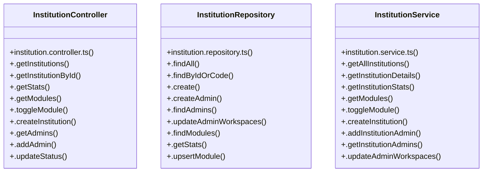

# [Document: Tech Spec & 1.1 Backend Architecture — Layered MVC] Cluster

> 126 nodes · cohesion 0.02

## Key Concepts

- [page.tsx](file:///C:/Antigravityyyyy/VID_School/frontend/app/admissions/documents/page.tsx#L1) (20 connections)
- [page.tsx](file:///C:/Antigravityyyyy/VID_School/frontend/app/institutions/page.tsx#L1) (17 connections)
- [page.tsx](file:///C:/Antigravityyyyy/VID_School/frontend/app/admissions/enquiries/page.tsx#L1) (15 connections)
- [InstitutionService](file:///C:/Antigravityyyyy/VID_School/backend/src/modules/institutions/institution.service.ts#L17) (12 connections)
- [[searchQuery, setSearchQuery]](file:///C:/Antigravityyyyy/VID_School/frontend/app/users/page.tsx#L82) (12 connections)
- [InstitutionController](file:///C:/Antigravityyyyy/VID_School/backend/src/modules/institutions/institution.controller.ts#L5) (11 connections)
- [InstitutionRepository](file:///C:/Antigravityyyyy/VID_School/backend/src/modules/institutions/institution.repository.ts#L5) (11 connections)
- [.findByIdOrCode()](file:///C:/Antigravityyyyy/VID_School/backend/src/modules/institutions/institution.repository.ts#L41) (11 connections)
- [page.tsx](file:///C:/Antigravityyyyy/VID_School/frontend/app/admissions/enrolled/page.tsx#L1) (10 connections)
- [page.tsx](file:///C:/Antigravityyyyy/VID_School/frontend/app/finance/collect/page.tsx#L1) (10 connections)
- [page.tsx](file:///C:/Antigravityyyyy/VID_School/frontend/app/finance/dashboard/page.tsx#L1) (9 connections)
- [page.tsx](file:///C:/Antigravityyyyy/VID_School/frontend/app/finance/invoices/page.tsx#L1) (8 connections)
- [page.tsx](file:///C:/Antigravityyyyy/VID_School/frontend/app/finance/structures/page.tsx#L1) (8 connections)
- [page.tsx](file:///C:/Antigravityyyyy/VID_School/frontend/app/faculty/my-students/page.tsx#L1) (5 connections)
- [.findModules()](file:///C:/Antigravityyyyy/VID_School/backend/src/modules/institutions/institution.repository.ts#L202) (5 connections)
- [.updateStatus()](file:///C:/Antigravityyyyy/VID_School/backend/src/modules/institutions/institution.repository.ts#L298) (5 connections)
- [variants](file:///C:/Antigravityyyyy/VID_School/frontend/app/voice-agent/campaigns/page.tsx#L95) (5 connections)
- [.getStats()](file:///C:/Antigravityyyyy/VID_School/backend/src/modules/institutions/institution.repository.ts#L240) (4 connections)
- [.upsertModule()](file:///C:/Antigravityyyyy/VID_School/backend/src/modules/institutions/institution.repository.ts#L271) (4 connections)
- [.addInstitutionAdmin()](file:///C:/Antigravityyyyy/VID_School/backend/src/modules/institutions/institution.service.ts#L141) (4 connections)
- [.getInstitutionDetails()](file:///C:/Antigravityyyyy/VID_School/backend/src/modules/institutions/institution.service.ts#L55) (4 connections)
- [.getInstitutionStats()](file:///C:/Antigravityyyyy/VID_School/backend/src/modules/institutions/institution.service.ts#L75) (4 connections)
- [[actionSuccess, setActionSuccess]](file:///C:/Antigravityyyyy/VID_School/frontend/app/hrms/staff/page.tsx#L171) (4 connections)
- [[selectedGrade, setSelectedGrade]](file:///C:/Antigravityyyyy/VID_School/frontend/app/finance/structures/page.tsx#L72) (4 connections)
- [[statusFilter, setStatusFilter]](file:///C:/Antigravityyyyy/VID_School/frontend/app/finance/invoices/page.tsx#L103) (4 connections)
- *... and 101 more nodes in this community*

## Class Diagram

## Relationships

- No strong cross-community connections detected

## Source Files

- [C:\Antigravityyyyy\VID_School\backend\src\modules\institutions\institution.controller.ts](file:///C:/Antigravityyyyy/VID_School/backend/src/modules/institutions/institution.controller.ts)
- [C:\Antigravityyyyy\VID_School\backend\src\modules\institutions\institution.repository.ts](file:///C:/Antigravityyyyy/VID_School/backend/src/modules/institutions/institution.repository.ts)
- [C:\Antigravityyyyy\VID_School\backend\src\modules\institutions\institution.service.ts](file:///C:/Antigravityyyyy/VID_School/backend/src/modules/institutions/institution.service.ts)
- [C:\Antigravityyyyy\VID_School\frontend\app\admissions\documents\page.tsx](file:///C:/Antigravityyyyy/VID_School/frontend/app/admissions/documents/page.tsx)
- [C:\Antigravityyyyy\VID_School\frontend\app\admissions\enquiries\page.tsx](file:///C:/Antigravityyyyy/VID_School/frontend/app/admissions/enquiries/page.tsx)
- [C:\Antigravityyyyy\VID_School\frontend\app\admissions\enrolled\page.tsx](file:///C:/Antigravityyyyy/VID_School/frontend/app/admissions/enrolled/page.tsx)
- [C:\Antigravityyyyy\VID_School\frontend\app\examinations\marks\page.tsx](file:///C:/Antigravityyyyy/VID_School/frontend/app/examinations/marks/page.tsx)
- [C:\Antigravityyyyy\VID_School\frontend\app\examinations\schedules\page.tsx](file:///C:/Antigravityyyyy/VID_School/frontend/app/examinations/schedules/page.tsx)
- [C:\Antigravityyyyy\VID_School\frontend\app\faculty\my-students\page.tsx](file:///C:/Antigravityyyyy/VID_School/frontend/app/faculty/my-students/page.tsx)
- [C:\Antigravityyyyy\VID_School\frontend\app\finance\collect\page.tsx](file:///C:/Antigravityyyyy/VID_School/frontend/app/finance/collect/page.tsx)
- [C:\Antigravityyyyy\VID_School\frontend\app\finance\dashboard\page.tsx](file:///C:/Antigravityyyyy/VID_School/frontend/app/finance/dashboard/page.tsx)
- [C:\Antigravityyyyy\VID_School\frontend\app\finance\invoices\page.tsx](file:///C:/Antigravityyyyy/VID_School/frontend/app/finance/invoices/page.tsx)
- [C:\Antigravityyyyy\VID_School\frontend\app\finance\structures\page.tsx](file:///C:/Antigravityyyyy/VID_School/frontend/app/finance/structures/page.tsx)
- [C:\Antigravityyyyy\VID_School\frontend\app\hrms\staff\page.tsx](file:///C:/Antigravityyyyy/VID_School/frontend/app/hrms/staff/page.tsx)
- [C:\Antigravityyyyy\VID_School\frontend\app\institutions\page.tsx](file:///C:/Antigravityyyyy/VID_School/frontend/app/institutions/page.tsx)
- [C:\Antigravityyyyy\VID_School\frontend\app\users\page.tsx](file:///C:/Antigravityyyyy/VID_School/frontend/app/users/page.tsx)
- [C:\Antigravityyyyy\VID_School\frontend\app\voice-agent\campaigns\page.tsx](file:///C:/Antigravityyyyy/VID_School/frontend/app/voice-agent/campaigns/page.tsx)

## Audit Trail

- EXTRACTED: 297 (82%)
- INFERRED: 64 (18%)
- AMBIGUOUS: 0 (0%)

---

*Part of the graphify knowledge wiki. See [[index]] to navigate.*