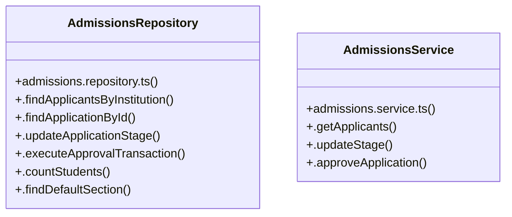

# [Document: Tech Spec & 1.1 Backend Architecture — Layered MVC] Cluster

> 43 nodes · cohesion 0.05

## Key Concepts

- [page.tsx](file:///C:/Antigravityyyyy/VID_School/frontend/app/admissions/page.tsx#L1) (15 connections)
- [page.tsx](file:///C:/Antigravityyyyy/VID_School/frontend/app/%28auth%29/login/page.tsx#L1) (10 connections)
- [AdmissionsRepository](file:///C:/Antigravityyyyy/VID_School/backend/src/modules/admissions/admissions.repository.ts#L15) (7 connections)
- [.approveApplication()](file:///C:/Antigravityyyyy/VID_School/backend/src/modules/admissions/admissions.service.ts#L53) (6 connections)
- [.updateStage()](file:///C:/Antigravityyyyy/VID_School/backend/src/modules/admissions/admissions.service.ts#L44) (5 connections)
- [AdmissionsService](file:///C:/Antigravityyyyy/VID_School/backend/src/modules/admissions/admissions.service.ts#L23) (4 connections)
- [.countStudents()](file:///C:/Antigravityyyyy/VID_School/backend/src/modules/admissions/admissions.repository.ts#L156) (3 connections)
- [.executeApprovalTransaction()](file:///C:/Antigravityyyyy/VID_School/backend/src/modules/admissions/admissions.repository.ts#L63) (3 connections)
- [.findApplicantsByInstitution()](file:///C:/Antigravityyyyy/VID_School/backend/src/modules/admissions/admissions.repository.ts#L16) (3 connections)
- [.findApplicationById()](file:///C:/Antigravityyyyy/VID_School/backend/src/modules/admissions/admissions.repository.ts#L47) (3 connections)
- [.findDefaultSection()](file:///C:/Antigravityyyyy/VID_School/backend/src/modules/admissions/admissions.repository.ts#L161) (3 connections)
- [.updateApplicationStage()](file:///C:/Antigravityyyyy/VID_School/backend/src/modules/admissions/admissions.repository.ts#L55) (3 connections)
- [admissions.service.ts](file:///C:/Antigravityyyyy/VID_School/backend/src/modules/admissions/admissions.service.ts#L1) (3 connections)
- [page.tsx](file:///C:/Antigravityyyyy/VID_School/frontend/app/timetable/matrix/page.tsx#L1) (3 connections)
- [.getApplicants()](file:///C:/Antigravityyyyy/VID_School/backend/src/modules/admissions/admissions.service.ts#L24) (2 connections)
- [handleAdvanceStage()](file:///C:/Antigravityyyyy/VID_School/frontend/app/admissions/page.tsx#L130) (2 connections)
- [handleEnroll()](file:///C:/Antigravityyyyy/VID_School/frontend/app/admissions/page.tsx#L120) (2 connections)
- [handleReject()](file:///C:/Antigravityyyyy/VID_School/frontend/app/admissions/page.tsx#L147) (2 connections)
- [router](file:///C:/Antigravityyyyy/VID_School/frontend/app/admissions/page.tsx#L45) (2 connections)
- [[selectedGrade, setSelectedGrade]](file:///C:/Antigravityyyyy/VID_School/frontend/app/timetable/matrix/page.tsx#L26) (2 connections)
- [STAGE_MAP_TO_DB](file:///C:/Antigravityyyyy/VID_School/backend/src/modules/admissions/admissions.service.ts#L13) (1 connections)
- [STAGE_MAP_TO_UI](file:///C:/Antigravityyyyy/VID_School/backend/src/modules/admissions/admissions.service.ts#L3) (1 connections)
- [admissions.repository.ts](file:///C:/Antigravityyyyy/VID_School/backend/src/modules/admissions/admissions.repository.ts#L1) (1 connections)
- [{ data: applicants = [], isLoading, updateStage }](file:///C:/Antigravityyyyy/VID_School/frontend/app/admissions/page.tsx#L46) (1 connections)
- [DAYS](file:///C:/Antigravityyyyy/VID_School/frontend/app/timetable/matrix/page.tsx#L15) (1 connections)
- *... and 18 more nodes in this community*

## Class Diagram

## Relationships

- No strong cross-community connections detected

## Source Files

- [C:\Antigravityyyyy\VID_School\backend\src\modules\admissions\admissions.repository.ts](file:///C:/Antigravityyyyy/VID_School/backend/src/modules/admissions/admissions.repository.ts)
- [C:\Antigravityyyyy\VID_School\backend\src\modules\admissions\admissions.service.ts](file:///C:/Antigravityyyyy/VID_School/backend/src/modules/admissions/admissions.service.ts)
- [C:\Antigravityyyyy\VID_School\frontend\app\(auth)\login\page.tsx](file:///C:/Antigravityyyyy/VID_School/frontend/app/%28auth%29/login/page.tsx)
- [C:\Antigravityyyyy\VID_School\frontend\app\admissions\page.tsx](file:///C:/Antigravityyyyy/VID_School/frontend/app/admissions/page.tsx)
- [C:\Antigravityyyyy\VID_School\frontend\app\timetable\matrix\page.tsx](file:///C:/Antigravityyyyy/VID_School/frontend/app/timetable/matrix/page.tsx)

## Audit Trail

- EXTRACTED: 81 (76%)
- INFERRED: 25 (24%)
- AMBIGUOUS: 0 (0%)

---

*Part of the graphify knowledge wiki. See [[index]] to navigate.*