# [Document: Vid Database Architecture & 10. RBAC / Permissions] Cluster

> 139 nodes · cohesion 0.04

## Key Concepts

- [sendSuccess()](file:///C:/Antigravityyyyy/VID_School/backend/src/utils/api-response.ts#L19) (149 connections)
- [sendError()](file:///C:/Antigravityyyyy/VID_School/backend/src/utils/api-response.ts#L48) (115 connections)
- [ExaminationsController](file:///C:/Antigravityyyyy/VID_School/backend/src/modules/examinations/examinations.controller.ts#L5) (26 connections)
- [FinanceController](file:///C:/Antigravityyyyy/VID_School/backend/src/modules/finance/finance.controller.ts#L5) (24 connections)
- [TimetableController](file:///C:/Antigravityyyyy/VID_School/backend/src/modules/timetable/timetable.controller.ts#L5) (23 connections)
- [HrmsController](file:///C:/Antigravityyyyy/VID_School/backend/src/modules/hrms/hrms.controller.ts#L62) (20 connections)
- [AcademicsController](file:///C:/Antigravityyyyy/VID_School/backend/src/modules/academics/academics.controller.ts#L5) (17 connections)
- [AttendanceController](file:///C:/Antigravityyyyy/VID_School/backend/src/modules/attendance/attendance.controller.ts#L5) (14 connections)
- [AdmissionsController](file:///C:/Antigravityyyyy/VID_School/backend/src/modules/admissions/admissions.controller.ts#L5) (6 connections)
- [NotificationController](file:///C:/Antigravityyyyy/VID_School/backend/src/modules/notifications/notification.controller.ts#L5) (6 connections)
- [.getHierarchy()](file:///C:/Antigravityyyyy/VID_School/backend/src/modules/academics/academics.controller.ts#L16) (4 connections)
- [.getFacultyWorkloads()](file:///C:/Antigravityyyyy/VID_School/backend/src/modules/hrms/hrms.controller.ts#L370) (4 connections)
- [.send()](file:///C:/Antigravityyyyy/VID_School/backend/src/modules/notifications/notification.controller.ts#L77) (4 connections)
- [.checkConflict()](file:///C:/Antigravityyyyy/VID_School/backend/src/modules/timetable/timetable.controller.ts#L188) (4 connections)
- [.getClasses()](file:///C:/Antigravityyyyy/VID_School/backend/src/modules/academics/academics.controller.ts#L69) (3 connections)
- [.getSubjects()](file:///C:/Antigravityyyyy/VID_School/backend/src/modules/academics/academics.controller.ts#L122) (3 connections)
- [.createApplication()](file:///C:/Antigravityyyyy/VID_School/backend/src/modules/admissions/admissions.controller.ts#L27) (3 connections)
- [.updateStage()](file:///C:/Antigravityyyyy/VID_School/backend/src/modules/admissions/admissions.controller.ts#L65) (3 connections)
- [.applyStudentLeave()](file:///C:/Antigravityyyyy/VID_School/backend/src/modules/attendance/attendance.controller.ts#L137) (3 connections)
- [.decideStudentLeave()](file:///C:/Antigravityyyyy/VID_School/backend/src/modules/attendance/attendance.controller.ts#L178) (3 connections)
- [.getInstitutionSummary()](file:///C:/Antigravityyyyy/VID_School/backend/src/modules/attendance/attendance.controller.ts#L237) (3 connections)
- [.getOrCreateSession()](file:///C:/Antigravityyyyy/VID_School/backend/src/modules/attendance/attendance.controller.ts#L7) (3 connections)
- [.getScopedAttendance()](file:///C:/Antigravityyyyy/VID_School/backend/src/modules/attendance/attendance.controller.ts#L121) (3 connections)
- [.getSectionRoster()](file:///C:/Antigravityyyyy/VID_School/backend/src/modules/attendance/attendance.controller.ts#L51) (3 connections)
- [.getSessionById()](file:///C:/Antigravityyyyy/VID_School/backend/src/modules/attendance/attendance.controller.ts#L22) (3 connections)
- *... and 114 more nodes in this community*

## Class Diagram

```mermaid
classDiagram
    class AcademicsController {
        +academics.controller.ts()
        +.getGrades()
        +.getHierarchy()
        +.getAcademicYears()
        +.createAcademicYear()
        +.getDepartments()
        +.createDepartment()
        +.getClasses()
        +.createClass()
        +.getClassSections()
    }
    class AdmissionsController {
        +admissions.controller.ts()
        +.getApplicants()
        +.getApplicationById()
        +.createApplication()
        +.updateStage()
        +.approve()
    }
    class AttendanceController {
        +attendance.controller.ts()
        +.getOrCreateSession()
        +.getSessionById()
        +.listSessions()
        +.getSectionRoster()
        +.submitRollCall()
        +.getStudentSummary()
        +.getScopedAttendance()
        +.applyStudentLeave()
        +.listStudentLeaves()
    }
    class ExaminationsController {
        +examinations.controller.ts()
        +.createExamType()
        +.listExamTypes()
        +.createExam()
        +.getExamById()
        +.listExams()
        +.updateExamStatus()
        +.addExamSubject()
        +.listExamSubjects()
        +.createExamSchedule()
    }
    class FinanceController {
        +finance.controller.ts()
        +.listFeeCategories()
        +.createFeeCategory()
        +.listFeeGroups()
        +.createFeeGroup()
        +.listFeeStructures()
        +.getFeeStructure()
        +.createFeeStructure()
        +.listDiscounts()
        +.createDiscount()
    }
    class HrmsController {
        +hrms.controller.ts()
        +.listDesignations()
        +.createDesignation()
        +.listStaff()
        +.getStaffDetails()
        +.onboardStaff()
        +.updateStaff()
        +.deleteStaff()
        +.listLeaveTypes()
        +.createLeaveType()
    }
    class NotificationController {
        +notification.controller.ts()
        +.getNotifications()
        +.getUnreadCount()
        +.markAsRead()
        +.markAllAsRead()
        +.send()
    }
    class TimetableController {
        +timetable.controller.ts()
        +.listRooms()
        +.createRoom()
        +.updateRoom()
        +.deleteRoom()
        +.listPeriods()
        +.createPeriod()
        +.updatePeriod()
        +.deletePeriod()
        +.listTimetables()
    }
```

## Relationships

- No strong cross-community connections detected

## Source Files

- [C:\Antigravityyyyy\VID_School\backend\src\middleware\error.middleware.ts](file:///C:/Antigravityyyyy/VID_School/backend/src/middleware/error.middleware.ts)
- [C:\Antigravityyyyy\VID_School\backend\src\modules\academics\academics.controller.ts](file:///C:/Antigravityyyyy/VID_School/backend/src/modules/academics/academics.controller.ts)
- [C:\Antigravityyyyy\VID_School\backend\src\modules\admissions\admissions.controller.ts](file:///C:/Antigravityyyyy/VID_School/backend/src/modules/admissions/admissions.controller.ts)
- [C:\Antigravityyyyy\VID_School\backend\src\modules\attendance\attendance.controller.ts](file:///C:/Antigravityyyyy/VID_School/backend/src/modules/attendance/attendance.controller.ts)
- [C:\Antigravityyyyy\VID_School\backend\src\modules\examinations\examinations.controller.ts](file:///C:/Antigravityyyyy/VID_School/backend/src/modules/examinations/examinations.controller.ts)
- [C:\Antigravityyyyy\VID_School\backend\src\modules\finance\finance.controller.ts](file:///C:/Antigravityyyyy/VID_School/backend/src/modules/finance/finance.controller.ts)
- [C:\Antigravityyyyy\VID_School\backend\src\modules\hrms\hrms.controller.ts](file:///C:/Antigravityyyyy/VID_School/backend/src/modules/hrms/hrms.controller.ts)
- [C:\Antigravityyyyy\VID_School\backend\src\modules\hrms\hrms.service.ts](file:///C:/Antigravityyyyy/VID_School/backend/src/modules/hrms/hrms.service.ts)
- [C:\Antigravityyyyy\VID_School\backend\src\modules\notifications\notification.controller.ts](file:///C:/Antigravityyyyy/VID_School/backend/src/modules/notifications/notification.controller.ts)
- [C:\Antigravityyyyy\VID_School\backend\src\modules\timetable\timetable.controller.ts](file:///C:/Antigravityyyyy/VID_School/backend/src/modules/timetable/timetable.controller.ts)
- [C:\Antigravityyyyy\VID_School\backend\src\utils\api-response.ts](file:///C:/Antigravityyyyy/VID_School/backend/src/utils/api-response.ts)

## Audit Trail

- EXTRACTED: 273 (36%)
- INFERRED: 483 (64%)
- AMBIGUOUS: 0 (0%)

---

*Part of the graphify knowledge wiki. See [[index]] to navigate.*