# [Document: Vid Database Architecture & 10. RBAC / Permissions] Cluster

> 283 nodes · cohesion 0.01

## Key Concepts

- [query](file:///C:/Antigravityyyyy/VID_School/backend/src/modules/users/users.routes.ts#L446) (280 connections)
- [AcademicsRepository](file:///C:/Antigravityyyyy/VID_School/backend/src/modules/academics/academics.repository.ts#L3) (51 connections)
- [HrmsRepository](file:///C:/Antigravityyyyy/VID_School/backend/src/modules/hrms/hrms.repository.ts#L101) (40 connections)
- [ExaminationsRepository](file:///C:/Antigravityyyyy/VID_School/backend/src/modules/examinations/examinations.repository.ts#L121) (30 connections)
- [DocumentsRepository](file:///C:/Antigravityyyyy/VID_School/backend/src/modules/documents/documents.repository.ts#L74) (27 connections)
- [FinanceRepository](file:///C:/Antigravityyyyy/VID_School/backend/src/modules/finance/finance.repository.ts#L88) (26 connections)
- [TimetableRepository](file:///C:/Antigravityyyyy/VID_School/backend/src/modules/timetable/timetable.repository.ts#L80) (25 connections)
- [DocumentsService](file:///C:/Antigravityyyyy/VID_School/backend/src/modules/documents/documents.service.ts#L30) (22 connections)
- [.generateBonafideCertificate()](file:///C:/Antigravityyyyy/VID_School/backend/src/modules/documents/documents.service.ts#L406) (9 connections)
- [.verifyParentChildLink()](file:///C:/Antigravityyyyy/VID_School/backend/src/modules/examinations/examinations.repository.ts#L1074) (9 connections)
- [.sendNotification()](file:///C:/Antigravityyyyy/VID_School/backend/src/modules/notifications/notification.service.ts#L21) (9 connections)
- [.actionLeaveRequest()](file:///C:/Antigravityyyyy/VID_School/backend/src/modules/hrms/hrms.service.ts#L585) (8 connections)
- [.applyLeave()](file:///C:/Antigravityyyyy/VID_School/backend/src/modules/hrms/hrms.service.ts#L487) (8 connections)
- [.onboardStaff()](file:///C:/Antigravityyyyy/VID_School/backend/src/modules/hrms/hrms.service.ts#L140) (8 connections)
- [.generateTransferCertificate()](file:///C:/Antigravityyyyy/VID_School/backend/src/modules/documents/documents.service.ts#L512) (7 connections)
- [.requestDocument()](file:///C:/Antigravityyyyy/VID_School/backend/src/modules/documents/documents.service.ts#L610) (7 connections)
- [.verifyDocument()](file:///C:/Antigravityyyyy/VID_School/backend/src/modules/documents/documents.service.ts#L236) (7 connections)
- [.calculateExamResults()](file:///C:/Antigravityyyyy/VID_School/backend/src/modules/examinations/examinations.repository.ts#L832) (7 connections)
- [.getStaffById()](file:///C:/Antigravityyyyy/VID_School/backend/src/modules/hrms/hrms.repository.ts#L282) (7 connections)
- [.createStaffDirect()](file:///C:/Antigravityyyyy/VID_School/backend/src/modules/hrms/hrms.service.ts#L229) (7 connections)
- [.updateStaff()](file:///C:/Antigravityyyyy/VID_School/backend/src/modules/hrms/hrms.service.ts#L376) (7 connections)
- [NotificationRepository](file:///C:/Antigravityyyyy/VID_School/backend/src/modules/notifications/notification.repository.ts#L17) (7 connections)
- [tenant-repository.base.ts](file:///C:/Antigravityyyyy/VID_School/backend/src/common/tenant-repository.base.ts#L1) (6 connections)
- [.findDocumentById()](file:///C:/Antigravityyyyy/VID_School/backend/src/modules/documents/documents.repository.ts#L177) (6 connections)
- [.getDocumentTypeById()](file:///C:/Antigravityyyyy/VID_School/backend/src/modules/documents/documents.repository.ts#L93) (6 connections)
- *... and 258 more nodes in this community*

## Class Diagram

```mermaid
classDiagram
    class AcademicsRepository {
        +academics.repository.ts()
        +.listAcademicYears()
        +.getAcademicYearById()
        +.createAcademicYear()
        +.updateAcademicYear()
        +.setCurrentAcademicYear()
        +.closeAcademicYear()
        +.cloneAcademicYear()
        +.getClassesByInstitution()
        +.getSectionsByClass()
    }
    class DocumentsRepository {
        +documents.repository.ts()
        +.constructor()
        +.listDocumentTypes()
        +.getDocumentTypeById()
        +.getDocumentTypeByCode()
        +.createDocumentType()
        +.createDocument()
        +.findDocumentById()
        +.findDocumentsByOwner()
        +.listDocuments()
    }
    class DocumentsService {
        +documents.service.ts()
        +.constructor()
        +.listDocumentTypes()
        +.getDocumentType()
        +.createDocumentType()
        +.uploadDocument()
        +.getDocument()
        +.listDocuments()
        +.deleteDocument()
        +.verifyDocument()
    }
    class ExaminationsRepository {
        +examinations.repository.ts()
        +.createExamType()
        +.listExamTypes()
        +.createExam()
        +.getExamById()
        +.listExams()
        +.updateExamStatus()
        +.publishExam()
        +.addExamSubject()
        +.listExamSubjects()
    }
    class FinanceRepository {
        +finance.repository.ts()
        +.listFeeCategories()
        +.createFeeCategory()
        +.listFeeGroups()
        +.createFeeGroup()
        +.listFeeStructures()
        +.getFeeStructureById()
        +.createFeeStructure()
        +.listDiscounts()
        +.createDiscount()
    }
    class HrmsRepository {
        +hrms.repository.ts()
        +.listDesignations()
        +.findDesignationByName()
        +.createDesignation()
        +.isDesignationInUse()
        +.deleteDesignation()
        +.listDepartments()
        +.createDepartment()
        +.isDepartmentInUse()
        +.deleteDepartment()
    }
    class NotificationRepository {
        +notification.repository.ts()
        +.constructor()
        +.findForUser()
        +.getUnreadCount()
        +.markAsRead()
        +.markAllAsRead()
        +.createNotification()
    }
    class NotificationService {
        +notification.service.ts()
        +.getUserNotifications()
        +.getUnreadCount()
        +.markAsRead()
        +.markAllAsRead()
        +.sendNotification()
    }
    class TimetableRepository {
        +timetable.repository.ts()
        +.listRooms()
        +.getRoomById()
        +.createRoom()
        +.updateRoom()
        +.deleteRoom()
        +.listPeriods()
        +.getPeriodById()
        +.createPeriod()
        +.updatePeriod()
    }
```

## Relationships

- No strong cross-community connections detected

## Source Files

- [C:\Antigravityyyyy\VID_School\backend\scripts\run-migration.ts](file:///C:/Antigravityyyyy/VID_School/backend/scripts/run-migration.ts)
- [C:\Antigravityyyyy\VID_School\backend\src\common\tenant-repository.base.ts](file:///C:/Antigravityyyyy/VID_School/backend/src/common/tenant-repository.base.ts)
- [C:\Antigravityyyyy\VID_School\backend\src\modules\academics\academics.repository.ts](file:///C:/Antigravityyyyy/VID_School/backend/src/modules/academics/academics.repository.ts)
- [C:\Antigravityyyyy\VID_School\backend\src\modules\attendance\attendance.repository.ts](file:///C:/Antigravityyyyy/VID_School/backend/src/modules/attendance/attendance.repository.ts)
- [C:\Antigravityyyyy\VID_School\backend\src\modules\attendance\attendance.service.ts](file:///C:/Antigravityyyyy/VID_School/backend/src/modules/attendance/attendance.service.ts)
- [C:\Antigravityyyyy\VID_School\backend\src\modules\documents\documents.repository.ts](file:///C:/Antigravityyyyy/VID_School/backend/src/modules/documents/documents.repository.ts)
- [C:\Antigravityyyyy\VID_School\backend\src\modules\documents\documents.service.ts](file:///C:/Antigravityyyyy/VID_School/backend/src/modules/documents/documents.service.ts)
- [C:\Antigravityyyyy\VID_School\backend\src\modules\examinations\examinations.repository.ts](file:///C:/Antigravityyyyy/VID_School/backend/src/modules/examinations/examinations.repository.ts)
- [C:\Antigravityyyyy\VID_School\backend\src\modules\examinations\examinations.service.ts](file:///C:/Antigravityyyyy/VID_School/backend/src/modules/examinations/examinations.service.ts)
- [C:\Antigravityyyyy\VID_School\backend\src\modules\finance\finance.repository.ts](file:///C:/Antigravityyyyy/VID_School/backend/src/modules/finance/finance.repository.ts)
- [C:\Antigravityyyyy\VID_School\backend\src\modules\finance\finance.service.ts](file:///C:/Antigravityyyyy/VID_School/backend/src/modules/finance/finance.service.ts)
- [C:\Antigravityyyyy\VID_School\backend\src\modules\hrms\hrms.repository.ts](file:///C:/Antigravityyyyy/VID_School/backend/src/modules/hrms/hrms.repository.ts)
- [C:\Antigravityyyyy\VID_School\backend\src\modules\hrms\hrms.service.ts](file:///C:/Antigravityyyyy/VID_School/backend/src/modules/hrms/hrms.service.ts)
- [C:\Antigravityyyyy\VID_School\backend\src\modules\notifications\notification.controller.ts](file:///C:/Antigravityyyyy/VID_School/backend/src/modules/notifications/notification.controller.ts)
- [C:\Antigravityyyyy\VID_School\backend\src\modules\notifications\notification.repository.ts](file:///C:/Antigravityyyyy/VID_School/backend/src/modules/notifications/notification.repository.ts)
- [C:\Antigravityyyyy\VID_School\backend\src\modules\notifications\notification.service.ts](file:///C:/Antigravityyyyy/VID_School/backend/src/modules/notifications/notification.service.ts)
- [C:\Antigravityyyyy\VID_School\backend\src\modules\timetable\timetable.repository.ts](file:///C:/Antigravityyyyy/VID_School/backend/src/modules/timetable/timetable.repository.ts)
- [C:\Antigravityyyyy\VID_School\backend\src\modules\timetable\timetable.service.ts](file:///C:/Antigravityyyyy/VID_School/backend/src/modules/timetable/timetable.service.ts)
- [C:\Antigravityyyyy\VID_School\backend\src\modules\users\users.routes.ts](file:///C:/Antigravityyyyy/VID_School/backend/src/modules/users/users.routes.ts)
- [C:\Antigravityyyyy\VID_School\backend\src\scripts\apply-010.ts](file:///C:/Antigravityyyyy/VID_School/backend/src/scripts/apply-010.ts)

## Audit Trail

- EXTRACTED: 613 (47%)
- INFERRED: 679 (53%)
- AMBIGUOUS: 0 (0%)

---

*Part of the graphify knowledge wiki. See [[index]] to navigate.*