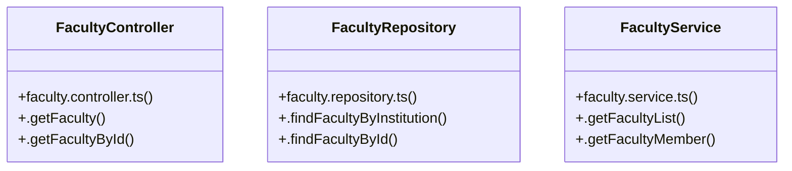

# [FacultyController & FacultyRepository] Cluster

> 12 nodes · cohesion 0.20

## Key Concepts

- [FacultyController](file:///C:/Antigravityyyyy/VID_School/backend/src/modules/faculty/faculty.controller.ts#L5) (3 connections)
- [.getFaculty()](file:///C:/Antigravityyyyy/VID_School/backend/src/modules/faculty/faculty.controller.ts#L6) (3 connections)
- [.getFacultyById()](file:///C:/Antigravityyyyy/VID_School/backend/src/modules/faculty/faculty.controller.ts#L16) (3 connections)
- [FacultyRepository](file:///C:/Antigravityyyyy/VID_School/backend/src/modules/faculty/faculty.repository.ts#L3) (3 connections)
- [.findFacultyById()](file:///C:/Antigravityyyyy/VID_School/backend/src/modules/faculty/faculty.repository.ts#L41) (3 connections)
- [.findFacultyByInstitution()](file:///C:/Antigravityyyyy/VID_School/backend/src/modules/faculty/faculty.repository.ts#L4) (3 connections)
- [FacultyService](file:///C:/Antigravityyyyy/VID_School/backend/src/modules/faculty/faculty.service.ts#L3) (3 connections)
- [.getFacultyList()](file:///C:/Antigravityyyyy/VID_School/backend/src/modules/faculty/faculty.service.ts#L4) (3 connections)
- [.getFacultyMember()](file:///C:/Antigravityyyyy/VID_School/backend/src/modules/faculty/faculty.service.ts#L43) (3 connections)
- [faculty.controller.ts](file:///C:/Antigravityyyyy/VID_School/backend/src/modules/faculty/faculty.controller.ts#L1) (1 connections)
- [faculty.repository.ts](file:///C:/Antigravityyyyy/VID_School/backend/src/modules/faculty/faculty.repository.ts#L1) (1 connections)
- [faculty.service.ts](file:///C:/Antigravityyyyy/VID_School/backend/src/modules/faculty/faculty.service.ts#L1) (1 connections)

## Class Diagram

## Relationships

- No strong cross-community connections detected

## Source Files

- [C:\Antigravityyyyy\VID_School\backend\src\modules\faculty\faculty.controller.ts](file:///C:/Antigravityyyyy/VID_School/backend/src/modules/faculty/faculty.controller.ts)
- [C:\Antigravityyyyy\VID_School\backend\src\modules\faculty\faculty.repository.ts](file:///C:/Antigravityyyyy/VID_School/backend/src/modules/faculty/faculty.repository.ts)
- [C:\Antigravityyyyy\VID_School\backend\src\modules\faculty\faculty.service.ts](file:///C:/Antigravityyyyy/VID_School/backend/src/modules/faculty/faculty.service.ts)

## Audit Trail

- EXTRACTED: 18 (60%)
- INFERRED: 12 (40%)
- AMBIGUOUS: 0 (0%)

---

*Part of the graphify knowledge wiki. See [[index]] to navigate.*