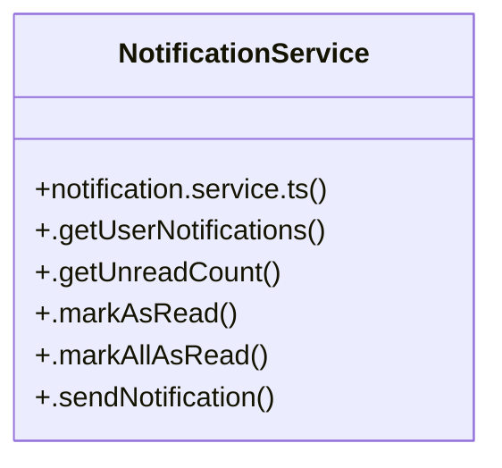

# [Skill: codex-reviewer & Checklist] Cluster

> 5 nodes · cohesion 0.40

## Key Concepts

- [NotificationService](file:///C:/Antigravityyyyy/VID_School/backend/src/modules/notifications/notification.service.ts#L3) (6 connections)
- [notification.service.ts](file:///C:/Antigravityyyyy/VID_School/backend/src/modules/notifications/notification.service.ts#L1) (1 connections)
- [.getUnreadCount()](file:///C:/Antigravityyyyy/VID_School/backend/src/modules/notifications/notification.service.ts#L8) (1 connections)
- [.markAllAsRead()](file:///C:/Antigravityyyyy/VID_School/backend/src/modules/notifications/notification.service.ts#L17) (1 connections)
- [.markAsRead()](file:///C:/Antigravityyyyy/VID_School/backend/src/modules/notifications/notification.service.ts#L13) (1 connections)

## Class Diagram

## Relationships

- No strong cross-community connections detected

## Source Files

- [C:\Antigravityyyyy\VID_School\backend\src\modules\notifications\notification.service.ts](file:///C:/Antigravityyyyy/VID_School/backend/src/modules/notifications/notification.service.ts)

## Audit Trail

- EXTRACTED: 10 (100%)
- INFERRED: 0 (0%)
- AMBIGUOUS: 0 (0%)

---

*Part of the graphify knowledge wiki. See [[index]] to navigate.*