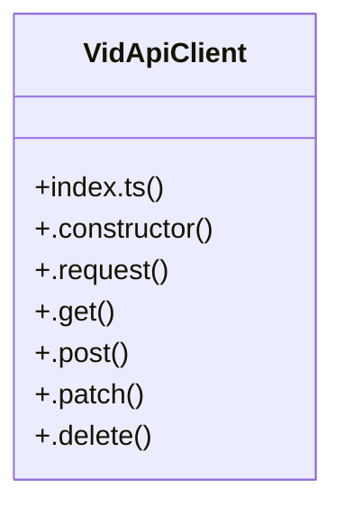

# [Skill: local-memory & Key Actions] Cluster

> 8 nodes · cohesion 0.39

## Key Concepts

- [VidApiClient](file:///C:/Antigravityyyyy/VID_School/packages/api-client/src/index.ts#L7) (7 connections)
- [.request()](file:///C:/Antigravityyyyy/VID_School/packages/api-client/src/index.ts#L18) (5 connections)
- [.delete()](file:///C:/Antigravityyyyy/VID_School/packages/api-client/src/index.ts#L71) (2 connections)
- [.get()](file:///C:/Antigravityyyyy/VID_School/packages/api-client/src/index.ts#L51) (2 connections)
- [.patch()](file:///C:/Antigravityyyyy/VID_School/packages/api-client/src/index.ts#L63) (2 connections)
- [.post()](file:///C:/Antigravityyyyy/VID_School/packages/api-client/src/index.ts#L55) (2 connections)
- [index.ts](file:///C:/Antigravityyyyy/VID_School/packages/api-client/src/index.ts#L1) (1 connections)
- [.constructor()](file:///C:/Antigravityyyyy/VID_School/packages/api-client/src/index.ts#L12) (1 connections)

## Class Diagram

## Relationships

- No strong cross-community connections detected

## Source Files

- [C:\Antigravityyyyy\VID_School\packages\api-client\src\index.ts](file:///C:/Antigravityyyyy/VID_School/packages/api-client/src/index.ts)

## Audit Trail

- EXTRACTED: 22 (100%)
- INFERRED: 0 (0%)
- AMBIGUOUS: 0 (0%)

---

*Part of the graphify knowledge wiki. See [[index]] to navigate.*