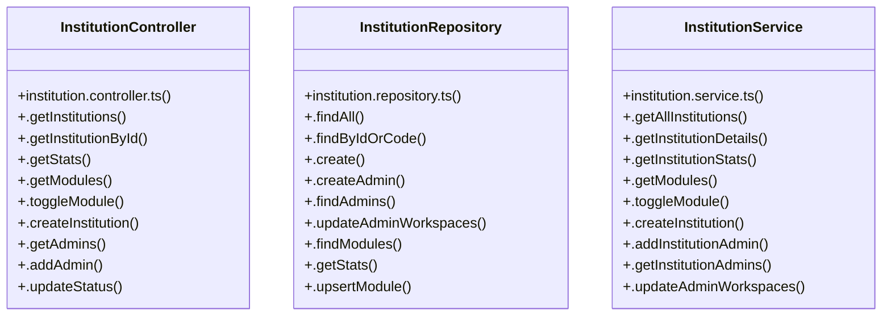

# [StudentController & StudentRepository] Cluster

> 37 nodes · cohesion 0.09

## Key Concepts

- [InstitutionService](file:///C:/Antigravityyyyy/VID_School/backend/src/modules/institutions/institution.service.ts#L17) (12 connections)
- [InstitutionController](file:///C:/Antigravityyyyy/VID_School/backend/src/modules/institutions/institution.controller.ts#L5) (11 connections)
- [InstitutionRepository](file:///C:/Antigravityyyyy/VID_School/backend/src/modules/institutions/institution.repository.ts#L5) (11 connections)
- [.findByIdOrCode()](file:///C:/Antigravityyyyy/VID_School/backend/src/modules/institutions/institution.repository.ts#L41) (11 connections)
- [.findModules()](file:///C:/Antigravityyyyy/VID_School/backend/src/modules/institutions/institution.repository.ts#L202) (5 connections)
- [.getStats()](file:///C:/Antigravityyyyy/VID_School/backend/src/modules/institutions/institution.repository.ts#L240) (4 connections)
- [.upsertModule()](file:///C:/Antigravityyyyy/VID_School/backend/src/modules/institutions/institution.repository.ts#L271) (4 connections)
- [.addInstitutionAdmin()](file:///C:/Antigravityyyyy/VID_School/backend/src/modules/institutions/institution.service.ts#L141) (4 connections)
- [.getInstitutionDetails()](file:///C:/Antigravityyyyy/VID_School/backend/src/modules/institutions/institution.service.ts#L55) (4 connections)
- [.getInstitutionStats()](file:///C:/Antigravityyyyy/VID_School/backend/src/modules/institutions/institution.service.ts#L75) (4 connections)
- [.addAdmin()](file:///C:/Antigravityyyyy/VID_School/backend/src/modules/institutions/institution.controller.ts#L77) (3 connections)
- [.getAdmins()](file:///C:/Antigravityyyyy/VID_School/backend/src/modules/institutions/institution.controller.ts#L67) (3 connections)
- [.getInstitutionById()](file:///C:/Antigravityyyyy/VID_School/backend/src/modules/institutions/institution.controller.ts#L15) (3 connections)
- [.getInstitutions()](file:///C:/Antigravityyyyy/VID_School/backend/src/modules/institutions/institution.controller.ts#L6) (3 connections)
- [.getStats()](file:///C:/Antigravityyyyy/VID_School/backend/src/modules/institutions/institution.controller.ts#L25) (3 connections)
- [.updateStatus()](file:///C:/Antigravityyyyy/VID_School/backend/src/modules/institutions/institution.controller.ts#L87) (3 connections)
- [.create()](file:///C:/Antigravityyyyy/VID_School/backend/src/modules/institutions/institution.repository.ts#L52) (3 connections)
- [.createAdmin()](file:///C:/Antigravityyyyy/VID_School/backend/src/modules/institutions/institution.repository.ts#L93) (3 connections)
- [.findAdmins()](file:///C:/Antigravityyyyy/VID_School/backend/src/modules/institutions/institution.repository.ts#L163) (3 connections)
- [.findAll()](file:///C:/Antigravityyyyy/VID_School/backend/src/modules/institutions/institution.repository.ts#L6) (3 connections)
- [.updateAdminWorkspaces()](file:///C:/Antigravityyyyy/VID_School/backend/src/modules/institutions/institution.repository.ts#L184) (3 connections)
- [.updateStatus()](file:///C:/Antigravityyyyy/VID_School/backend/src/modules/institutions/institution.repository.ts#L298) (3 connections)
- [.getAllInstitutions()](file:///C:/Antigravityyyyy/VID_School/backend/src/modules/institutions/institution.service.ts#L21) (3 connections)
- [.getInstitutionAdmins()](file:///C:/Antigravityyyyy/VID_School/backend/src/modules/institutions/institution.service.ts#L212) (3 connections)
- [.getModules()](file:///C:/Antigravityyyyy/VID_School/backend/src/modules/institutions/institution.service.ts#L92) (3 connections)
- *... and 12 more nodes in this community*

## Class Diagram

## Relationships

- No strong cross-community connections detected

## Source Files

- [C:\Antigravityyyyy\VID_School\backend\src\modules\institutions\institution.controller.ts](file:///C:/Antigravityyyyy/VID_School/backend/src/modules/institutions/institution.controller.ts)
- [C:\Antigravityyyyy\VID_School\backend\src\modules\institutions\institution.repository.ts](file:///C:/Antigravityyyyy/VID_School/backend/src/modules/institutions/institution.repository.ts)
- [C:\Antigravityyyyy\VID_School\backend\src\modules\institutions\institution.service.ts](file:///C:/Antigravityyyyy/VID_School/backend/src/modules/institutions/institution.service.ts)

## Audit Trail

- EXTRACTED: 76 (56%)
- INFERRED: 60 (44%)
- AMBIGUOUS: 0 (0%)

---

*Part of the graphify knowledge wiki. See [[index]] to navigate.*