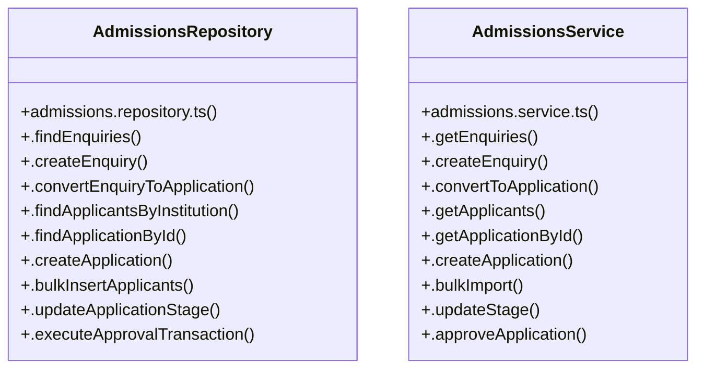

# [VID Platform Educational Ecosystem Specification & Academics & Curriculum] Cluster

> 29 nodes · cohesion 0.09

## Key Concepts

- [AdmissionsRepository](file:///C:/Antigravityyyyy/VID_School/backend/src/modules/admissions/admissions.repository.ts#L23) (14 connections)
- [AdmissionsService](file:///C:/Antigravityyyyy/VID_School/backend/src/modules/admissions/admissions.service.ts#L15) (11 connections)
- [.approveApplication()](file:///C:/Antigravityyyyy/VID_School/backend/src/modules/admissions/admissions.service.ts#L75) (9 connections)
- [.convertEnquiry()](file:///C:/Antigravityyyyy/VID_School/backend/src/modules/admissions/admissions.controller.ts#L32) (4 connections)
- [.executeApprovalTransaction()](file:///C:/Antigravityyyyy/VID_School/backend/src/modules/admissions/admissions.repository.ts#L281) (4 connections)
- [.findApplicationById()](file:///C:/Antigravityyyyy/VID_School/backend/src/modules/admissions/admissions.repository.ts#L153) (4 connections)
- [.convertToApplication()](file:///C:/Antigravityyyyy/VID_School/backend/src/modules/admissions/admissions.service.ts#L25) (4 connections)
- [.approve()](file:///C:/Antigravityyyyy/VID_School/backend/src/modules/admissions/admissions.controller.ts#L99) (3 connections)
- [.bulkInsertApplicants()](file:///C:/Antigravityyyyy/VID_School/backend/src/modules/admissions/admissions.repository.ts#L222) (3 connections)
- [.convertEnquiryToApplication()](file:///C:/Antigravityyyyy/VID_School/backend/src/modules/admissions/admissions.repository.ts#L77) (3 connections)
- [.countStudents()](file:///C:/Antigravityyyyy/VID_School/backend/src/modules/admissions/admissions.repository.ts#L355) (3 connections)
- [.createApplication()](file:///C:/Antigravityyyyy/VID_School/backend/src/modules/admissions/admissions.repository.ts#L161) (3 connections)
- [.existsAdmissionNumber()](file:///C:/Antigravityyyyy/VID_School/backend/src/modules/admissions/admissions.repository.ts#L360) (3 connections)
- [.findApplicantsByInstitution()](file:///C:/Antigravityyyyy/VID_School/backend/src/modules/admissions/admissions.repository.ts#L119) (3 connections)
- [.findDefaultSection()](file:///C:/Antigravityyyyy/VID_School/backend/src/modules/admissions/admissions.repository.ts#L365) (3 connections)
- [.findEnquiries()](file:///C:/Antigravityyyyy/VID_School/backend/src/modules/admissions/admissions.repository.ts#L27) (3 connections)
- [.getApplicants()](file:///C:/Antigravityyyyy/VID_School/backend/src/modules/admissions/admissions.service.ts#L31) (3 connections)
- [.getEnquiries()](file:///C:/Antigravityyyyy/VID_School/backend/src/modules/admissions/admissions.service.ts#L17) (3 connections)
- [admissions.service.ts](file:///C:/Antigravityyyyy/VID_School/backend/src/modules/admissions/admissions.service.ts#L1) (3 connections)
- [.createEnquiry()](file:///C:/Antigravityyyyy/VID_School/backend/src/modules/admissions/admissions.repository.ts#L48) (2 connections)
- [.getPipelineStats()](file:///C:/Antigravityyyyy/VID_School/backend/src/modules/admissions/admissions.repository.ts#L370) (2 connections)
- [.bulkImport()](file:///C:/Antigravityyyyy/VID_School/backend/src/modules/admissions/admissions.service.ts#L64) (2 connections)
- [.createEnquiry()](file:///C:/Antigravityyyyy/VID_School/backend/src/modules/admissions/admissions.service.ts#L21) (2 connections)
- [.getApplicationById()](file:///C:/Antigravityyyyy/VID_School/backend/src/modules/admissions/admissions.service.ts#L54) (2 connections)
- [.createApplication()](file:///C:/Antigravityyyyy/VID_School/backend/src/modules/admissions/admissions.service.ts#L60) (1 connections)
- *... and 4 more nodes in this community*

## Class Diagram

## Relationships

- No strong cross-community connections detected

## Source Files

- [C:\Antigravityyyyy\VID_School\backend\src\modules\admissions\admissions.controller.ts](file:///C:/Antigravityyyyy/VID_School/backend/src/modules/admissions/admissions.controller.ts)
- [C:\Antigravityyyyy\VID_School\backend\src\modules\admissions\admissions.repository.ts](file:///C:/Antigravityyyyy/VID_School/backend/src/modules/admissions/admissions.repository.ts)
- [C:\Antigravityyyyy\VID_School\backend\src\modules\admissions\admissions.service.ts](file:///C:/Antigravityyyyy/VID_School/backend/src/modules/admissions/admissions.service.ts)

## Audit Trail

- EXTRACTED: 56 (55%)
- INFERRED: 45 (45%)
- AMBIGUOUS: 0 (0%)

---

*Part of the graphify knowledge wiki. See [[index]] to navigate.*