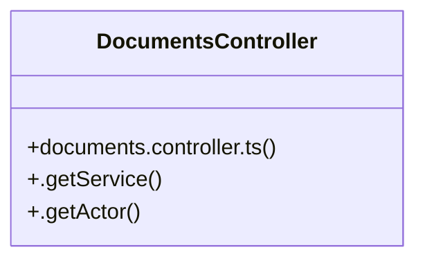

# [[academicYear, setAcademicYear] & [activeSection, setActiveSection]] Cluster

> 32 nodes · cohesion 0.06

## Key Concepts

- [documents.controller.ts](file:///C:/Antigravityyyyy/VID_School/backend/src/modules/documents/documents.controller.ts#L1) (29 connections)
- [DocumentsController](file:///C:/Antigravityyyyy/VID_School/backend/src/modules/documents/documents.controller.ts#L73) (3 connections)
- [actor](file:///C:/Antigravityyyyy/VID_School/backend/src/modules/documents/documents.controller.ts#L109) (1 connections)
- [bonafideSchema](file:///C:/Antigravityyyyy/VID_School/backend/src/modules/documents/documents.controller.ts#L42) (1 connections)
- [certificate](file:///C:/Antigravityyyyy/VID_School/backend/src/modules/documents/documents.controller.ts#L267) (1 connections)
- [created](file:///C:/Antigravityyyyy/VID_School/backend/src/modules/documents/documents.controller.ts#L110) (1 connections)
- [createTemplateSchema](file:///C:/Antigravityyyyy/VID_School/backend/src/modules/documents/documents.controller.ts#L27) (1 connections)
- [createTypeSchema](file:///C:/Antigravityyyyy/VID_School/backend/src/modules/documents/documents.controller.ts#L6) (1 connections)
- [doc](file:///C:/Antigravityyyyy/VID_School/backend/src/modules/documents/documents.controller.ts#L125) (1 connections)
- [docTypeId](file:///C:/Antigravityyyyy/VID_School/backend/src/modules/documents/documents.controller.ts#L218) (1 connections)
- [.getActor()](file:///C:/Antigravityyyyy/VID_School/backend/src/modules/documents/documents.controller.ts#L82) (1 connections)
- [.getService()](file:///C:/Antigravityyyyy/VID_School/backend/src/modules/documents/documents.controller.ts#L74) (1 connections)
- [filters](file:///C:/Antigravityyyyy/VID_School/backend/src/modules/documents/documents.controller.ts#L147) (1 connections)
- [history](file:///C:/Antigravityyyyy/VID_School/backend/src/modules/documents/documents.controller.ts#L193) (1 connections)
- [paramToStr()](file:///C:/Antigravityyyyy/VID_School/backend/src/modules/documents/documents.controller.ts#L68) (1 connections)
- [parsed](file:///C:/Antigravityyyyy/VID_School/backend/src/modules/documents/documents.controller.ts#L107) (1 connections)
- [processed](file:///C:/Antigravityyyyy/VID_School/backend/src/modules/documents/documents.controller.ts#L322) (1 connections)
- [processRequestSchema](file:///C:/Antigravityyyyy/VID_School/backend/src/modules/documents/documents.controller.ts#L62) (1 connections)
- [request](file:///C:/Antigravityyyyy/VID_School/backend/src/modules/documents/documents.controller.ts#L294) (1 connections)
- [requestDocumentSchema](file:///C:/Antigravityyyyy/VID_School/backend/src/modules/documents/documents.controller.ts#L55) (1 connections)
- [requests](file:///C:/Antigravityyyyy/VID_School/backend/src/modules/documents/documents.controller.ts#L310) (1 connections)
- [result](file:///C:/Antigravityyyyy/VID_School/backend/src/modules/documents/documents.controller.ts#L156) (1 connections)
- [service](file:///C:/Antigravityyyyy/VID_School/backend/src/modules/documents/documents.controller.ts#L97) (1 connections)
- [template](file:///C:/Antigravityyyyy/VID_School/backend/src/modules/documents/documents.controller.ts#L208) (1 connections)
- [templates](file:///C:/Antigravityyyyy/VID_School/backend/src/modules/documents/documents.controller.ts#L219) (1 connections)
- *... and 7 more nodes in this community*

## Class Diagram

## Relationships

- No strong cross-community connections detected

## Source Files

- [C:\Antigravityyyyy\VID_School\backend\src\modules\documents\documents.controller.ts](file:///C:/Antigravityyyyy/VID_School/backend/src/modules/documents/documents.controller.ts)

## Audit Trail

- EXTRACTED: 62 (100%)
- INFERRED: 0 (0%)
- AMBIGUOUS: 0 (0%)

---

*Part of the graphify knowledge wiki. See [[index]] to navigate.*