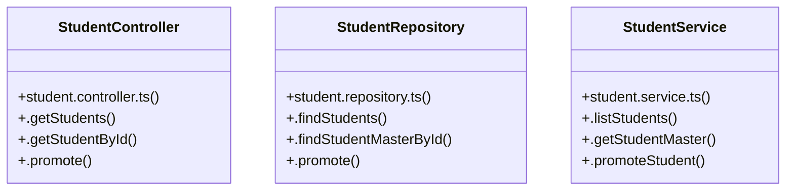

# [[activeRollCall, setActiveRollCall] & [attendanceRecords, setAttendanceRecords]] Cluster

> 15 nodes · cohesion 0.17

## Key Concepts

- [StudentController](file:///C:/Antigravityyyyy/VID_School/backend/src/modules/students/student.controller.ts#L5) (4 connections)
- [StudentRepository](file:///C:/Antigravityyyyy/VID_School/backend/src/modules/students/student.repository.ts#L3) (4 connections)
- [StudentService](file:///C:/Antigravityyyyy/VID_School/backend/src/modules/students/student.service.ts#L3) (4 connections)
- [.getStudentById()](file:///C:/Antigravityyyyy/VID_School/backend/src/modules/students/student.controller.ts#L24) (3 connections)
- [.getStudents()](file:///C:/Antigravityyyyy/VID_School/backend/src/modules/students/student.controller.ts#L6) (3 connections)
- [.promote()](file:///C:/Antigravityyyyy/VID_School/backend/src/modules/students/student.controller.ts#L36) (3 connections)
- [.getStudentMaster()](file:///C:/Antigravityyyyy/VID_School/backend/src/modules/students/student.service.ts#L8) (3 connections)
- [.listStudents()](file:///C:/Antigravityyyyy/VID_School/backend/src/modules/students/student.service.ts#L4) (3 connections)
- [.promoteStudent()](file:///C:/Antigravityyyyy/VID_School/backend/src/modules/students/student.service.ts#L16) (3 connections)
- [.findStudentMasterById()](file:///C:/Antigravityyyyy/VID_School/backend/src/modules/students/student.repository.ts#L57) (2 connections)
- [.findStudents()](file:///C:/Antigravityyyyy/VID_School/backend/src/modules/students/student.repository.ts#L4) (2 connections)
- [.promote()](file:///C:/Antigravityyyyy/VID_School/backend/src/modules/students/student.repository.ts#L145) (2 connections)
- [student.controller.ts](file:///C:/Antigravityyyyy/VID_School/backend/src/modules/students/student.controller.ts#L1) (1 connections)
- [student.repository.ts](file:///C:/Antigravityyyyy/VID_School/backend/src/modules/students/student.repository.ts#L1) (1 connections)
- [student.service.ts](file:///C:/Antigravityyyyy/VID_School/backend/src/modules/students/student.service.ts#L1) (1 connections)

## Class Diagram

## Relationships

- No strong cross-community connections detected

## Source Files

- [C:\Antigravityyyyy\VID_School\backend\src\modules\students\student.controller.ts](file:///C:/Antigravityyyyy/VID_School/backend/src/modules/students/student.controller.ts)
- [C:\Antigravityyyyy\VID_School\backend\src\modules\students\student.repository.ts](file:///C:/Antigravityyyyy/VID_School/backend/src/modules/students/student.repository.ts)
- [C:\Antigravityyyyy\VID_School\backend\src\modules\students\student.service.ts](file:///C:/Antigravityyyyy/VID_School/backend/src/modules/students/student.service.ts)

## Audit Trail

- EXTRACTED: 24 (62%)
- INFERRED: 15 (38%)
- AMBIGUOUS: 0 (0%)

---

*Part of the graphify knowledge wiki. See [[index]] to navigate.*