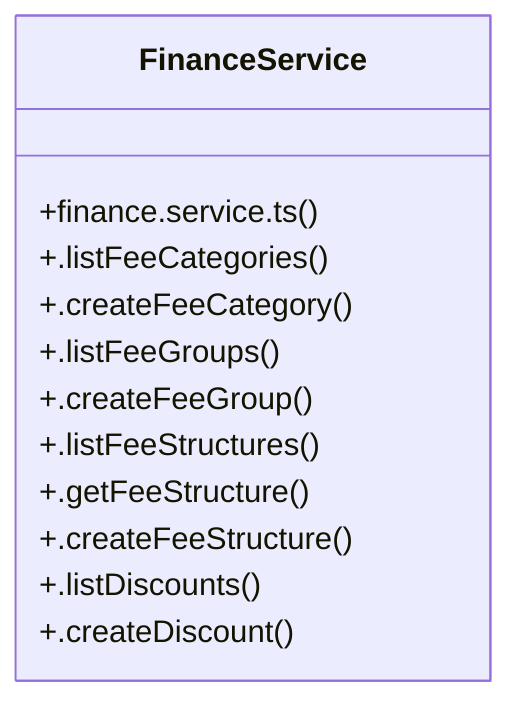

# [certificateId & instId] Cluster

> 19 nodes · cohesion 0.11

## Key Concepts

- [FinanceService](file:///C:/Antigravityyyyy/VID_School/backend/src/modules/finance/finance.service.ts#L4) (24 connections)
- [.assignFeeToStudent()](file:///C:/Antigravityyyyy/VID_School/backend/src/modules/finance/finance.service.ts#L81) (2 connections)
- [.createFeeStructure()](file:///C:/Antigravityyyyy/VID_School/backend/src/modules/finance/finance.service.ts#L33) (2 connections)
- [.processRefund()](file:///C:/Antigravityyyyy/VID_School/backend/src/modules/finance/finance.service.ts#L229) (2 connections)
- [finance.service.ts](file:///C:/Antigravityyyyy/VID_School/backend/src/modules/finance/finance.service.ts#L1) (1 connections)
- [.createDiscount()](file:///C:/Antigravityyyyy/VID_School/backend/src/modules/finance/finance.service.ts#L66) (1 connections)
- [.createFeeCategory()](file:///C:/Antigravityyyyy/VID_School/backend/src/modules/finance/finance.service.ts#L10) (1 connections)
- [.createFeeGroup()](file:///C:/Antigravityyyyy/VID_School/backend/src/modules/finance/finance.service.ts#L19) (1 connections)
- [.createScholarship()](file:///C:/Antigravityyyyy/VID_School/backend/src/modules/finance/finance.service.ts#L75) (1 connections)
- [.getScopedFees()](file:///C:/Antigravityyyyy/VID_School/backend/src/modules/finance/finance.service.ts#L259) (1 connections)
- [.getStudentFeeLedger()](file:///C:/Antigravityyyyy/VID_School/backend/src/modules/finance/finance.service.ts#L116) (1 connections)
- [.listDiscounts()](file:///C:/Antigravityyyyy/VID_School/backend/src/modules/finance/finance.service.ts#L62) (1 connections)
- [.listFeeCategories()](file:///C:/Antigravityyyyy/VID_School/backend/src/modules/finance/finance.service.ts#L6) (1 connections)
- [.listFeeGroups()](file:///C:/Antigravityyyyy/VID_School/backend/src/modules/finance/finance.service.ts#L15) (1 connections)
- [.listFeeStructures()](file:///C:/Antigravityyyyy/VID_School/backend/src/modules/finance/finance.service.ts#L25) (1 connections)
- [.listInvoices()](file:///C:/Antigravityyyyy/VID_School/backend/src/modules/finance/finance.service.ts#L121) (1 connections)
- [.listPayments()](file:///C:/Antigravityyyyy/VID_School/backend/src/modules/finance/finance.service.ts#L161) (1 connections)
- [.listScholarships()](file:///C:/Antigravityyyyy/VID_School/backend/src/modules/finance/finance.service.ts#L71) (1 connections)
- [.listStudentFees()](file:///C:/Antigravityyyyy/VID_School/backend/src/modules/finance/finance.service.ts#L112) (1 connections)

## Class Diagram

## Relationships

- No strong cross-community connections detected

## Source Files

- [C:\Antigravityyyyy\VID_School\backend\src\modules\finance\finance.service.ts](file:///C:/Antigravityyyyy/VID_School/backend/src/modules/finance/finance.service.ts)

## Audit Trail

- EXTRACTED: 42 (93%)
- INFERRED: 3 (7%)
- AMBIGUOUS: 0 (0%)

---

*Part of the graphify knowledge wiki. See [[index]] to navigate.*