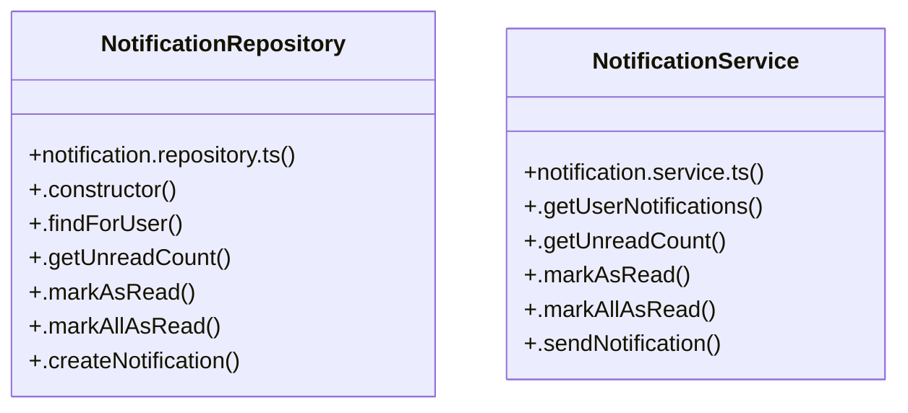

# [certificateId & instId] Cluster

> 15 nodes · cohesion 0.13

## Key Concepts

- [NotificationRepository](file:///C:/Antigravityyyyy/VID_School/backend/src/modules/notifications/notification.repository.ts#L17) (7 connections)
- [NotificationService](file:///C:/Antigravityyyyy/VID_School/backend/src/modules/notifications/notification.service.ts#L3) (6 connections)
- [.getNotifications()](file:///C:/Antigravityyyyy/VID_School/backend/src/modules/notifications/notification.controller.ts#L6) (4 connections)
- [.getUserNotifications()](file:///C:/Antigravityyyyy/VID_School/backend/src/modules/notifications/notification.service.ts#L4) (3 connections)
- [.createNotification()](file:///C:/Antigravityyyyy/VID_School/backend/src/modules/notifications/notification.repository.ts#L72) (2 connections)
- [.findForUser()](file:///C:/Antigravityyyyy/VID_School/backend/src/modules/notifications/notification.repository.ts#L22) (2 connections)
- [notification.repository.ts](file:///C:/Antigravityyyyy/VID_School/backend/src/modules/notifications/notification.repository.ts#L1) (1 connections)
- [notification.service.ts](file:///C:/Antigravityyyyy/VID_School/backend/src/modules/notifications/notification.service.ts#L1) (1 connections)
- [.constructor()](file:///C:/Antigravityyyyy/VID_School/backend/src/modules/notifications/notification.repository.ts#L18) (1 connections)
- [.getUnreadCount()](file:///C:/Antigravityyyyy/VID_School/backend/src/modules/notifications/notification.repository.ts#L40) (1 connections)
- [.markAllAsRead()](file:///C:/Antigravityyyyy/VID_School/backend/src/modules/notifications/notification.repository.ts#L61) (1 connections)
- [.markAsRead()](file:///C:/Antigravityyyyy/VID_School/backend/src/modules/notifications/notification.repository.ts#L50) (1 connections)
- [.getUnreadCount()](file:///C:/Antigravityyyyy/VID_School/backend/src/modules/notifications/notification.service.ts#L8) (1 connections)
- [.markAllAsRead()](file:///C:/Antigravityyyyy/VID_School/backend/src/modules/notifications/notification.service.ts#L17) (1 connections)
- [.markAsRead()](file:///C:/Antigravityyyyy/VID_School/backend/src/modules/notifications/notification.service.ts#L13) (1 connections)

## Class Diagram

## Relationships

- No strong cross-community connections detected

## Source Files

- [C:\Antigravityyyyy\VID_School\backend\src\modules\notifications\notification.controller.ts](file:///C:/Antigravityyyyy/VID_School/backend/src/modules/notifications/notification.controller.ts)
- [C:\Antigravityyyyy\VID_School\backend\src\modules\notifications\notification.repository.ts](file:///C:/Antigravityyyyy/VID_School/backend/src/modules/notifications/notification.repository.ts)
- [C:\Antigravityyyyy\VID_School\backend\src\modules\notifications\notification.service.ts](file:///C:/Antigravityyyyy/VID_School/backend/src/modules/notifications/notification.service.ts)

## Audit Trail

- EXTRACTED: 26 (79%)
- INFERRED: 7 (21%)
- AMBIGUOUS: 0 (0%)

---

*Part of the graphify knowledge wiki. See [[index]] to navigate.*