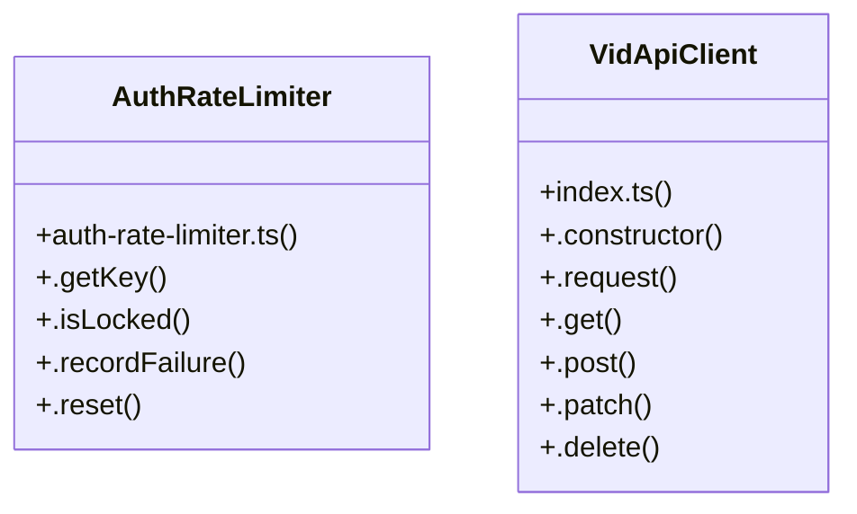

# [certificateId & instId] Cluster

> 16 nodes · cohesion 0.20

## Key Concepts

- [VidApiClient](file:///C:/Antigravityyyyy/VID_School/packages/api-client/src/index.ts#L7) (7 connections)
- [AuthRateLimiter](file:///C:/Antigravityyyyy/VID_School/backend/src/modules/auth/auth-rate-limiter.ts#L9) (5 connections)
- [.reset()](file:///C:/Antigravityyyyy/VID_School/backend/src/modules/auth/auth-rate-limiter.ts#L103) (5 connections)
- [.request()](file:///C:/Antigravityyyyy/VID_School/packages/api-client/src/index.ts#L18) (5 connections)
- [.getKey()](file:///C:/Antigravityyyyy/VID_School/backend/src/modules/auth/auth-rate-limiter.ts#L15) (4 connections)
- [.isLocked()](file:///C:/Antigravityyyyy/VID_School/backend/src/modules/auth/auth-rate-limiter.ts#L19) (4 connections)
- [.recordFailure()](file:///C:/Antigravityyyyy/VID_School/backend/src/modules/auth/auth-rate-limiter.ts#L52) (4 connections)
- [.get()](file:///C:/Antigravityyyyy/VID_School/packages/api-client/src/index.ts#L51) (4 connections)
- [.delete()](file:///C:/Antigravityyyyy/VID_School/packages/api-client/src/index.ts#L71) (3 connections)
- [runTests()](file:///C:/Antigravityyyyy/VID_School/backend/src/scripts/verify-r2-auth.ts#L8) (3 connections)
- [.patch()](file:///C:/Antigravityyyyy/VID_School/packages/api-client/src/index.ts#L63) (2 connections)
- [.post()](file:///C:/Antigravityyyyy/VID_School/packages/api-client/src/index.ts#L55) (2 connections)
- [auth-rate-limiter.ts](file:///C:/Antigravityyyyy/VID_School/backend/src/modules/auth/auth-rate-limiter.ts#L1) (1 connections)
- [verify-r2-auth.ts](file:///C:/Antigravityyyyy/VID_School/backend/src/scripts/verify-r2-auth.ts#L1) (1 connections)
- [index.ts](file:///C:/Antigravityyyyy/VID_School/packages/api-client/src/index.ts#L1) (1 connections)
- [.constructor()](file:///C:/Antigravityyyyy/VID_School/packages/api-client/src/index.ts#L12) (1 connections)

## Class Diagram

## Relationships

- No strong cross-community connections detected

## Source Files

- [C:\Antigravityyyyy\VID_School\backend\src\modules\auth\auth-rate-limiter.ts](file:///C:/Antigravityyyyy/VID_School/backend/src/modules/auth/auth-rate-limiter.ts)
- [C:\Antigravityyyyy\VID_School\backend\src\scripts\verify-r2-auth.ts](file:///C:/Antigravityyyyy/VID_School/backend/src/scripts/verify-r2-auth.ts)
- [C:\Antigravityyyyy\VID_School\packages\api-client\src\index.ts](file:///C:/Antigravityyyyy/VID_School/packages/api-client/src/index.ts)

## Audit Trail

- EXTRACTED: 40 (77%)
- INFERRED: 12 (23%)
- AMBIGUOUS: 0 (0%)

---

*Part of the graphify knowledge wiki. See [[index]] to navigate.*