# [query & AcademicsRepository] Cluster

> 74 nodes · cohesion 0.04

## Key Concepts

- [query](file:///C:/Antigravityyyyy/VID_School/backend/src/modules/timetable/timetable.routes.ts#L14) (40 connections)
- [InstitutionRepository](file:///C:/Antigravityyyyy/VID_School/backend/src/modules/institutions/institution.repository.ts#L3) (11 connections)
- [InstitutionService](file:///C:/Antigravityyyyy/VID_School/backend/src/modules/institutions/institution.service.ts#L16) (11 connections)
- [AcademicsRepository](file:///C:/Antigravityyyyy/VID_School/backend/src/modules/academics/academics.repository.ts#L3) (7 connections)
- [AdmissionsRepository](file:///C:/Antigravityyyyy/VID_School/backend/src/modules/admissions/admissions.repository.ts#L15) (7 connections)
- [.findByIdOrCode()](file:///C:/Antigravityyyyy/VID_School/backend/src/modules/institutions/institution.repository.ts#L39) (7 connections)
- [.approveApplication()](file:///C:/Antigravityyyyy/VID_School/backend/src/modules/admissions/admissions.service.ts#L53) (6 connections)
- [tenant-repository.base.ts](file:///C:/Antigravityyyyy/VID_School/backend/src/common/tenant-repository.base.ts#L1) (6 connections)
- [AcademicsService](file:///C:/Antigravityyyyy/VID_School/backend/src/modules/academics/academics.service.ts#L3) (5 connections)
- [AdmissionsService](file:///C:/Antigravityyyyy/VID_School/backend/src/modules/admissions/admissions.service.ts#L23) (4 connections)
- [authMiddleware()](file:///C:/Antigravityyyyy/VID_School/backend/src/middleware/auth.middleware.ts#L26) (4 connections)
- [.addInstitutionAdmin()](file:///C:/Antigravityyyyy/VID_School/backend/src/modules/institutions/institution.service.ts#L132) (4 connections)
- [.getInstitutionDetails()](file:///C:/Antigravityyyyy/VID_School/backend/src/modules/institutions/institution.service.ts#L54) (4 connections)
- [.getInstitutionStats()](file:///C:/Antigravityyyyy/VID_School/backend/src/modules/institutions/institution.service.ts#L74) (4 connections)
- [findById()](file:///C:/Antigravityyyyy/VID_School/backend/src/common/tenant-repository.base.ts#L53) (4 connections)
- [validateTenant()](file:///C:/Antigravityyyyy/VID_School/backend/src/common/tenant-repository.base.ts#L44) (4 connections)
- [.getGrades()](file:///C:/Antigravityyyyy/VID_School/backend/src/modules/academics/academics.controller.ts#L6) (3 connections)
- [.getClassesByInstitution()](file:///C:/Antigravityyyyy/VID_School/backend/src/modules/academics/academics.repository.ts#L4) (3 connections)
- [.listClasses()](file:///C:/Antigravityyyyy/VID_School/backend/src/modules/academics/academics.repository.ts#L60) (3 connections)
- [.listSubjects()](file:///C:/Antigravityyyyy/VID_School/backend/src/modules/academics/academics.repository.ts#L73) (3 connections)
- [.getAcademicGrades()](file:///C:/Antigravityyyyy/VID_School/backend/src/modules/academics/academics.service.ts#L4) (3 connections)
- [.countStudents()](file:///C:/Antigravityyyyy/VID_School/backend/src/modules/admissions/admissions.repository.ts#L156) (3 connections)
- [.executeApprovalTransaction()](file:///C:/Antigravityyyyy/VID_School/backend/src/modules/admissions/admissions.repository.ts#L63) (3 connections)
- [.findApplicantsByInstitution()](file:///C:/Antigravityyyyy/VID_School/backend/src/modules/admissions/admissions.repository.ts#L16) (3 connections)
- [.findApplicationById()](file:///C:/Antigravityyyyy/VID_School/backend/src/modules/admissions/admissions.repository.ts#L47) (3 connections)
- *... and 49 more nodes in this community*

## Class Diagram

```mermaid
classDiagram
    class AcademicsRepository {
        +academics.repository.ts()
        +.getClassesByInstitution()
        +.getSectionsByClass()
        +.getSubjectsByClass()
        +.getHierarchy()
        +.listClasses()
        +.listSubjects()
    }
    class AcademicsService {
        +academics.service.ts()
        +.getAcademicGrades()
        +.getHierarchy()
        +.getClasses()
        +.getSubjects()
    }
    class AdmissionsRepository {
        +admissions.repository.ts()
        +.findApplicantsByInstitution()
        +.findApplicationById()
        +.updateApplicationStage()
        +.executeApprovalTransaction()
        +.countStudents()
        +.findDefaultSection()
    }
    class AdmissionsService {
        +admissions.service.ts()
        +.getApplicants()
        +.updateStage()
        +.approveApplication()
    }
    class AuditDispatcher {
        +audit-dispatcher.ts()
        +.dispatch()
    }
    class InstitutionRepository {
        +institution.repository.ts()
        +.findAll()
        +.findByIdOrCode()
        +.create()
        +.createAdmin()
        +.findAdmins()
        +.updateAdminWorkspaces()
        +.findModules()
        +.getStats()
        +.upsertModule()
    }
    class InstitutionService {
        +institution.service.ts()
        +.getAllInstitutions()
        +.getInstitutionDetails()
        +.getInstitutionStats()
        +.toggleModule()
        +.createInstitution()
        +.addInstitutionAdmin()
        +.getInstitutionAdmins()
        +.updateAdminWorkspaces()
        +.findAdminByIdentifier()
    }
```

## Relationships

- No strong cross-community connections detected

## Source Files

- [C:\Antigravityyyyy\VID_School\backend\scripts\purge-dummy-institutions.js](file:///C:/Antigravityyyyy/VID_School/backend/scripts/purge-dummy-institutions.js)
- [C:\Antigravityyyyy\VID_School\backend\scripts\verify-cloud-e2e.js](file:///C:/Antigravityyyyy/VID_School/backend/scripts/verify-cloud-e2e.js)
- [C:\Antigravityyyyy\VID_School\backend\scripts\verify-workspaces-e2e.js](file:///C:/Antigravityyyyy/VID_School/backend/scripts/verify-workspaces-e2e.js)
- [C:\Antigravityyyyy\VID_School\backend\src\common\audit-dispatcher.ts](file:///C:/Antigravityyyyy/VID_School/backend/src/common/audit-dispatcher.ts)
- [C:\Antigravityyyyy\VID_School\backend\src\common\tenant-repository.base.ts](file:///C:/Antigravityyyyy/VID_School/backend/src/common/tenant-repository.base.ts)
- [C:\Antigravityyyyy\VID_School\backend\src\middleware\auth.middleware.ts](file:///C:/Antigravityyyyy/VID_School/backend/src/middleware/auth.middleware.ts)
- [C:\Antigravityyyyy\VID_School\backend\src\modules\academics\academics.controller.ts](file:///C:/Antigravityyyyy/VID_School/backend/src/modules/academics/academics.controller.ts)
- [C:\Antigravityyyyy\VID_School\backend\src\modules\academics\academics.repository.ts](file:///C:/Antigravityyyyy/VID_School/backend/src/modules/academics/academics.repository.ts)
- [C:\Antigravityyyyy\VID_School\backend\src\modules\academics\academics.service.ts](file:///C:/Antigravityyyyy/VID_School/backend/src/modules/academics/academics.service.ts)
- [C:\Antigravityyyyy\VID_School\backend\src\modules\admissions\admissions.repository.ts](file:///C:/Antigravityyyyy/VID_School/backend/src/modules/admissions/admissions.repository.ts)
- [C:\Antigravityyyyy\VID_School\backend\src\modules\admissions\admissions.service.ts](file:///C:/Antigravityyyyy/VID_School/backend/src/modules/admissions/admissions.service.ts)
- [C:\Antigravityyyyy\VID_School\backend\src\modules\institutions\institution.repository.ts](file:///C:/Antigravityyyyy/VID_School/backend/src/modules/institutions/institution.repository.ts)
- [C:\Antigravityyyyy\VID_School\backend\src\modules\institutions\institution.service.ts](file:///C:/Antigravityyyyy/VID_School/backend/src/modules/institutions/institution.service.ts)
- [C:\Antigravityyyyy\VID_School\backend\src\modules\timetable\timetable.routes.ts](file:///C:/Antigravityyyyy/VID_School/backend/src/modules/timetable/timetable.routes.ts)

## Audit Trail

- EXTRACTED: 134 (53%)
- INFERRED: 121 (47%)
- AMBIGUOUS: 0 (0%)

---

*Part of the graphify knowledge wiki. See [[index]] to navigate.*