# [query & AcademicsRepository] Cluster

> 110 nodes · cohesion 0.03

## Key Concepts

- [query](file:///C:/Antigravityyyyy/VID_School/backend/src/modules/timetable/timetable.routes.ts#L14) (36 connections)
- [sendSuccess()](file:///C:/Antigravityyyyy/VID_School/backend/src/utils/api-response.ts#L19) (25 connections)
- [InstitutionRepository](file:///C:/Antigravityyyyy/VID_School/backend/src/modules/institutions/institution.repository.ts#L3) (11 connections)
- [InstitutionService](file:///C:/Antigravityyyyy/VID_School/backend/src/modules/institutions/institution.service.ts#L16) (11 connections)
- [InstitutionController](file:///C:/Antigravityyyyy/VID_School/backend/src/modules/institutions/institution.controller.ts#L5) (10 connections)
- [AcademicsRepository](file:///C:/Antigravityyyyy/VID_School/backend/src/modules/academics/academics.repository.ts#L3) (7 connections)
- [.findByIdOrCode()](file:///C:/Antigravityyyyy/VID_School/backend/src/modules/institutions/institution.repository.ts#L39) (7 connections)
- [AcademicsController](file:///C:/Antigravityyyyy/VID_School/backend/src/modules/academics/academics.controller.ts#L5) (5 connections)
- [AcademicsService](file:///C:/Antigravityyyyy/VID_School/backend/src/modules/academics/academics.service.ts#L3) (5 connections)
- [sendError()](file:///C:/Antigravityyyyy/VID_School/backend/src/utils/api-response.ts#L48) (5 connections)
- [AdmissionsController](file:///C:/Antigravityyyyy/VID_School/backend/src/modules/admissions/admissions.controller.ts#L5) (4 connections)
- [authMiddleware()](file:///C:/Antigravityyyyy/VID_School/backend/src/middleware/auth.middleware.ts#L26) (4 connections)
- [FinanceController](file:///C:/Antigravityyyyy/VID_School/backend/src/modules/finance/finance.controller.ts#L5) (4 connections)
- [FinanceRepository](file:///C:/Antigravityyyyy/VID_School/backend/src/modules/finance/finance.repository.ts#L3) (4 connections)
- [FinanceService](file:///C:/Antigravityyyyy/VID_School/backend/src/modules/finance/finance.service.ts#L3) (4 connections)
- [.addInstitutionAdmin()](file:///C:/Antigravityyyyy/VID_School/backend/src/modules/institutions/institution.service.ts#L132) (4 connections)
- [.getInstitutionDetails()](file:///C:/Antigravityyyyy/VID_School/backend/src/modules/institutions/institution.service.ts#L54) (4 connections)
- [.getInstitutionStats()](file:///C:/Antigravityyyyy/VID_School/backend/src/modules/institutions/institution.service.ts#L74) (4 connections)
- [StudentController](file:///C:/Antigravityyyyy/VID_School/backend/src/modules/students/student.controller.ts#L5) (4 connections)
- [StudentRepository](file:///C:/Antigravityyyyy/VID_School/backend/src/modules/students/student.repository.ts#L3) (4 connections)
- [StudentService](file:///C:/Antigravityyyyy/VID_School/backend/src/modules/students/student.service.ts#L3) (4 connections)
- [.getGrades()](file:///C:/Antigravityyyyy/VID_School/backend/src/modules/academics/academics.controller.ts#L6) (3 connections)
- [.getClassesByInstitution()](file:///C:/Antigravityyyyy/VID_School/backend/src/modules/academics/academics.repository.ts#L4) (3 connections)
- [.listClasses()](file:///C:/Antigravityyyyy/VID_School/backend/src/modules/academics/academics.repository.ts#L60) (3 connections)
- [.listSubjects()](file:///C:/Antigravityyyyy/VID_School/backend/src/modules/academics/academics.repository.ts#L73) (3 connections)
- *... and 85 more nodes in this community*

## Class Diagram

```mermaid
classDiagram
    class AcademicsController {
        +academics.controller.ts()
        +.getGrades()
        +.getHierarchy()
        +.getClasses()
        +.getSubjects()
    }
    class AcademicsRepository {
        +academics.repository.ts()
        +.getClassesByInstitution()
        +.getSectionsByClass()
        +.getSubjectsByClass()
        +.getHierarchy()
        +.listClasses()
        +.listSubjects()
    }
    class AcademicsService {
        +academics.service.ts()
        +.getAcademicGrades()
        +.getHierarchy()
        +.getClasses()
        +.getSubjects()
    }
    class AdmissionsController {
        +admissions.controller.ts()
        +.getApplicants()
        +.updateStage()
        +.approve()
    }
    class FinanceController {
        +finance.controller.ts()
        +.getRecords()
        +.recordPayment()
        +.getSummary()
    }
    class FinanceRepository {
        +finance.repository.ts()
        +.findFeeRecordsByInstitution()
        +.recordPayment()
        +.getSummary()
    }
    class FinanceService {
        +finance.service.ts()
        +.getFeeRecords()
        +.processPayment()
        +.getCollectionSummary()
    }
    class InstitutionController {
        +institution.controller.ts()
        +.getInstitutions()
        +.getInstitutionById()
        +.getStats()
        +.toggleModule()
        +.createInstitution()
        +.getAdmins()
        +.addAdmin()
        +.updateStatus()
        +.updateAdminWorkspaces()
    }
    class InstitutionRepository {
        +institution.repository.ts()
        +.findAll()
        +.findByIdOrCode()
        +.create()
        +.createAdmin()
        +.findAdmins()
        +.updateAdminWorkspaces()
        +.findModules()
        +.getStats()
        +.upsertModule()
    }
    class InstitutionService {
        +institution.service.ts()
        +.getAllInstitutions()
        +.getInstitutionDetails()
        +.getInstitutionStats()
        +.toggleModule()
        +.createInstitution()
        +.addInstitutionAdmin()
        +.getInstitutionAdmins()
        +.updateAdminWorkspaces()
        +.findAdminByIdentifier()
    }
    class StudentController {
        +student.controller.ts()
        +.getStudents()
        +.getStudentById()
        +.promote()
    }
    class StudentRepository {
        +student.repository.ts()
        +.findStudents()
        +.findStudentMasterById()
        +.promote()
    }
    class StudentService {
        +student.service.ts()
        +.listStudents()
        +.getStudentMaster()
        +.promoteStudent()
    }
```

## Relationships

- No strong cross-community connections detected

## Source Files

- [C:\Antigravityyyyy\VID_School\backend\scripts\purge-dummy-institutions.js](file:///C:/Antigravityyyyy/VID_School/backend/scripts/purge-dummy-institutions.js)
- [C:\Antigravityyyyy\VID_School\backend\scripts\verify-cloud-e2e.js](file:///C:/Antigravityyyyy/VID_School/backend/scripts/verify-cloud-e2e.js)
- [C:\Antigravityyyyy\VID_School\backend\scripts\verify-workspaces-e2e.js](file:///C:/Antigravityyyyy/VID_School/backend/scripts/verify-workspaces-e2e.js)
- [C:\Antigravityyyyy\VID_School\backend\src\middleware\auth.middleware.ts](file:///C:/Antigravityyyyy/VID_School/backend/src/middleware/auth.middleware.ts)
- [C:\Antigravityyyyy\VID_School\backend\src\middleware\error.middleware.ts](file:///C:/Antigravityyyyy/VID_School/backend/src/middleware/error.middleware.ts)
- [C:\Antigravityyyyy\VID_School\backend\src\middleware\tenant.middleware.ts](file:///C:/Antigravityyyyy/VID_School/backend/src/middleware/tenant.middleware.ts)
- [C:\Antigravityyyyy\VID_School\backend\src\modules\academics\academics.controller.ts](file:///C:/Antigravityyyyy/VID_School/backend/src/modules/academics/academics.controller.ts)
- [C:\Antigravityyyyy\VID_School\backend\src\modules\academics\academics.repository.ts](file:///C:/Antigravityyyyy/VID_School/backend/src/modules/academics/academics.repository.ts)
- [C:\Antigravityyyyy\VID_School\backend\src\modules\academics\academics.service.ts](file:///C:/Antigravityyyyy/VID_School/backend/src/modules/academics/academics.service.ts)
- [C:\Antigravityyyyy\VID_School\backend\src\modules\admissions\admissions.controller.ts](file:///C:/Antigravityyyyy/VID_School/backend/src/modules/admissions/admissions.controller.ts)
- [C:\Antigravityyyyy\VID_School\backend\src\modules\finance\finance.controller.ts](file:///C:/Antigravityyyyy/VID_School/backend/src/modules/finance/finance.controller.ts)
- [C:\Antigravityyyyy\VID_School\backend\src\modules\finance\finance.repository.ts](file:///C:/Antigravityyyyy/VID_School/backend/src/modules/finance/finance.repository.ts)
- [C:\Antigravityyyyy\VID_School\backend\src\modules\finance\finance.service.ts](file:///C:/Antigravityyyyy/VID_School/backend/src/modules/finance/finance.service.ts)
- [C:\Antigravityyyyy\VID_School\backend\src\modules\institutions\institution.controller.ts](file:///C:/Antigravityyyyy/VID_School/backend/src/modules/institutions/institution.controller.ts)
- [C:\Antigravityyyyy\VID_School\backend\src\modules\institutions\institution.repository.ts](file:///C:/Antigravityyyyy/VID_School/backend/src/modules/institutions/institution.repository.ts)
- [C:\Antigravityyyyy\VID_School\backend\src\modules\institutions\institution.service.ts](file:///C:/Antigravityyyyy/VID_School/backend/src/modules/institutions/institution.service.ts)
- [C:\Antigravityyyyy\VID_School\backend\src\modules\students\student.controller.ts](file:///C:/Antigravityyyyy/VID_School/backend/src/modules/students/student.controller.ts)
- [C:\Antigravityyyyy\VID_School\backend\src\modules\students\student.repository.ts](file:///C:/Antigravityyyyy/VID_School/backend/src/modules/students/student.repository.ts)
- [C:\Antigravityyyyy\VID_School\backend\src\modules\students\student.service.ts](file:///C:/Antigravityyyyy/VID_School/backend/src/modules/students/student.service.ts)
- [C:\Antigravityyyyy\VID_School\backend\src\modules\timetable\timetable.routes.ts](file:///C:/Antigravityyyyy/VID_School/backend/src/modules/timetable/timetable.routes.ts)

## Audit Trail

- EXTRACTED: 181 (49%)
- INFERRED: 187 (51%)
- AMBIGUOUS: 0 (0%)

---

*Part of the graphify knowledge wiki. See [[index]] to navigate.*