# [query & AcademicsRepository] Cluster

> 43 nodes · cohesion 0.07

## Key Concepts

- [query](file:///C:/Antigravityyyyy/VID_School/backend/src/modules/timetable/timetable.routes.ts#L14) (28 connections)
- [AcademicsRepository](file:///C:/Antigravityyyyy/VID_School/backend/src/modules/academics/academics.repository.ts#L3) (7 connections)
- [AdmissionsRepository](file:///C:/Antigravityyyyy/VID_School/backend/src/modules/admissions/admissions.repository.ts#L15) (7 connections)
- [.approveApplication()](file:///C:/Antigravityyyyy/VID_School/backend/src/modules/admissions/admissions.service.ts#L53) (6 connections)
- [AcademicsService](file:///C:/Antigravityyyyy/VID_School/backend/src/modules/academics/academics.service.ts#L3) (5 connections)
- [AdmissionsService](file:///C:/Antigravityyyyy/VID_School/backend/src/modules/admissions/admissions.service.ts#L23) (4 connections)
- [FinanceController](file:///C:/Antigravityyyyy/VID_School/backend/src/modules/finance/finance.controller.ts#L5) (4 connections)
- [FinanceRepository](file:///C:/Antigravityyyyy/VID_School/backend/src/modules/finance/finance.repository.ts#L3) (4 connections)
- [FinanceService](file:///C:/Antigravityyyyy/VID_School/backend/src/modules/finance/finance.service.ts#L3) (4 connections)
- [.getClassesByInstitution()](file:///C:/Antigravityyyyy/VID_School/backend/src/modules/academics/academics.repository.ts#L4) (3 connections)
- [.listClasses()](file:///C:/Antigravityyyyy/VID_School/backend/src/modules/academics/academics.repository.ts#L60) (3 connections)
- [.listSubjects()](file:///C:/Antigravityyyyy/VID_School/backend/src/modules/academics/academics.repository.ts#L73) (3 connections)
- [.getAcademicGrades()](file:///C:/Antigravityyyyy/VID_School/backend/src/modules/academics/academics.service.ts#L4) (3 connections)
- [.countStudents()](file:///C:/Antigravityyyyy/VID_School/backend/src/modules/admissions/admissions.repository.ts#L156) (3 connections)
- [.executeApprovalTransaction()](file:///C:/Antigravityyyyy/VID_School/backend/src/modules/admissions/admissions.repository.ts#L63) (3 connections)
- [.findApplicantsByInstitution()](file:///C:/Antigravityyyyy/VID_School/backend/src/modules/admissions/admissions.repository.ts#L16) (3 connections)
- [.findApplicationById()](file:///C:/Antigravityyyyy/VID_School/backend/src/modules/admissions/admissions.repository.ts#L47) (3 connections)
- [.findDefaultSection()](file:///C:/Antigravityyyyy/VID_School/backend/src/modules/admissions/admissions.repository.ts#L161) (3 connections)
- [admissions.service.ts](file:///C:/Antigravityyyyy/VID_School/backend/src/modules/admissions/admissions.service.ts#L1) (3 connections)
- [.getRecords()](file:///C:/Antigravityyyyy/VID_School/backend/src/modules/finance/finance.controller.ts#L6) (3 connections)
- [.getSummary()](file:///C:/Antigravityyyyy/VID_School/backend/src/modules/finance/finance.controller.ts#L35) (3 connections)
- [.recordPayment()](file:///C:/Antigravityyyyy/VID_School/backend/src/modules/finance/finance.controller.ts#L16) (3 connections)
- [.findFeeRecordsByInstitution()](file:///C:/Antigravityyyyy/VID_School/backend/src/modules/finance/finance.repository.ts#L4) (3 connections)
- [.getSummary()](file:///C:/Antigravityyyyy/VID_School/backend/src/modules/finance/finance.repository.ts#L51) (3 connections)
- [.recordPayment()](file:///C:/Antigravityyyyy/VID_School/backend/src/modules/finance/finance.repository.ts#L36) (3 connections)
- *... and 18 more nodes in this community*

## Class Diagram

```mermaid
classDiagram
    class AcademicsRepository {
        +academics.repository.ts()
        +.getClassesByInstitution()
        +.getSectionsByClass()
        +.getSubjectsByClass()
        +.getHierarchy()
        +.listClasses()
        +.listSubjects()
    }
    class AcademicsService {
        +academics.service.ts()
        +.getAcademicGrades()
        +.getHierarchy()
        +.getClasses()
        +.getSubjects()
    }
    class AdmissionsRepository {
        +admissions.repository.ts()
        +.findApplicantsByInstitution()
        +.findApplicationById()
        +.updateApplicationStage()
        +.executeApprovalTransaction()
        +.countStudents()
        +.findDefaultSection()
    }
    class AdmissionsService {
        +admissions.service.ts()
        +.getApplicants()
        +.updateStage()
        +.approveApplication()
    }
    class FinanceController {
        +finance.controller.ts()
        +.getRecords()
        +.recordPayment()
        +.getSummary()
    }
    class FinanceRepository {
        +finance.repository.ts()
        +.findFeeRecordsByInstitution()
        +.recordPayment()
        +.getSummary()
    }
    class FinanceService {
        +finance.service.ts()
        +.getFeeRecords()
        +.processPayment()
        +.getCollectionSummary()
    }
```

## Relationships

- No strong cross-community connections detected

## Source Files

- [C:\Antigravityyyyy\VID_School\backend\src\modules\academics\academics.repository.ts](file:///C:/Antigravityyyyy/VID_School/backend/src/modules/academics/academics.repository.ts)
- [C:\Antigravityyyyy\VID_School\backend\src\modules\academics\academics.service.ts](file:///C:/Antigravityyyyy/VID_School/backend/src/modules/academics/academics.service.ts)
- [C:\Antigravityyyyy\VID_School\backend\src\modules\admissions\admissions.repository.ts](file:///C:/Antigravityyyyy/VID_School/backend/src/modules/admissions/admissions.repository.ts)
- [C:\Antigravityyyyy\VID_School\backend\src\modules\admissions\admissions.service.ts](file:///C:/Antigravityyyyy/VID_School/backend/src/modules/admissions/admissions.service.ts)
- [C:\Antigravityyyyy\VID_School\backend\src\modules\finance\finance.controller.ts](file:///C:/Antigravityyyyy/VID_School/backend/src/modules/finance/finance.controller.ts)
- [C:\Antigravityyyyy\VID_School\backend\src\modules\finance\finance.repository.ts](file:///C:/Antigravityyyyy/VID_School/backend/src/modules/finance/finance.repository.ts)
- [C:\Antigravityyyyy\VID_School\backend\src\modules\finance\finance.service.ts](file:///C:/Antigravityyyyy/VID_School/backend/src/modules/finance/finance.service.ts)
- [C:\Antigravityyyyy\VID_School\backend\src\modules\timetable\timetable.routes.ts](file:///C:/Antigravityyyyy/VID_School/backend/src/modules/timetable/timetable.routes.ts)

## Audit Trail

- EXTRACTED: 73 (50%)
- INFERRED: 74 (50%)
- AMBIGUOUS: 0 (0%)

---

*Part of the graphify knowledge wiki. See [[index]] to navigate.*