# [sendSuccess() & InstitutionRepository] Cluster

> 71 nodes · cohesion 0.04

## Key Concepts

- [sendSuccess()](file:///C:/Antigravityyyyy/VID_School/backend/src/utils/api-response.ts#L19) (25 connections)
- [InstitutionController](file:///C:/Antigravityyyyy/VID_School/backend/src/modules/institutions/institution.controller.ts#L5) (10 connections)
- [AcademicsController](file:///C:/Antigravityyyyy/VID_School/backend/src/modules/academics/academics.controller.ts#L5) (5 connections)
- [sendError()](file:///C:/Antigravityyyyy/VID_School/backend/src/utils/api-response.ts#L48) (5 connections)
- [AdmissionsController](file:///C:/Antigravityyyyy/VID_School/backend/src/modules/admissions/admissions.controller.ts#L5) (4 connections)
- [FinanceController](file:///C:/Antigravityyyyy/VID_School/backend/src/modules/finance/finance.controller.ts#L5) (4 connections)
- [FinanceRepository](file:///C:/Antigravityyyyy/VID_School/backend/src/modules/finance/finance.repository.ts#L3) (4 connections)
- [FinanceService](file:///C:/Antigravityyyyy/VID_School/backend/src/modules/finance/finance.service.ts#L3) (4 connections)
- [StudentController](file:///C:/Antigravityyyyy/VID_School/backend/src/modules/students/student.controller.ts#L5) (4 connections)
- [StudentRepository](file:///C:/Antigravityyyyy/VID_School/backend/src/modules/students/student.repository.ts#L3) (4 connections)
- [StudentService](file:///C:/Antigravityyyyy/VID_School/backend/src/modules/students/student.service.ts#L3) (4 connections)
- [.approve()](file:///C:/Antigravityyyyy/VID_School/backend/src/modules/admissions/admissions.controller.ts#L33) (3 connections)
- [.updateStage()](file:///C:/Antigravityyyyy/VID_School/backend/src/modules/admissions/admissions.controller.ts#L16) (3 connections)
- [api-response.ts](file:///C:/Antigravityyyyy/VID_School/backend/src/utils/api-response.ts#L1) (3 connections)
- [FacultyController](file:///C:/Antigravityyyyy/VID_School/backend/src/modules/faculty/faculty.controller.ts#L5) (3 connections)
- [.getFaculty()](file:///C:/Antigravityyyyy/VID_School/backend/src/modules/faculty/faculty.controller.ts#L6) (3 connections)
- [.getFacultyById()](file:///C:/Antigravityyyyy/VID_School/backend/src/modules/faculty/faculty.controller.ts#L16) (3 connections)
- [FacultyRepository](file:///C:/Antigravityyyyy/VID_School/backend/src/modules/faculty/faculty.repository.ts#L3) (3 connections)
- [.findFacultyById()](file:///C:/Antigravityyyyy/VID_School/backend/src/modules/faculty/faculty.repository.ts#L41) (3 connections)
- [.findFacultyByInstitution()](file:///C:/Antigravityyyyy/VID_School/backend/src/modules/faculty/faculty.repository.ts#L4) (3 connections)
- [FacultyService](file:///C:/Antigravityyyyy/VID_School/backend/src/modules/faculty/faculty.service.ts#L3) (3 connections)
- [.getFacultyList()](file:///C:/Antigravityyyyy/VID_School/backend/src/modules/faculty/faculty.service.ts#L4) (3 connections)
- [.getFacultyMember()](file:///C:/Antigravityyyyy/VID_School/backend/src/modules/faculty/faculty.service.ts#L43) (3 connections)
- [.getRecords()](file:///C:/Antigravityyyyy/VID_School/backend/src/modules/finance/finance.controller.ts#L6) (3 connections)
- [.getSummary()](file:///C:/Antigravityyyyy/VID_School/backend/src/modules/finance/finance.controller.ts#L35) (3 connections)
- *... and 46 more nodes in this community*

## Class Diagram

```mermaid
classDiagram
    class AcademicsController {
        +academics.controller.ts()
        +.getGrades()
        +.getHierarchy()
        +.getClasses()
        +.getSubjects()
    }
    class AdmissionsController {
        +admissions.controller.ts()
        +.getApplicants()
        +.updateStage()
        +.approve()
    }
    class FacultyController {
        +faculty.controller.ts()
        +.getFaculty()
        +.getFacultyById()
    }
    class FacultyRepository {
        +faculty.repository.ts()
        +.findFacultyByInstitution()
        +.findFacultyById()
    }
    class FacultyService {
        +faculty.service.ts()
        +.getFacultyList()
        +.getFacultyMember()
    }
    class FinanceController {
        +finance.controller.ts()
        +.getRecords()
        +.recordPayment()
        +.getSummary()
    }
    class FinanceRepository {
        +finance.repository.ts()
        +.findFeeRecordsByInstitution()
        +.recordPayment()
        +.getSummary()
    }
    class FinanceService {
        +finance.service.ts()
        +.getFeeRecords()
        +.processPayment()
        +.getCollectionSummary()
    }
    class InstitutionController {
        +institution.controller.ts()
        +.getInstitutions()
        +.getInstitutionById()
        +.getStats()
        +.toggleModule()
        +.createInstitution()
        +.getAdmins()
        +.addAdmin()
        +.updateStatus()
        +.updateAdminWorkspaces()
    }
    class StudentController {
        +student.controller.ts()
        +.getStudents()
        +.getStudentById()
        +.promote()
    }
    class StudentRepository {
        +student.repository.ts()
        +.findStudents()
        +.findStudentMasterById()
        +.promote()
    }
    class StudentService {
        +student.service.ts()
        +.listStudents()
        +.getStudentMaster()
        +.promoteStudent()
    }
```

## Relationships

- No strong cross-community connections detected

## Source Files

- [C:\Antigravityyyyy\VID_School\backend\src\middleware\error.middleware.ts](file:///C:/Antigravityyyyy/VID_School/backend/src/middleware/error.middleware.ts)
- [C:\Antigravityyyyy\VID_School\backend\src\middleware\tenant.middleware.ts](file:///C:/Antigravityyyyy/VID_School/backend/src/middleware/tenant.middleware.ts)
- [C:\Antigravityyyyy\VID_School\backend\src\modules\academics\academics.controller.ts](file:///C:/Antigravityyyyy/VID_School/backend/src/modules/academics/academics.controller.ts)
- [C:\Antigravityyyyy\VID_School\backend\src\modules\admissions\admissions.controller.ts](file:///C:/Antigravityyyyy/VID_School/backend/src/modules/admissions/admissions.controller.ts)
- [C:\Antigravityyyyy\VID_School\backend\src\modules\faculty\faculty.controller.ts](file:///C:/Antigravityyyyy/VID_School/backend/src/modules/faculty/faculty.controller.ts)
- [C:\Antigravityyyyy\VID_School\backend\src\modules\faculty\faculty.repository.ts](file:///C:/Antigravityyyyy/VID_School/backend/src/modules/faculty/faculty.repository.ts)
- [C:\Antigravityyyyy\VID_School\backend\src\modules\faculty\faculty.service.ts](file:///C:/Antigravityyyyy/VID_School/backend/src/modules/faculty/faculty.service.ts)
- [C:\Antigravityyyyy\VID_School\backend\src\modules\finance\finance.controller.ts](file:///C:/Antigravityyyyy/VID_School/backend/src/modules/finance/finance.controller.ts)
- [C:\Antigravityyyyy\VID_School\backend\src\modules\finance\finance.repository.ts](file:///C:/Antigravityyyyy/VID_School/backend/src/modules/finance/finance.repository.ts)
- [C:\Antigravityyyyy\VID_School\backend\src\modules\finance\finance.service.ts](file:///C:/Antigravityyyyy/VID_School/backend/src/modules/finance/finance.service.ts)
- [C:\Antigravityyyyy\VID_School\backend\src\modules\institutions\institution.controller.ts](file:///C:/Antigravityyyyy/VID_School/backend/src/modules/institutions/institution.controller.ts)
- [C:\Antigravityyyyy\VID_School\backend\src\modules\students\student.controller.ts](file:///C:/Antigravityyyyy/VID_School/backend/src/modules/students/student.controller.ts)
- [C:\Antigravityyyyy\VID_School\backend\src\modules\students\student.repository.ts](file:///C:/Antigravityyyyy/VID_School/backend/src/modules/students/student.repository.ts)
- [C:\Antigravityyyyy\VID_School\backend\src\modules\students\student.service.ts](file:///C:/Antigravityyyyy/VID_School/backend/src/modules/students/student.service.ts)
- [C:\Antigravityyyyy\VID_School\backend\src\utils\api-response.ts](file:///C:/Antigravityyyyy/VID_School/backend/src/utils/api-response.ts)

## Audit Trail

- EXTRACTED: 113 (53%)
- INFERRED: 102 (47%)
- AMBIGUOUS: 0 (0%)

---

*Part of the graphify knowledge wiki. See [[index]] to navigate.*