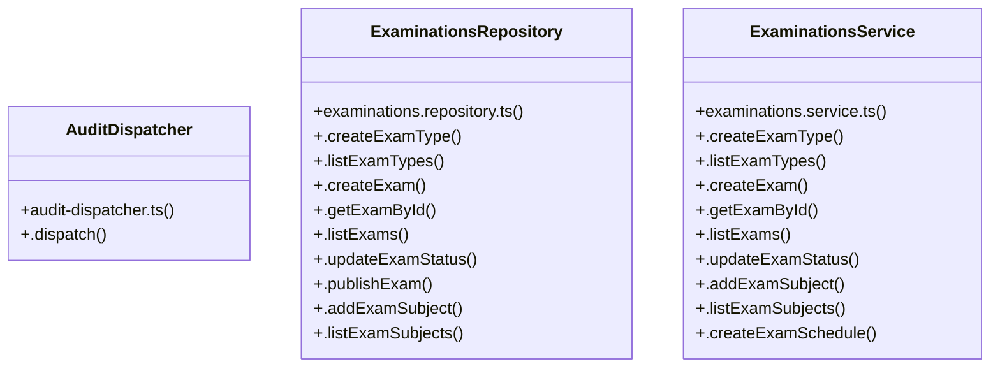

# [sendSuccess() & InstitutionRepository] Cluster

> 66 nodes · cohesion 0.04

## Key Concepts

- [ExaminationsRepository](file:///C:/Antigravityyyyy/VID_School/backend/src/modules/examinations/examinations.repository.ts#L121) (30 connections)
- [ExaminationsService](file:///C:/Antigravityyyyy/VID_School/backend/src/modules/examinations/examinations.service.ts#L6) (26 connections)
- [.dispatch()](file:///C:/Antigravityyyyy/VID_School/backend/src/common/audit-dispatcher.ts#L23) (24 connections)
- [.calculateExamResults()](file:///C:/Antigravityyyyy/VID_School/backend/src/modules/examinations/examinations.repository.ts#L832) (6 connections)
- [.verifyFacultySubjectAllocation()](file:///C:/Antigravityyyyy/VID_School/backend/src/modules/examinations/examinations.repository.ts#L1053) (5 connections)
- [.publishExamResults()](file:///C:/Antigravityyyyy/VID_School/backend/src/modules/examinations/examinations.service.ts#L372) (5 connections)
- [.commitImportBatch()](file:///C:/Antigravityyyyy/VID_School/backend/src/modules/examinations/examinations.repository.ts#L807) (4 connections)
- [.getExamSubjectById()](file:///C:/Antigravityyyyy/VID_School/backend/src/modules/examinations/examinations.repository.ts#L320) (4 connections)
- [.upsertMarksBatch()](file:///C:/Antigravityyyyy/VID_School/backend/src/modules/examinations/examinations.repository.ts#L560) (4 connections)
- [.validateImportBatch()](file:///C:/Antigravityyyyy/VID_School/backend/src/modules/examinations/examinations.repository.ts#L694) (4 connections)
- [.verifyParentChildLink()](file:///C:/Antigravityyyyy/VID_School/backend/src/modules/examinations/examinations.repository.ts#L1074) (4 connections)
- [.commitExcelImport()](file:///C:/Antigravityyyyy/VID_School/backend/src/modules/examinations/examinations.service.ts#L315) (4 connections)
- [.submitMarksBatch()](file:///C:/Antigravityyyyy/VID_School/backend/src/modules/examinations/examinations.service.ts#L193) (4 connections)
- [.getExamById()](file:///C:/Antigravityyyyy/VID_School/backend/src/modules/examinations/examinations.repository.ts#L168) (3 connections)
- [.calculateResults()](file:///C:/Antigravityyyyy/VID_School/backend/src/modules/examinations/examinations.service.ts#L355) (3 connections)
- [.getStudentReportCard()](file:///C:/Antigravityyyyy/VID_School/backend/src/modules/examinations/examinations.service.ts#L448) (3 connections)
- [.listMarks()](file:///C:/Antigravityyyyy/VID_School/backend/src/modules/examinations/examinations.service.ts#L236) (3 connections)
- [.validateExcelImport()](file:///C:/Antigravityyyyy/VID_School/backend/src/modules/examinations/examinations.service.ts#L294) (3 connections)
- [tenantMiddleware()](file:///C:/Antigravityyyyy/VID_School/backend/src/middleware/tenant.middleware.ts#L12) (3 connections)
- [AuditDispatcher](file:///C:/Antigravityyyyy/VID_School/backend/src/common/audit-dispatcher.ts#L19) (2 connections)
- [.addExamSubject()](file:///C:/Antigravityyyyy/VID_School/backend/src/modules/examinations/examinations.repository.ts#L277) (2 connections)
- [.createExamSchedule()](file:///C:/Antigravityyyyy/VID_School/backend/src/modules/examinations/examinations.repository.ts#L344) (2 connections)
- [.listExamSubjects()](file:///C:/Antigravityyyyy/VID_School/backend/src/modules/examinations/examinations.repository.ts#L297) (2 connections)
- [.publishExam()](file:///C:/Antigravityyyyy/VID_School/backend/src/modules/examinations/examinations.repository.ts#L256) (2 connections)
- [.resolveGrade()](file:///C:/Antigravityyyyy/VID_School/backend/src/modules/examinations/examinations.repository.ts#L521) (2 connections)
- *... and 41 more nodes in this community*

## Class Diagram

## Relationships

- No strong cross-community connections detected

## Source Files

- [C:\Antigravityyyyy\VID_School\backend\src\common\audit-dispatcher.ts](file:///C:/Antigravityyyyy/VID_School/backend/src/common/audit-dispatcher.ts)
- [C:\Antigravityyyyy\VID_School\backend\src\middleware\tenant.middleware.ts](file:///C:/Antigravityyyyy/VID_School/backend/src/middleware/tenant.middleware.ts)
- [C:\Antigravityyyyy\VID_School\backend\src\modules\examinations\examinations.repository.ts](file:///C:/Antigravityyyyy/VID_School/backend/src/modules/examinations/examinations.repository.ts)
- [C:\Antigravityyyyy\VID_School\backend\src\modules\examinations\examinations.service.ts](file:///C:/Antigravityyyyy/VID_School/backend/src/modules/examinations/examinations.service.ts)
- [C:\Antigravityyyyy\VID_School\backend\src\modules\finance\finance.service.ts](file:///C:/Antigravityyyyy/VID_School/backend/src/modules/finance/finance.service.ts)

## Audit Trail

- EXTRACTED: 141 (68%)
- INFERRED: 65 (32%)
- AMBIGUOUS: 0 (0%)

---

*Part of the graphify knowledge wiki. See [[index]] to navigate.*