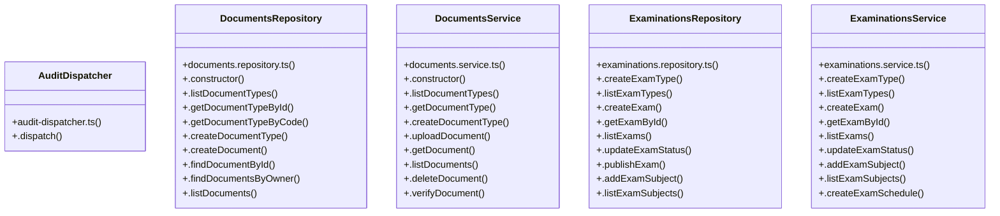

# [sendSuccess() & InstitutionRepository] Cluster

> 116 nodes · cohesion 0.03

## Key Concepts

- [.dispatch()](file:///C:/Antigravityyyyy/VID_School/backend/src/common/audit-dispatcher.ts#L23) (35 connections)
- [ExaminationsRepository](file:///C:/Antigravityyyyy/VID_School/backend/src/modules/examinations/examinations.repository.ts#L121) (30 connections)
- [DocumentsRepository](file:///C:/Antigravityyyyy/VID_School/backend/src/modules/documents/documents.repository.ts#L74) (27 connections)
- [ExaminationsService](file:///C:/Antigravityyyyy/VID_School/backend/src/modules/examinations/examinations.service.ts#L6) (26 connections)
- [DocumentsService](file:///C:/Antigravityyyyy/VID_School/backend/src/modules/documents/documents.service.ts#L30) (22 connections)
- [.generateBonafideCertificate()](file:///C:/Antigravityyyyy/VID_School/backend/src/modules/documents/documents.service.ts#L406) (8 connections)
- [.verifyParentChildLink()](file:///C:/Antigravityyyyy/VID_School/backend/src/modules/examinations/examinations.repository.ts#L1074) (8 connections)
- [.sendNotification()](file:///C:/Antigravityyyyy/VID_School/backend/src/modules/notifications/notification.service.ts#L21) (8 connections)
- [.generateTransferCertificate()](file:///C:/Antigravityyyyy/VID_School/backend/src/modules/documents/documents.service.ts#L512) (7 connections)
- [.requestDocument()](file:///C:/Antigravityyyyy/VID_School/backend/src/modules/documents/documents.service.ts#L610) (7 connections)
- [.uploadDocument()](file:///C:/Antigravityyyyy/VID_School/backend/src/modules/documents/documents.service.ts#L77) (6 connections)
- [.verifyDocument()](file:///C:/Antigravityyyyy/VID_School/backend/src/modules/documents/documents.service.ts#L236) (6 connections)
- [.calculateExamResults()](file:///C:/Antigravityyyyy/VID_School/backend/src/modules/examinations/examinations.repository.ts#L832) (6 connections)
- [.findDocumentById()](file:///C:/Antigravityyyyy/VID_School/backend/src/modules/documents/documents.repository.ts#L177) (5 connections)
- [.getDocumentTypeById()](file:///C:/Antigravityyyyy/VID_School/backend/src/modules/documents/documents.repository.ts#L93) (5 connections)
- [.assertDocumentAccess()](file:///C:/Antigravityyyyy/VID_School/backend/src/modules/documents/documents.service.ts#L741) (5 connections)
- [.verifyFacultySubjectAllocation()](file:///C:/Antigravityyyyy/VID_School/backend/src/modules/examinations/examinations.repository.ts#L1053) (5 connections)
- [.publishExamResults()](file:///C:/Antigravityyyyy/VID_School/backend/src/modules/examinations/examinations.service.ts#L372) (5 connections)
- [.createDocument()](file:///C:/Antigravityyyyy/VID_School/backend/src/modules/documents/documents.repository.ts#L127) (4 connections)
- [.createDocumentType()](file:///C:/Antigravityyyyy/VID_School/backend/src/modules/documents/documents.service.ts#L52) (4 connections)
- [.deleteDocument()](file:///C:/Antigravityyyyy/VID_School/backend/src/modules/documents/documents.service.ts#L200) (4 connections)
- [.processDocumentRequest()](file:///C:/Antigravityyyyy/VID_School/backend/src/modules/documents/documents.service.ts#L698) (4 connections)
- [.commitImportBatch()](file:///C:/Antigravityyyyy/VID_School/backend/src/modules/examinations/examinations.repository.ts#L807) (4 connections)
- [.getExamSubjectById()](file:///C:/Antigravityyyyy/VID_School/backend/src/modules/examinations/examinations.repository.ts#L320) (4 connections)
- [.upsertMarksBatch()](file:///C:/Antigravityyyyy/VID_School/backend/src/modules/examinations/examinations.repository.ts#L560) (4 connections)
- *... and 91 more nodes in this community*

## Class Diagram

## Relationships

- No strong cross-community connections detected

## Source Files

- [C:\Antigravityyyyy\VID_School\backend\src\common\audit-dispatcher.ts](file:///C:/Antigravityyyyy/VID_School/backend/src/common/audit-dispatcher.ts)
- [C:\Antigravityyyyy\VID_School\backend\src\middleware\tenant.middleware.ts](file:///C:/Antigravityyyyy/VID_School/backend/src/middleware/tenant.middleware.ts)
- [C:\Antigravityyyyy\VID_School\backend\src\modules\documents\documents.repository.ts](file:///C:/Antigravityyyyy/VID_School/backend/src/modules/documents/documents.repository.ts)
- [C:\Antigravityyyyy\VID_School\backend\src\modules\documents\documents.service.ts](file:///C:/Antigravityyyyy/VID_School/backend/src/modules/documents/documents.service.ts)
- [C:\Antigravityyyyy\VID_School\backend\src\modules\examinations\examinations.repository.ts](file:///C:/Antigravityyyyy/VID_School/backend/src/modules/examinations/examinations.repository.ts)
- [C:\Antigravityyyyy\VID_School\backend\src\modules\examinations\examinations.service.ts](file:///C:/Antigravityyyyy/VID_School/backend/src/modules/examinations/examinations.service.ts)
- [C:\Antigravityyyyy\VID_School\backend\src\modules\notifications\notification.service.ts](file:///C:/Antigravityyyyy/VID_School/backend/src/modules/notifications/notification.service.ts)

## Audit Trail

- EXTRACTED: 253 (62%)
- INFERRED: 153 (38%)
- AMBIGUOUS: 0 (0%)

---

*Part of the graphify knowledge wiki. See [[index]] to navigate.*