# [sendSuccess() & InstitutionRepository] Cluster

> 60 nodes · cohesion 0.05

## Key Concepts

- [sendSuccess()](file:///C:/Antigravityyyyy/VID_School/backend/src/utils/api-response.ts#L19) (33 connections)
- [sendError()](file:///C:/Antigravityyyyy/VID_School/backend/src/utils/api-response.ts#L48) (12 connections)
- [InstitutionController](file:///C:/Antigravityyyyy/VID_School/backend/src/modules/institutions/institution.controller.ts#L5) (11 connections)
- [NotificationController](file:///C:/Antigravityyyyy/VID_School/backend/src/modules/notifications/notification.controller.ts#L5) (6 connections)
- [AcademicsController](file:///C:/Antigravityyyyy/VID_School/backend/src/modules/academics/academics.controller.ts#L5) (5 connections)
- [AdmissionsController](file:///C:/Antigravityyyyy/VID_School/backend/src/modules/admissions/admissions.controller.ts#L5) (4 connections)
- [.getLogById()](file:///C:/Antigravityyyyy/VID_School/backend/src/modules/audit/audit.controller.ts#L38) (4 connections)
- [.getLogs()](file:///C:/Antigravityyyyy/VID_School/backend/src/modules/audit/audit.controller.ts#L6) (4 connections)
- [AuditRepository](file:///C:/Antigravityyyyy/VID_School/backend/src/modules/audit/audit.repository.ts#L18) (4 connections)
- [.getNotifications()](file:///C:/Antigravityyyyy/VID_School/backend/src/modules/notifications/notification.controller.ts#L6) (4 connections)
- [.send()](file:///C:/Antigravityyyyy/VID_School/backend/src/modules/notifications/notification.controller.ts#L77) (4 connections)
- [.approve()](file:///C:/Antigravityyyyy/VID_School/backend/src/modules/admissions/admissions.controller.ts#L33) (3 connections)
- [.updateStage()](file:///C:/Antigravityyyyy/VID_School/backend/src/modules/admissions/admissions.controller.ts#L16) (3 connections)
- [AuditController](file:///C:/Antigravityyyyy/VID_School/backend/src/modules/audit/audit.controller.ts#L5) (3 connections)
- [.findLogById()](file:///C:/Antigravityyyyy/VID_School/backend/src/modules/audit/audit.repository.ts#L98) (3 connections)
- [.findLogs()](file:///C:/Antigravityyyyy/VID_School/backend/src/modules/audit/audit.repository.ts#L23) (3 connections)
- [AuditService](file:///C:/Antigravityyyyy/VID_School/backend/src/modules/audit/audit.service.ts#L3) (3 connections)
- [.getAuditLogById()](file:///C:/Antigravityyyyy/VID_School/backend/src/modules/audit/audit.service.ts#L15) (3 connections)
- [.getAuditLogs()](file:///C:/Antigravityyyyy/VID_School/backend/src/modules/audit/audit.service.ts#L4) (3 connections)
- [api-response.ts](file:///C:/Antigravityyyyy/VID_School/backend/src/utils/api-response.ts#L1) (3 connections)
- [FacultyController](file:///C:/Antigravityyyyy/VID_School/backend/src/modules/faculty/faculty.controller.ts#L5) (3 connections)
- [.getFaculty()](file:///C:/Antigravityyyyy/VID_School/backend/src/modules/faculty/faculty.controller.ts#L6) (3 connections)
- [.getFacultyById()](file:///C:/Antigravityyyyy/VID_School/backend/src/modules/faculty/faculty.controller.ts#L16) (3 connections)
- [FacultyRepository](file:///C:/Antigravityyyyy/VID_School/backend/src/modules/faculty/faculty.repository.ts#L3) (3 connections)
- [.findFacultyById()](file:///C:/Antigravityyyyy/VID_School/backend/src/modules/faculty/faculty.repository.ts#L41) (3 connections)
- *... and 35 more nodes in this community*

## Class Diagram

```mermaid
classDiagram
    class AcademicsController {
        +academics.controller.ts()
        +.getGrades()
        +.getHierarchy()
        +.getClasses()
        +.getSubjects()
    }
    class AdmissionsController {
        +admissions.controller.ts()
        +.getApplicants()
        +.updateStage()
        +.approve()
    }
    class AuditController {
        +audit.controller.ts()
        +.getLogs()
        +.getLogById()
    }
    class AuditRepository {
        +audit.repository.ts()
        +.constructor()
        +.findLogs()
        +.findLogById()
    }
    class AuditService {
        +audit.service.ts()
        +.getAuditLogs()
        +.getAuditLogById()
    }
    class FacultyController {
        +faculty.controller.ts()
        +.getFaculty()
        +.getFacultyById()
    }
    class FacultyRepository {
        +faculty.repository.ts()
        +.findFacultyByInstitution()
        +.findFacultyById()
    }
    class FacultyService {
        +faculty.service.ts()
        +.getFacultyList()
        +.getFacultyMember()
    }
    class InstitutionController {
        +institution.controller.ts()
        +.getInstitutions()
        +.getInstitutionById()
        +.getStats()
        +.getModules()
        +.toggleModule()
        +.createInstitution()
        +.getAdmins()
        +.addAdmin()
        +.updateStatus()
    }
    class NotificationController {
        +notification.controller.ts()
        +.getNotifications()
        +.getUnreadCount()
        +.markAsRead()
        +.markAllAsRead()
        +.send()
    }
```

## Relationships

- No strong cross-community connections detected

## Source Files

- [C:\Antigravityyyyy\VID_School\backend\src\middleware\error.middleware.ts](file:///C:/Antigravityyyyy/VID_School/backend/src/middleware/error.middleware.ts)
- [C:\Antigravityyyyy\VID_School\backend\src\modules\academics\academics.controller.ts](file:///C:/Antigravityyyyy/VID_School/backend/src/modules/academics/academics.controller.ts)
- [C:\Antigravityyyyy\VID_School\backend\src\modules\admissions\admissions.controller.ts](file:///C:/Antigravityyyyy/VID_School/backend/src/modules/admissions/admissions.controller.ts)
- [C:\Antigravityyyyy\VID_School\backend\src\modules\audit\audit.controller.ts](file:///C:/Antigravityyyyy/VID_School/backend/src/modules/audit/audit.controller.ts)
- [C:\Antigravityyyyy\VID_School\backend\src\modules\audit\audit.repository.ts](file:///C:/Antigravityyyyy/VID_School/backend/src/modules/audit/audit.repository.ts)
- [C:\Antigravityyyyy\VID_School\backend\src\modules\audit\audit.service.ts](file:///C:/Antigravityyyyy/VID_School/backend/src/modules/audit/audit.service.ts)
- [C:\Antigravityyyyy\VID_School\backend\src\modules\faculty\faculty.controller.ts](file:///C:/Antigravityyyyy/VID_School/backend/src/modules/faculty/faculty.controller.ts)
- [C:\Antigravityyyyy\VID_School\backend\src\modules\faculty\faculty.repository.ts](file:///C:/Antigravityyyyy/VID_School/backend/src/modules/faculty/faculty.repository.ts)
- [C:\Antigravityyyyy\VID_School\backend\src\modules\faculty\faculty.service.ts](file:///C:/Antigravityyyyy/VID_School/backend/src/modules/faculty/faculty.service.ts)
- [C:\Antigravityyyyy\VID_School\backend\src\modules\institutions\institution.controller.ts](file:///C:/Antigravityyyyy/VID_School/backend/src/modules/institutions/institution.controller.ts)
- [C:\Antigravityyyyy\VID_School\backend\src\modules\notifications\notification.controller.ts](file:///C:/Antigravityyyyy/VID_School/backend/src/modules/notifications/notification.controller.ts)
- [C:\Antigravityyyyy\VID_School\backend\src\utils\api-response.ts](file:///C:/Antigravityyyyy/VID_School/backend/src/utils/api-response.ts)

## Audit Trail

- EXTRACTED: 97 (48%)
- INFERRED: 106 (52%)
- AMBIGUOUS: 0 (0%)

---

*Part of the graphify knowledge wiki. See [[index]] to navigate.*