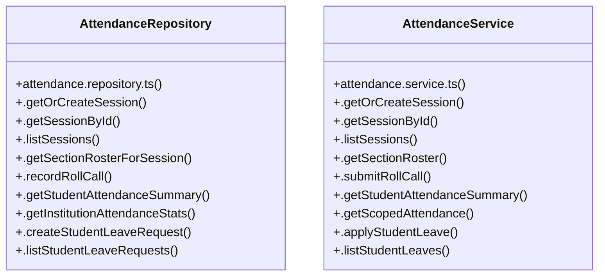

# [{ email, password, role = 'INSTITUTION_ADMIN' } & inst] Cluster

> 29 nodes · cohesion 0.10

## Key Concepts

- [AttendanceRepository](file:///C:/Antigravityyyyy/VID_School/backend/src/modules/attendance/attendance.repository.ts#L60) (14 connections)
- [AttendanceService](file:///C:/Antigravityyyyy/VID_School/backend/src/modules/attendance/attendance.service.ts#L6) (14 connections)
- [.submitRollCall()](file:///C:/Antigravityyyyy/VID_School/backend/src/modules/attendance/attendance.service.ts#L93) (6 connections)
- [.getStudentSummary()](file:///C:/Antigravityyyyy/VID_School/backend/src/modules/attendance/attendance.controller.ts#L94) (4 connections)
- [.verifyFacultySectionAccess()](file:///C:/Antigravityyyyy/VID_School/backend/src/modules/attendance/attendance.repository.ts#L642) (4 connections)
- [.getInstitutionAttendanceStats()](file:///C:/Antigravityyyyy/VID_School/backend/src/modules/attendance/attendance.repository.ts#L402) (3 connections)
- [.applyStudentLeave()](file:///C:/Antigravityyyyy/VID_School/backend/src/modules/attendance/attendance.service.ts#L266) (3 connections)
- [.getOrCreateSession()](file:///C:/Antigravityyyyy/VID_School/backend/src/modules/attendance/attendance.service.ts#L8) (3 connections)
- [.getScopedAttendance()](file:///C:/Antigravityyyyy/VID_School/backend/src/modules/attendance/attendance.service.ts#L206) (3 connections)
- [.getSectionRoster()](file:///C:/Antigravityyyyy/VID_School/backend/src/modules/attendance/attendance.service.ts#L72) (3 connections)
- [.getStudentAttendanceSummary()](file:///C:/Antigravityyyyy/VID_School/backend/src/modules/attendance/attendance.service.ts#L168) (3 connections)
- [.createStudentLeaveRequest()](file:///C:/Antigravityyyyy/VID_School/backend/src/modules/attendance/attendance.repository.ts#L432) (2 connections)
- [.getOrCreateSession()](file:///C:/Antigravityyyyy/VID_School/backend/src/modules/attendance/attendance.repository.ts#L62) (2 connections)
- [.getSectionRosterForSession()](file:///C:/Antigravityyyyy/VID_School/backend/src/modules/attendance/attendance.repository.ts#L221) (2 connections)
- [.getSessionById()](file:///C:/Antigravityyyyy/VID_School/backend/src/modules/attendance/attendance.repository.ts#L115) (2 connections)
- [.listStudentLeaveRequests()](file:///C:/Antigravityyyyy/VID_School/backend/src/modules/attendance/attendance.repository.ts#L454) (2 connections)
- [.recordRollCall()](file:///C:/Antigravityyyyy/VID_School/backend/src/modules/attendance/attendance.repository.ts#L262) (2 connections)
- [.getInstitutionSummary()](file:///C:/Antigravityyyyy/VID_School/backend/src/modules/attendance/attendance.service.ts#L421) (2 connections)
- [.getSessionById()](file:///C:/Antigravityyyyy/VID_School/backend/src/modules/attendance/attendance.service.ts#L51) (2 connections)
- [.listStudentLeaves()](file:///C:/Antigravityyyyy/VID_School/backend/src/modules/attendance/attendance.service.ts#L324) (2 connections)
- [.getStudentAttendanceSummary()](file:///C:/Antigravityyyyy/VID_School/backend/src/modules/attendance/attendance.repository.ts#L321) (1 connections)
- [.listSessions()](file:///C:/Antigravityyyyy/VID_School/backend/src/modules/attendance/attendance.repository.ts#L149) (1 connections)
- [.listStaffAttendance()](file:///C:/Antigravityyyyy/VID_School/backend/src/modules/attendance/attendance.repository.ts#L593) (1 connections)
- [.recordStaffAttendance()](file:///C:/Antigravityyyyy/VID_School/backend/src/modules/attendance/attendance.repository.ts#L569) (1 connections)
- [.listSessions()](file:///C:/Antigravityyyyy/VID_School/backend/src/modules/attendance/attendance.service.ts#L57) (1 connections)
- *... and 4 more nodes in this community*

## Class Diagram

## Relationships

- No strong cross-community connections detected

## Source Files

- [C:\Antigravityyyyy\VID_School\backend\src\modules\attendance\attendance.controller.ts](file:///C:/Antigravityyyyy/VID_School/backend/src/modules/attendance/attendance.controller.ts)
- [C:\Antigravityyyyy\VID_School\backend\src\modules\attendance\attendance.repository.ts](file:///C:/Antigravityyyyy/VID_School/backend/src/modules/attendance/attendance.repository.ts)
- [C:\Antigravityyyyy\VID_School\backend\src\modules\attendance\attendance.service.ts](file:///C:/Antigravityyyyy/VID_School/backend/src/modules/attendance/attendance.service.ts)

## Audit Trail

- EXTRACTED: 61 (70%)
- INFERRED: 26 (30%)
- AMBIGUOUS: 0 (0%)

---

*Part of the graphify knowledge wiki. See [[index]] to navigate.*