# query

> God node · 121 connections · [C:\Antigravityyyyy\VID_School\backend\src\modules\examinations\examinations.routes.ts](file:///C:/Antigravityyyyy/VID_School/backend/src/modules/examinations/examinations.routes.ts#L13)

## Call Trace Diagram

```mermaid
sequenceDiagram
    participant P0 as query
    participant P1 as .dispatch()
    participant P2 as .submitRollCall()
    participant P3 as .verifyFacultySectionAccess()
    participant P4 as .sendNotification()
    participant P5 as .getSessionById()
    participant P6 as .recordRollCall()
    participant P7 as .publishTimetable()
    participant P8 as .checkTimetableConflicts()
    participant P9 as .getTimetableById()
    participant P10 as .setPublishStatus()
    participant P11 as tenantMiddleware()
    participant P12 as .executeApprovalTransaction()
    participant P13 as .applyStudentLeave()
    participant P14 as .decideStudentLeave()
    participant P15 as .processPayment()
    participant P16 as .getOrCreateSession()
    participant P17 as .unpublishTimetable()
    participant P18 as .createFeeStructure()
    participant P19 as .assignFeeToStudent()
    participant P20 as .processRefund()
    participant P21 as .createSubstitution()
    participant P22 as .findByIdOrCode()
    participant P23 as .findFacultyByProfileId()
    participant P24 as .getScopedFees()
    participant P25 as .findModules()
    participant P26 as .listEntries()
    participant P27 as .checkCandidateConflicts()
    participant P28 as findById()
    participant P29 as authMiddleware()
    participant P30 as .findApplicationById()
    participant P31 as .getInstitutionAttendanceStats()
    participant P32 as .getStudentAttendanceSummary()
    participant P33 as .getScopedAttendance()
    participant P34 as .findAssignedClasses()
    participant P35 as .findAssignedSubjects()
    participant P36 as .listStudentFees()
    participant P37 as .getInvoiceById()
    participant P38 as .listPayments()
    participant P39 as .getSummary()
    participant P40 as .getStats()
    participant P41 as .upsertModule()
    participant P42 as .getRoomById()
    participant P43 as .getPeriodById()
    participant P44 as .createEntry()
    participant P45 as .getScopedSchedule()
    participant P46 as .recordPayment()
    participant P47 as verify()
    participant P48 as findMany()
    participant P49 as softDelete()
    participant P50 as .getClassesByInstitution()
    participant P51 as .getSectionsByClass()
    participant P52 as .getSubjectsByClass()
    participant P53 as .listAcademicYears()
    participant P54 as .listDepartments()
    participant P55 as .listAllocations()
    participant P56 as .findApplicantsByInstitution()
    participant P57 as .updateApplicationStage()
    participant P58 as .countStudents()
    participant P59 as .findDefaultSection()
    participant P60 as .getOrCreateSession()
    participant P61 as .getSessionById()
    participant P62 as .getSectionRosterForSession()
    participant P63 as .createStudentLeaveRequest()
    participant P64 as .listStudentLeaveRequests()
    participant P65 as .listStudentLeaves()
    participant P66 as .findLogs()
    participant P67 as .findLogById()
    participant P68 as .findFacultyByInstitution()
    participant P69 as .findFacultyById()
    participant P70 as .findSectionStudents()
    participant P71 as .getFeeStructureById()
    participant P72 as .listInvoices()
    participant P73 as .getReceiptByPaymentId()
    participant P74 as .isWebhookEventProcessed()
    participant P75 as .recordWebhookEvent()
    participant P76 as .findAll()
    participant P77 as .create()
    participant P78 as .createAdmin()
    participant P79 as .findAdmins()
    participant P80 as .updateAdminWorkspaces()
    participant P81 as .updateStatus()
    participant P82 as .findForUser()
    participant P83 as .createNotification()
    participant P84 as .findStudents()
    participant P85 as .findStudentMasterById()
    participant P86 as .promote()
    participant P87 as .updateRoom()
    participant P88 as .updatePeriod()
    participant P89 as .listSubstitutions()
    participant P90 as purgeDummyData()
    participant P91 as main()
    participant P92 as run()
    participant P93 as .getHierarchy()
    participant P94 as .listClasses()
    participant P95 as .createAcademicYear()
    participant P96 as .createDepartment()
    participant P97 as .createClass()
    participant P98 as .createSection()
    participant P99 as .createSubject()
    participant P100 as .linkSubjectToClass()
    participant P101 as .createAllocation()
    participant P102 as .createApplication()
    participant P103 as .listSessions()
    participant P104 as .getStudentAttendanceSummary()
    participant P105 as .listStaffAttendance()
    participant P106 as .listFeeCategories()
    participant P107 as .createFeeCategory()
    participant P108 as .listFeeGroups()
    participant P109 as .createFeeGroup()
    participant P110 as .listFeeStructures()
    participant P111 as .listDiscounts()
    participant P112 as .createDiscount()
    participant P113 as .listScholarships()
    participant P114 as .createScholarship()
    participant P115 as .getUnreadCount()
    participant P116 as .markAsRead()
    participant P117 as .markAllAsRead()
    participant P118 as .listRooms()
    participant P119 as .createRoom()
    participant P120 as .deleteRoom()
    participant P121 as .listPeriods()
    participant P122 as .createPeriod()
    participant P123 as .deletePeriod()
    participant P124 as .listTimetables()
    participant P125 as .createTimetable()
    participant P126 as .deleteTimetable()
    participant P127 as .deleteEntry()
    participant P128 as .createSubstitution()
    participant P129 as runStepBTests()
    participant P130 as runStepCTests()
    participant P131 as runAttendanceTests()
    participant P132 as runFinanceTests()
    participant P133 as runTimetableTests()
    P0->>+ P1: calls
    P1-->>- P0: return
    P1->>+ P0: calls
    P0-->>- P1: return
    P1->>+ P2: calls
    P2-->>- P1: return
    P2->>+ P0: calls
    P0-->>- P2: return
    P2->>+ P1: calls
    P1-->>- P2: return
    P2->>+ P3: calls
    P3-->>- P2: return
    P2->>+ P4: calls
    P4-->>- P2: return
    P2->>+ P5: calls
    P5-->>- P2: return
    P2->>+ P6: calls
    P6-->>- P2: return
    P1->>+ P7: calls
    P7-->>- P1: return
    P7->>+ P1: calls
    P1-->>- P7: return
    P7->>+ P8: calls
    P8-->>- P7: return
    P7->>+ P9: calls
    P9-->>- P7: return
    P7->>+ P10: calls
    P10-->>- P7: return
    P1->>+ P11: calls
    P11-->>- P1: return
    P1->>+ P12: calls
    P12-->>- P1: return
    P1->>+ P13: calls
    P13-->>- P1: return
    P1->>+ P14: calls
    P14-->>- P1: return
    P1->>+ P15: calls
    P15-->>- P1: return
    P1->>+ P16: calls
    P16-->>- P1: return
    P1->>+ P17: calls
    P17-->>- P1: return
    P1->>+ P18: calls
    P18-->>- P1: return
    P1->>+ P19: calls
    P19-->>- P1: return
    P1->>+ P20: calls
    P20-->>- P1: return
    P1->>+ P21: calls
    P21-->>- P1: return
    P0->>+ P22: calls
    P22-->>- P0: return
    P0->>+ P2: calls
    P2-->>- P0: return
    P0->>+ P3: calls
    P3-->>- P0: return
    P0->>+ P23: calls
    P23-->>- P0: return
    P0->>+ P24: calls
    P24-->>- P0: return
    P0->>+ P25: calls
    P25-->>- P0: return
    P0->>+ P26: calls
    P26-->>- P0: return
    P0->>+ P27: calls
    P27-->>- P0: return
    P0->>+ P28: calls
    P28-->>- P0: return
    P0->>+ P29: calls
    P29-->>- P0: return
    P0->>+ P11: calls
    P11-->>- P0: return
    P0->>+ P30: calls
    P30-->>- P0: return
    P0->>+ P12: calls
    P12-->>- P0: return
    P0->>+ P31: calls
    P31-->>- P0: return
    P0->>+ P32: calls
    P32-->>- P0: return
    P0->>+ P33: calls
    P33-->>- P0: return
    P0->>+ P13: calls
    P13-->>- P0: return
    P0->>+ P34: calls
    P34-->>- P0: return
    P0->>+ P35: calls
    P35-->>- P0: return
    P0->>+ P36: calls
    P36-->>- P0: return
    P0->>+ P37: calls
    P37-->>- P0: return
    P0->>+ P38: calls
    P38-->>- P0: return
    P0->>+ P39: calls
    P39-->>- P0: return
    P0->>+ P40: calls
    P40-->>- P0: return
    P0->>+ P41: calls
    P41-->>- P0: return
    P0->>+ P42: calls
    P42-->>- P0: return
    P0->>+ P43: calls
    P43-->>- P0: return
    P0->>+ P9: calls
    P9-->>- P0: return
    P0->>+ P44: calls
    P44-->>- P0: return
    P0->>+ P10: calls
    P10-->>- P0: return
    P0->>+ P45: calls
    P45-->>- P0: return
    P0->>+ P46: calls
    P46-->>- P0: return
    P0->>+ P47: calls
    P47-->>- P0: return
    P0->>+ P48: calls
    P48-->>- P0: return
    P0->>+ P49: calls
    P49-->>- P0: return
    P0->>+ P50: calls
    P50-->>- P0: return
    P0->>+ P51: calls
    P51-->>- P0: return
    P0->>+ P52: calls
    P52-->>- P0: return
    P0->>+ P53: calls
    P53-->>- P0: return
    P0->>+ P54: calls
    P54-->>- P0: return
    P0->>+ P55: calls
    P55-->>- P0: return
    P0->>+ P56: calls
    P56-->>- P0: return
    P0->>+ P57: calls
    P57-->>- P0: return
    P0->>+ P58: calls
    P58-->>- P0: return
    P0->>+ P59: calls
    P59-->>- P0: return
    P0->>+ P60: calls
    P60-->>- P0: return
    P0->>+ P61: calls
    P61-->>- P0: return
    P0->>+ P62: calls
    P62-->>- P0: return
    P0->>+ P63: calls
    P63-->>- P0: return
    P0->>+ P64: calls
    P64-->>- P0: return
    P0->>+ P65: calls
    P65-->>- P0: return
    P0->>+ P66: calls
    P66-->>- P0: return
    P0->>+ P67: calls
    P67-->>- P0: return
    P0->>+ P68: calls
    P68-->>- P0: return
    P0->>+ P69: calls
    P69-->>- P0: return
    P0->>+ P70: calls
    P70-->>- P0: return
    P0->>+ P71: calls
    P71-->>- P0: return
    P0->>+ P72: calls
    P72-->>- P0: return
    P0->>+ P73: calls
    P73-->>- P0: return
    P0->>+ P74: calls
    P74-->>- P0: return
    P0->>+ P75: calls
    P75-->>- P0: return
    P0->>+ P76: calls
    P76-->>- P0: return
    P0->>+ P77: calls
    P77-->>- P0: return
    P0->>+ P78: calls
    P78-->>- P0: return
    P0->>+ P79: calls
    P79-->>- P0: return
    P0->>+ P80: calls
    P80-->>- P0: return
    P0->>+ P81: calls
    P81-->>- P0: return
    P0->>+ P82: calls
    P82-->>- P0: return
    P0->>+ P83: calls
    P83-->>- P0: return
    P0->>+ P84: calls
    P84-->>- P0: return
    P0->>+ P85: calls
    P85-->>- P0: return
    P0->>+ P86: calls
    P86-->>- P0: return
    P0->>+ P87: calls
    P87-->>- P0: return
    P0->>+ P88: calls
    P88-->>- P0: return
    P0->>+ P89: calls
    P89-->>- P0: return
    P0->>+ P90: calls
    P90-->>- P0: return
    P0->>+ P91: calls
    P91-->>- P0: return
    P0->>+ P92: calls
    P92-->>- P0: return
    P0->>+ P93: calls
    P93-->>- P0: return
    P0->>+ P94: calls
    P94-->>- P0: return
    P0->>+ P95: calls
    P95-->>- P0: return
    P0->>+ P96: calls
    P96-->>- P0: return
    P0->>+ P97: calls
    P97-->>- P0: return
    P0->>+ P98: calls
    P98-->>- P0: return
    P0->>+ P99: calls
    P99-->>- P0: return
    P0->>+ P100: calls
    P100-->>- P0: return
    P0->>+ P101: calls
    P101-->>- P0: return
    P0->>+ P102: calls
    P102-->>- P0: return
    P0->>+ P103: calls
    P103-->>- P0: return
    P0->>+ P104: calls
    P104-->>- P0: return
    P0->>+ P105: calls
    P105-->>- P0: return
    P0->>+ P106: calls
    P106-->>- P0: return
    P0->>+ P107: calls
    P107-->>- P0: return
    P0->>+ P108: calls
    P108-->>- P0: return
    P0->>+ P109: calls
    P109-->>- P0: return
    P0->>+ P110: calls
    P110-->>- P0: return
    P0->>+ P111: calls
    P111-->>- P0: return
    P0->>+ P112: calls
    P112-->>- P0: return
    P0->>+ P113: calls
    P113-->>- P0: return
    P0->>+ P114: calls
    P114-->>- P0: return
    P0->>+ P115: calls
    P115-->>- P0: return
    P0->>+ P116: calls
    P116-->>- P0: return
    P0->>+ P117: calls
    P117-->>- P0: return
    P0->>+ P118: calls
    P118-->>- P0: return
    P0->>+ P119: calls
    P119-->>- P0: return
    P0->>+ P120: calls
    P120-->>- P0: return
    P0->>+ P121: calls
    P121-->>- P0: return
    P0->>+ P122: calls
    P122-->>- P0: return
    P0->>+ P123: calls
    P123-->>- P0: return
    P0->>+ P124: calls
    P124-->>- P0: return
    P0->>+ P125: calls
    P125-->>- P0: return
    P0->>+ P126: calls
    P126-->>- P0: return
    P0->>+ P127: calls
    P127-->>- P0: return
    P0->>+ P128: calls
    P128-->>- P0: return
    P0->>+ P129: calls
    P129-->>- P0: return
    P0->>+ P130: calls
    P130-->>- P0: return
    P0->>+ P131: calls
    P131-->>- P0: return
    P0->>+ P132: calls
    P132-->>- P0: return
    P0->>+ P133: calls
    P133-->>- P0: return
```

## Connections by Relation

### calls
- [[.dispatch()]] `INFERRED`
- [[.findByIdOrCode()]] `INFERRED`
- [[.submitRollCall()]] `INFERRED`
- [[.verifyFacultySectionAccess()]] `INFERRED`
- [[.findFacultyByProfileId()]] `INFERRED`
- [[.getScopedFees()]] `INFERRED`
- [[.findModules()]] `INFERRED`
- [[.listEntries()]] `INFERRED`
- [[.checkCandidateConflicts()]] `INFERRED`
- [[findById()]] `INFERRED`
- [[authMiddleware()]] `INFERRED`
- [[tenantMiddleware()]] `INFERRED`
- [[.findApplicationById()]] `INFERRED`
- [[.executeApprovalTransaction()]] `INFERRED`
- [[.getInstitutionAttendanceStats()]] `INFERRED`
- [[.getStudentAttendanceSummary()]] `INFERRED`
- [[.getScopedAttendance()]] `INFERRED`
- [[.applyStudentLeave()]] `INFERRED`
- [[.findAssignedClasses()]] `INFERRED`
- [[.findAssignedSubjects()]] `INFERRED`

### contains
- [[examinations.routes.ts]] `EXTRACTED`

---

*Part of the graphify knowledge wiki. See [[index]] to navigate.*