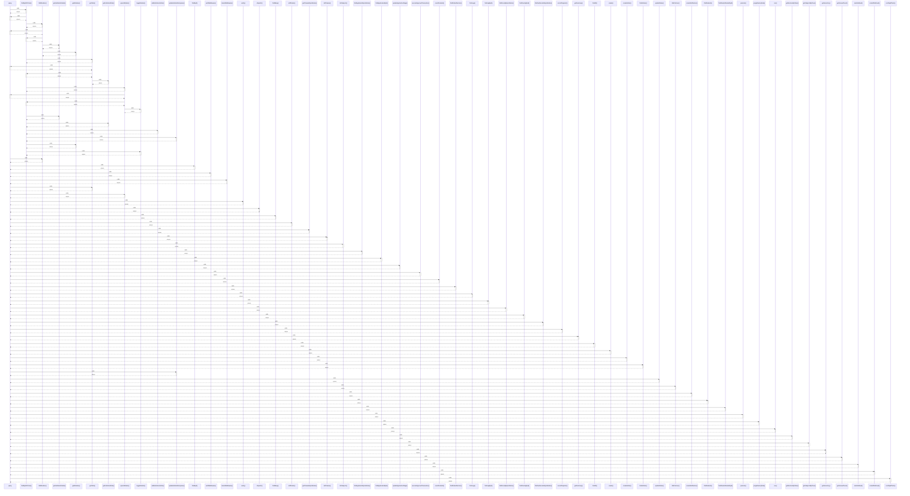

# query

> God node · 48 connections · [C:\Antigravityyyyy\VID_School\backend\src\modules\timetable\timetable.routes.ts](file:///C:/Antigravityyyyy/VID_School/backend/src/modules/timetable/timetable.routes.ts#L14)

## Call Trace Diagram

## Connections by Relation

### calls
- [[.findByIdOrCode()]] `INFERRED`
- [[.findModules()]] `INFERRED`
- [[findById()]] `INFERRED`
- [[authMiddleware()]] `INFERRED`
- [[tenantMiddleware()]] `INFERRED`
- [[.getStats()]] `INFERRED`
- [[.upsertModule()]] `INFERRED`
- [[verify()]] `INFERRED`
- [[.dispatch()]] `INFERRED`
- [[findMany()]] `INFERRED`
- [[softDelete()]] `INFERRED`
- [[.getClassesByInstitution()]] `INFERRED`
- [[.listClasses()]] `INFERRED`
- [[.listSubjects()]] `INFERRED`
- [[.findApplicantsByInstitution()]] `INFERRED`
- [[.findApplicationById()]] `INFERRED`
- [[.updateApplicationStage()]] `INFERRED`
- [[.executeApprovalTransaction()]] `INFERRED`
- [[.countStudents()]] `INFERRED`
- [[.findDefaultSection()]] `INFERRED`

### contains
- [[timetable.routes.ts]] `EXTRACTED`

---

*Part of the graphify knowledge wiki. See [[index]] to navigate.*