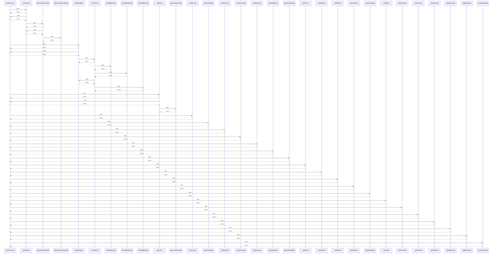

# sendSuccess()

> God node · 23 connections · [C:\Antigravityyyyy\VID_School\backend\src\utils\api-response.ts](file:///C:/Antigravityyyyy/VID_School/backend/src/utils/api-response.ts#L19)

## Call Trace Diagram

## Connections by Relation

### calls
- [[.getGrades()]] `INFERRED`
- [[.updateStage()]] `INFERRED`
- [[.approve()]] `INFERRED`
- [[.getFaculty()]] `INFERRED`
- [[.getFacultyById()]] `INFERRED`
- [[.getRecords()]] `INFERRED`
- [[.recordPayment()]] `INFERRED`
- [[.getSummary()]] `INFERRED`
- [[.getInstitutions()]] `INFERRED`
- [[.getInstitutionById()]] `INFERRED`
- [[.getStats()]] `INFERRED`
- [[.getAdmins()]] `INFERRED`
- [[.addAdmin()]] `INFERRED`
- [[.getStudents()]] `INFERRED`
- [[.getStudentById()]] `INFERRED`
- [[.promote()]] `INFERRED`
- [[.getHierarchy()]] `INFERRED`
- [[.getClasses()]] `INFERRED`
- [[.getSubjects()]] `INFERRED`
- [[.getApplicants()]] `INFERRED`

### contains
- [[api-response.ts]] `EXTRACTED`

---

*Part of the graphify knowledge wiki. See [[index]] to navigate.*